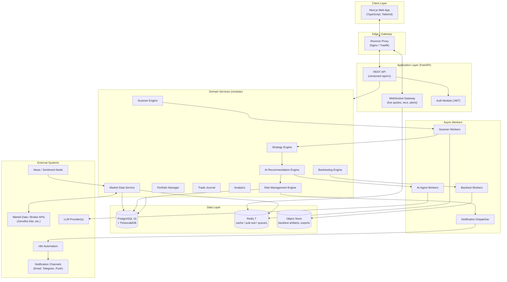
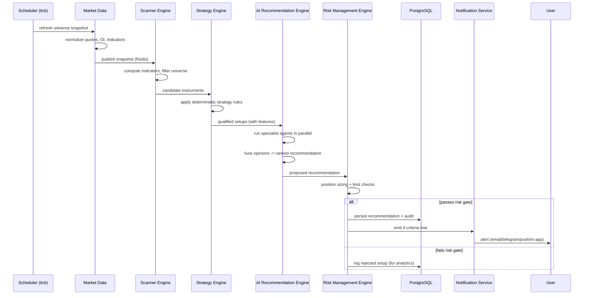

# 01 — System Architecture

## 1. Architectural Style

BKN AI Capital is a **modular monolith at the code level, service-oriented at
the runtime level**. We begin with a well-bounded modular monolith (fast to
build, easy to reason about) whose module boundaries are drawn so cleanly that
high-load components (Market Data, Scanner, AI Engine) can be **extracted into
independent services** without rewrites.

**Why this approach:**
- A solo/small team ships far faster with one deployable backend than with a
  dozen microservices and their operational overhead.
- Clean Architecture + explicit module interfaces means the "seams" for future
  extraction already exist.
- The genuinely bursty, CPU/IO-heavy workloads (real-time scanning, LLM calls)
  are isolated behind interfaces and run as **workers**, so they scale
  independently even inside the monolith.

## 2. High-Level Topology

## 3. Request & Data Flows

### 3.1 The recommendation pipeline (the heart of the system)

**Key property:** the AI never has the final word on whether a user sees a
recommendation. The **Risk Management Engine is the terminal gate.**

### 3.2 Live market flow (read path)

1. Market Data Service maintains a hot snapshot in Redis (updated on each poll /
   websocket tick from the data provider).
2. WebSocket Gateway subscribes to Redis pub/sub channels and fans out to
   connected browsers.
3. REST endpoints serve point-in-time and historical reads from PostgreSQL /
   TimescaleDB.

## 4. C4 — Container View (textual)

| Container | Tech | Responsibility | Scales by |
|-----------|------|----------------|-----------|
| Web App | Next.js | UI, SSR/ISR, TradingView charts | CDN / replicas |
| API Gateway | FastAPI (ASGI, Uvicorn/Gunicorn) | REST + WS, auth, orchestration | horizontal replicas |
| Scanner Workers | Python (Celery) | Indicator compute, universe scans | worker count |
| AI Workers | Python (Celery) | Agent execution, LLM calls | worker count |
| Backtest Workers | Python (Celery) | Historical simulation | worker count (batch) |
| PostgreSQL | Postgres 16 + TimescaleDB | System of record, time-series | read replicas + partitions |
| Redis | Redis 7 | Cache, pub/sub, queue, rate limits | cluster if needed |
| n8n | n8n | Automation & notification workflows | single/HA |

## 5. Cross-Cutting Concerns

| Concern | Approach |
|---------|----------|
| **AuthN/AuthZ** | JWT access (short TTL) + refresh; RBAC (user/admin); see [12](12-security-compliance.md) |
| **Config** | 12-factor; env vars + typed settings (Pydantic `Settings`) |
| **Logging** | Structured JSON logs, correlation IDs per request & per recommendation |
| **Tracing** | OpenTelemetry-ready; trace the recommendation pipeline end-to-end |
| **Metrics** | Prometheus-format metrics; Grafana dashboards |
| **Error handling** | Typed domain errors → consistent API error envelope |
| **Idempotency** | Recommendation generation keyed by `(instrument, strategy, bar_ts)` |
| **Rate limiting** | Redis token bucket per user & per external API |
| **Auditing** | Every recommendation + risk decision is immutable-logged |

## 6. Tech Stack Rationale

| Choice | Why |
|--------|-----|
| **FastAPI** | Async-native (critical for many concurrent external calls + WS), first-class Pydantic typing, automatic OpenAPI |
| **PostgreSQL + TimescaleDB** | One database for relational + time-series (OHLCV, ticks) avoids a second datastore; hypertables + continuous aggregates for candles |
| **Redis** | Triple duty: low-latency market snapshot cache, pub/sub for live fan-out, and Celery broker |
| **Celery workers** | Isolate bursty CPU/LLM work from the request path; independent scaling |
| **Next.js App Router** | SSR for fast first paint, streaming for live data, mature TradingView integration |
| **n8n** | Non-developer-editable automation for alert routing, scheduled reports, integrations — decouples "plumbing" from core code |
| **Docker Compose (dev) → orchestrator (prod)** | Identical topology locally and in prod; painless onboarding |

## 7. Environments

| Env | Purpose | Data |
|-----|---------|------|
| `local` | Developer machine via Docker Compose | Seeded/mock market data |
| `staging` | Pre-prod validation, paper feeds | Delayed/live-paper data |
| `production` | Live users | Live market data (read-only in V1) |

## 8. Non-Functional Targets (initial)

| Attribute | Target (V1) |
|-----------|-------------|
| Live quote fan-out latency | < 500 ms provider→browser |
| Recommendation pipeline (per tick) | < 10 s for full F&O universe |
| API p95 latency (reads) | < 200 ms |
| Availability (trading hours) | 99.5% |
| Recoverability | RPO ≤ 5 min, RTO ≤ 30 min |

## 9. Key Architectural Decisions (ADR summary)

| ADR | Decision | Status |
|-----|----------|--------|
| ADR-001 | Modular monolith first, extract hot services later | Accepted |
| ADR-002 | TimescaleDB inside Postgres instead of a separate TSDB | Accepted |
| ADR-003 | Risk Engine is the terminal gate; AI cannot bypass it | Accepted |
| ADR-004 | Deterministic Strategy Engine produces candidates *before* LLM agents | Accepted |
| ADR-005 | No auto-execution in V1; advisory only | Accepted |
| ADR-006 | Celery+Redis for async workers (revisit vs. arq/Dramatiq if needed) | Provisional |

ADRs are maintained under `docs/adr/` once implementation begins.
