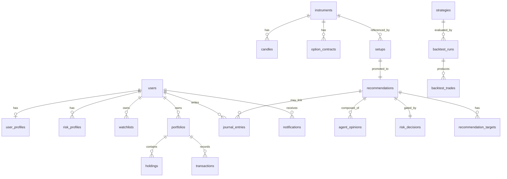

# 03 — Database Schema

**Engine:** PostgreSQL 16 with the **TimescaleDB** extension for time-series
tables (OHLCV candles, ticks, option-chain snapshots). Migrations managed with
**Alembic**. Money is stored as `NUMERIC(18,4)` (never floats). All timestamps
are `TIMESTAMPTZ`, stored UTC, rendered IST in the app.

## 1. Schema Organization

Logical groups (implemented as Postgres schemas or table prefixes):

| Group | Concern |
|-------|---------|
| `identity` | users, auth, sessions, profiles |
| `market` | instruments, candles, quotes, option chains, indices |
| `signals` | scans, setups, recommendations, agent opinions |
| `risk` | risk profiles, limits, position sizing decisions |
| `portfolio` | holdings, transactions, watchlists |
| `journal` | trade journal entries and outcomes |
| `backtest` | strategies, runs, results |
| `ops` | notifications, audit log, feature flags |

## 2. Entity-Relationship Overview



## 3. Core Tables

### 3.1 Identity

```sql
-- users
CREATE TABLE users (
    id              UUID PRIMARY KEY DEFAULT gen_random_uuid(),
    email           CITEXT UNIQUE NOT NULL,
    password_hash   TEXT NOT NULL,
    role            TEXT NOT NULL DEFAULT 'user'      -- user | admin
                    CHECK (role IN ('user','admin')),
    status          TEXT NOT NULL DEFAULT 'active'
                    CHECK (status IN ('active','suspended','pending')),
    mfa_enabled     BOOLEAN NOT NULL DEFAULT false,
    created_at      TIMESTAMPTZ NOT NULL DEFAULT now(),
    updated_at      TIMESTAMPTZ NOT NULL DEFAULT now()
);

-- user_profiles
CREATE TABLE user_profiles (
    user_id             UUID PRIMARY KEY REFERENCES users(id) ON DELETE CASCADE,
    display_name        TEXT,
    trading_capital     NUMERIC(18,4) NOT NULL DEFAULT 0,
    experience_level    TEXT CHECK (experience_level IN
                        ('beginner','intermediate','advanced','pro')),
    preferred_segments  TEXT[] NOT NULL DEFAULT '{}',  -- intraday, swing, options…
    timezone            TEXT NOT NULL DEFAULT 'Asia/Kolkata',
    notification_prefs  JSONB NOT NULL DEFAULT '{}',
    updated_at          TIMESTAMPTZ NOT NULL DEFAULT now()
);

-- refresh_tokens (rotating)
CREATE TABLE refresh_tokens (
    id          UUID PRIMARY KEY DEFAULT gen_random_uuid(),
    user_id     UUID NOT NULL REFERENCES users(id) ON DELETE CASCADE,
    token_hash  TEXT NOT NULL,
    expires_at  TIMESTAMPTZ NOT NULL,
    revoked_at  TIMESTAMPTZ,
    created_at  TIMESTAMPTZ NOT NULL DEFAULT now()
);
CREATE INDEX idx_refresh_user ON refresh_tokens(user_id) WHERE revoked_at IS NULL;
```

### 3.2 Market data

```sql
-- instruments: the master security list (equities, indices, F&O underlyings)
CREATE TABLE instruments (
    id              BIGSERIAL PRIMARY KEY,
    symbol          TEXT NOT NULL,             -- e.g. RELIANCE, NIFTY, BANKNIFTY
    exchange        TEXT NOT NULL,             -- NSE, BSE, NFO
    instrument_type TEXT NOT NULL,             -- EQ, INDEX, FUT, CE, PE
    lot_size        INTEGER,
    tick_size       NUMERIC(10,4),
    isin            TEXT,
    sector          TEXT,
    in_fno          BOOLEAN NOT NULL DEFAULT false,
    in_nifty500     BOOLEAN NOT NULL DEFAULT false,
    is_active       BOOLEAN NOT NULL DEFAULT true,
    metadata        JSONB NOT NULL DEFAULT '{}',
    UNIQUE (symbol, exchange, instrument_type)
);
CREATE INDEX idx_instruments_fno ON instruments(in_fno) WHERE in_fno;

-- candles: OHLCV time-series (TimescaleDB hypertable)
CREATE TABLE candles (
    instrument_id   BIGINT NOT NULL REFERENCES instruments(id),
    timeframe       TEXT NOT NULL,             -- 1m,5m,15m,1h,1d
    ts              TIMESTAMPTZ NOT NULL,
    open            NUMERIC(18,4) NOT NULL,
    high            NUMERIC(18,4) NOT NULL,
    low             NUMERIC(18,4) NOT NULL,
    close           NUMERIC(18,4) NOT NULL,
    volume          BIGINT NOT NULL DEFAULT 0,
    PRIMARY KEY (instrument_id, timeframe, ts)
);
SELECT create_hypertable('candles', 'ts', chunk_time_interval => INTERVAL '7 days');

-- option_contracts + option_chain_snapshots
CREATE TABLE option_contracts (
    id              BIGSERIAL PRIMARY KEY,
    underlying_id   BIGINT NOT NULL REFERENCES instruments(id),
    expiry          DATE NOT NULL,
    strike          NUMERIC(18,4) NOT NULL,
    option_type     TEXT NOT NULL CHECK (option_type IN ('CE','PE')),
    lot_size        INTEGER NOT NULL,
    UNIQUE (underlying_id, expiry, strike, option_type)
);

CREATE TABLE option_chain_snapshots (
    contract_id     BIGINT NOT NULL REFERENCES option_contracts(id),
    ts              TIMESTAMPTZ NOT NULL,
    ltp             NUMERIC(18,4),
    oi              BIGINT,
    oi_change       BIGINT,
    volume          BIGINT,
    iv              NUMERIC(10,4),
    delta           NUMERIC(10,6),
    theta           NUMERIC(10,6),
    gamma           NUMERIC(10,6),
    vega            NUMERIC(10,6),
    PRIMARY KEY (contract_id, ts)
);
SELECT create_hypertable('option_chain_snapshots','ts',
    chunk_time_interval => INTERVAL '1 day');

-- market_indicators: precomputed per instrument/timeframe (latest + history)
CREATE TABLE market_indicators (
    instrument_id   BIGINT NOT NULL REFERENCES instruments(id),
    timeframe       TEXT NOT NULL,
    ts              TIMESTAMPTZ NOT NULL,
    ema_9           NUMERIC(18,4),
    ema_21          NUMERIC(18,4),
    ema_50          NUMERIC(18,4),
    ema_200         NUMERIC(18,4),
    rsi_14          NUMERIC(10,4),
    macd            NUMERIC(18,6),
    macd_signal     NUMERIC(18,6),
    atr_14          NUMERIC(18,4),
    vwap            NUMERIC(18,4),
    supertrend      NUMERIC(18,4),
    supertrend_dir  SMALLINT,                  -- 1 up, -1 down
    PRIMARY KEY (instrument_id, timeframe, ts)
);
SELECT create_hypertable('market_indicators','ts',
    chunk_time_interval => INTERVAL '7 days');
```

### 3.3 Signals — scans, setups, recommendations

```sql
-- scan_runs: one row per scanner tick
CREATE TABLE scan_runs (
    id              UUID PRIMARY KEY DEFAULT gen_random_uuid(),
    universe        TEXT NOT NULL,             -- nifty500, fno, indices…
    started_at      TIMESTAMPTZ NOT NULL DEFAULT now(),
    finished_at     TIMESTAMPTZ,
    instruments_scanned INTEGER,
    setups_found    INTEGER,
    status          TEXT NOT NULL DEFAULT 'running'
);

-- setups: deterministic strategy candidates (pre-AI, pre-risk)
CREATE TABLE setups (
    id              UUID PRIMARY KEY DEFAULT gen_random_uuid(),
    scan_run_id     UUID REFERENCES scan_runs(id),
    instrument_id   BIGINT NOT NULL REFERENCES instruments(id),
    strategy_name   TEXT NOT NULL,
    trade_type      TEXT NOT NULL,             -- intraday, swing, options
    direction       TEXT NOT NULL CHECK (direction IN ('long','short')),
    bar_ts          TIMESTAMPTZ NOT NULL,      -- bar that triggered it (idempotency)
    features        JSONB NOT NULL DEFAULT '{}',
    created_at      TIMESTAMPTZ NOT NULL DEFAULT now(),
    UNIQUE (instrument_id, strategy_name, bar_ts)   -- idempotency key
);

-- recommendations: AI-fused, risk-gated, user-facing output
CREATE TABLE recommendations (
    id                  UUID PRIMARY KEY DEFAULT gen_random_uuid(),
    setup_id            UUID REFERENCES setups(id),
    instrument_id       BIGINT NOT NULL REFERENCES instruments(id),
    trade_type          TEXT NOT NULL,
    direction           TEXT NOT NULL,
    strategy_name       TEXT NOT NULL,
    confidence          SMALLINT NOT NULL CHECK (confidence BETWEEN 0 AND 100),
    rank                INTEGER,
    entry               NUMERIC(18,4) NOT NULL,
    stop_loss           NUMERIC(18,4) NOT NULL,
    risk_reward         NUMERIC(10,4) NOT NULL,
    position_size       INTEGER NOT NULL,       -- qty / lots
    max_capital_alloc   NUMERIC(18,4) NOT NULL,
    expected_risk       NUMERIC(18,4) NOT NULL, -- max loss in ₹
    market_context      TEXT NOT NULL,
    technical_reasoning TEXT NOT NULL,
    risk_factors        TEXT NOT NULL,
    invalidation        TEXT NOT NULL,          -- invalidation conditions
    status              TEXT NOT NULL DEFAULT 'active'
                        CHECK (status IN ('active','invalidated','expired','acted')),
    valid_until         TIMESTAMPTZ,
    created_at          TIMESTAMPTZ NOT NULL DEFAULT now()
);
CREATE INDEX idx_recs_active ON recommendations(status, created_at DESC)
    WHERE status = 'active';

-- recommendation_targets: T1/T2/T3 (multiple targets per rec)
CREATE TABLE recommendation_targets (
    id              BIGSERIAL PRIMARY KEY,
    recommendation_id UUID NOT NULL REFERENCES recommendations(id) ON DELETE CASCADE,
    label           TEXT NOT NULL,             -- T1, T2, T3
    price           NUMERIC(18,4) NOT NULL,
    rr_at_target    NUMERIC(10,4),
    allocation_pct  NUMERIC(6,3)               -- suggested partial exit %
);

-- agent_opinions: each specialist agent's contribution (explainability/audit)
CREATE TABLE agent_opinions (
    id              BIGSERIAL PRIMARY KEY,
    recommendation_id UUID NOT NULL REFERENCES recommendations(id) ON DELETE CASCADE,
    agent_name      TEXT NOT NULL,             -- technical, options, risk…
    stance          TEXT NOT NULL,             -- bullish, bearish, neutral, veto
    score           SMALLINT,                  -- 0-100 agent conviction
    weight          NUMERIC(6,3),              -- fusion weight applied
    rationale       TEXT NOT NULL,
    raw_output      JSONB                      -- full structured agent payload
);
```

### 3.4 Risk

```sql
CREATE TABLE risk_profiles (
    id                      UUID PRIMARY KEY DEFAULT gen_random_uuid(),
    user_id                 UUID NOT NULL REFERENCES users(id) ON DELETE CASCADE,
    max_risk_per_trade_pct  NUMERIC(6,3) NOT NULL DEFAULT 1.0,   -- % of capital
    max_daily_loss_pct      NUMERIC(6,3) NOT NULL DEFAULT 3.0,
    max_open_positions      INTEGER NOT NULL DEFAULT 5,
    max_capital_per_trade_pct NUMERIC(6,3) NOT NULL DEFAULT 20.0,
    max_sector_exposure_pct NUMERIC(6,3) NOT NULL DEFAULT 30.0,
    allow_shorts            BOOLEAN NOT NULL DEFAULT true,
    is_active               BOOLEAN NOT NULL DEFAULT true,
    updated_at              TIMESTAMPTZ NOT NULL DEFAULT now()
);

-- risk_decisions: immutable audit of the terminal gate for each recommendation
CREATE TABLE risk_decisions (
    id                  UUID PRIMARY KEY DEFAULT gen_random_uuid(),
    recommendation_id   UUID REFERENCES recommendations(id),
    setup_id            UUID REFERENCES setups(id),
    user_id             UUID REFERENCES users(id),
    decision            TEXT NOT NULL CHECK (decision IN ('pass','reject')),
    reason_codes        TEXT[] NOT NULL DEFAULT '{}',
    computed_size       INTEGER,
    risk_amount         NUMERIC(18,4),
    checks              JSONB NOT NULL,        -- each limit + pass/fail
    created_at          TIMESTAMPTZ NOT NULL DEFAULT now()
);
```

### 3.5 Portfolio

```sql
CREATE TABLE portfolios (
    id          UUID PRIMARY KEY DEFAULT gen_random_uuid(),
    user_id     UUID NOT NULL REFERENCES users(id) ON DELETE CASCADE,
    name        TEXT NOT NULL DEFAULT 'Main',
    base_capital NUMERIC(18,4) NOT NULL DEFAULT 0,
    created_at  TIMESTAMPTZ NOT NULL DEFAULT now()
);

CREATE TABLE holdings (
    id              BIGSERIAL PRIMARY KEY,
    portfolio_id    UUID NOT NULL REFERENCES portfolios(id) ON DELETE CASCADE,
    instrument_id   BIGINT NOT NULL REFERENCES instruments(id),
    quantity        NUMERIC(18,4) NOT NULL,
    avg_price       NUMERIC(18,4) NOT NULL,
    opened_at       TIMESTAMPTZ NOT NULL DEFAULT now(),
    UNIQUE (portfolio_id, instrument_id)
);

CREATE TABLE transactions (
    id              BIGSERIAL PRIMARY KEY,
    portfolio_id    UUID NOT NULL REFERENCES portfolios(id) ON DELETE CASCADE,
    instrument_id   BIGINT NOT NULL REFERENCES instruments(id),
    side            TEXT NOT NULL CHECK (side IN ('buy','sell')),
    quantity        NUMERIC(18,4) NOT NULL,
    price           NUMERIC(18,4) NOT NULL,
    fees            NUMERIC(18,4) NOT NULL DEFAULT 0,
    executed_at     TIMESTAMPTZ NOT NULL,
    source          TEXT,                      -- manual, import, recommendation
    recommendation_id UUID REFERENCES recommendations(id)
);

CREATE TABLE watchlists (
    id          UUID PRIMARY KEY DEFAULT gen_random_uuid(),
    user_id     UUID NOT NULL REFERENCES users(id) ON DELETE CASCADE,
    name        TEXT NOT NULL
);
CREATE TABLE watchlist_items (
    watchlist_id    UUID NOT NULL REFERENCES watchlists(id) ON DELETE CASCADE,
    instrument_id   BIGINT NOT NULL REFERENCES instruments(id),
    added_at        TIMESTAMPTZ NOT NULL DEFAULT now(),
    PRIMARY KEY (watchlist_id, instrument_id)
);
```

### 3.6 Journal

```sql
CREATE TABLE journal_entries (
    id                  UUID PRIMARY KEY DEFAULT gen_random_uuid(),
    user_id             UUID NOT NULL REFERENCES users(id) ON DELETE CASCADE,
    recommendation_id   UUID REFERENCES recommendations(id),
    instrument_id       BIGINT REFERENCES instruments(id),
    trade_type          TEXT,
    direction           TEXT,
    entry_price         NUMERIC(18,4),
    exit_price          NUMERIC(18,4),
    quantity            NUMERIC(18,4),
    pnl                 NUMERIC(18,4),
    r_multiple          NUMERIC(10,4),         -- outcome in R
    emotional_state     TEXT,                  -- for psychology analytics
    followed_plan       BOOLEAN,
    notes               TEXT,
    opened_at           TIMESTAMPTZ,
    closed_at           TIMESTAMPTZ,
    created_at          TIMESTAMPTZ NOT NULL DEFAULT now()
);
```

### 3.7 Backtesting

```sql
CREATE TABLE strategies (
    id          UUID PRIMARY KEY DEFAULT gen_random_uuid(),
    name        TEXT UNIQUE NOT NULL,
    version     TEXT NOT NULL DEFAULT '1',
    params      JSONB NOT NULL DEFAULT '{}',
    description TEXT,
    created_at  TIMESTAMPTZ NOT NULL DEFAULT now()
);

CREATE TABLE backtest_runs (
    id              UUID PRIMARY KEY DEFAULT gen_random_uuid(),
    strategy_id     UUID NOT NULL REFERENCES strategies(id),
    user_id         UUID REFERENCES users(id),
    universe        TEXT NOT NULL,
    period_start    DATE NOT NULL,
    period_end      DATE NOT NULL,
    params          JSONB NOT NULL DEFAULT '{}',
    status          TEXT NOT NULL DEFAULT 'queued',
    metrics         JSONB,                     -- CAGR, sharpe, maxDD, winrate…
    artifact_url    TEXT,                      -- equity curve, trade log
    created_at      TIMESTAMPTZ NOT NULL DEFAULT now()
);

CREATE TABLE backtest_trades (
    id              BIGSERIAL PRIMARY KEY,
    run_id          UUID NOT NULL REFERENCES backtest_runs(id) ON DELETE CASCADE,
    instrument_id   BIGINT REFERENCES instruments(id),
    direction       TEXT,
    entry_ts        TIMESTAMPTZ,
    entry_price     NUMERIC(18,4),
    exit_ts         TIMESTAMPTZ,
    exit_price      NUMERIC(18,4),
    pnl             NUMERIC(18,4),
    r_multiple      NUMERIC(10,4)
);
```

### 3.8 Ops — notifications, audit, flags

```sql
CREATE TABLE notifications (
    id          UUID PRIMARY KEY DEFAULT gen_random_uuid(),
    user_id     UUID NOT NULL REFERENCES users(id) ON DELETE CASCADE,
    type        TEXT NOT NULL,                 -- recommendation, alert, system
    channel     TEXT NOT NULL,                 -- inapp, email, telegram, push
    payload     JSONB NOT NULL,
    status      TEXT NOT NULL DEFAULT 'pending',
    read_at     TIMESTAMPTZ,
    created_at  TIMESTAMPTZ NOT NULL DEFAULT now()
);
CREATE INDEX idx_notif_user_unread ON notifications(user_id)
    WHERE read_at IS NULL;

-- audit_log: append-only, immutable trail of significant actions
CREATE TABLE audit_log (
    id          BIGSERIAL PRIMARY KEY,
    actor_id    UUID,                          -- user or 'system'
    action      TEXT NOT NULL,
    entity_type TEXT NOT NULL,
    entity_id   TEXT,
    correlation_id TEXT,
    payload     JSONB,
    created_at  TIMESTAMPTZ NOT NULL DEFAULT now()
);
CREATE INDEX idx_audit_entity ON audit_log(entity_type, entity_id);

CREATE TABLE feature_flags (
    key         TEXT PRIMARY KEY,
    enabled     BOOLEAN NOT NULL DEFAULT false,
    rollout     JSONB NOT NULL DEFAULT '{}',
    updated_at  TIMESTAMPTZ NOT NULL DEFAULT now()
);
```

## 4. Indexing & Retention Strategy

| Concern | Strategy |
|---------|----------|
| Time-series scale | TimescaleDB hypertables + chunk intervals sized per timeframe |
| Rollups | Continuous aggregates for higher timeframes from 1m base candles |
| Hot queries | Partial indexes on `status='active'`, `read_at IS NULL` |
| Retention | Raw ticks/1m: 6–12 months; daily candles: indefinite; snapshots compressed after 7 days |
| Compression | TimescaleDB native compression on chunks older than 7 days |

## 5. Data Integrity Rules

- **Idempotency:** `setups (instrument_id, strategy_name, bar_ts)` unique — a bar
  can only ever produce one setup per strategy.
- **Immutable audit:** `risk_decisions` and `audit_log` are append-only (enforced
  by revoked UPDATE/DELETE grants in production).
- **Money:** always `NUMERIC`, never `FLOAT`.
- **Soft references:** recommendations retain denormalized fields (entry, stop)
  so historical records stay meaningful even if a strategy changes.
