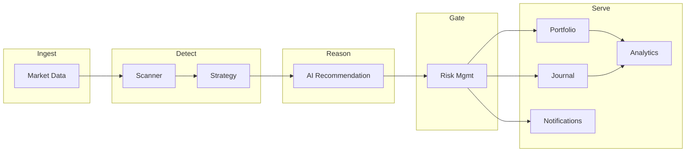
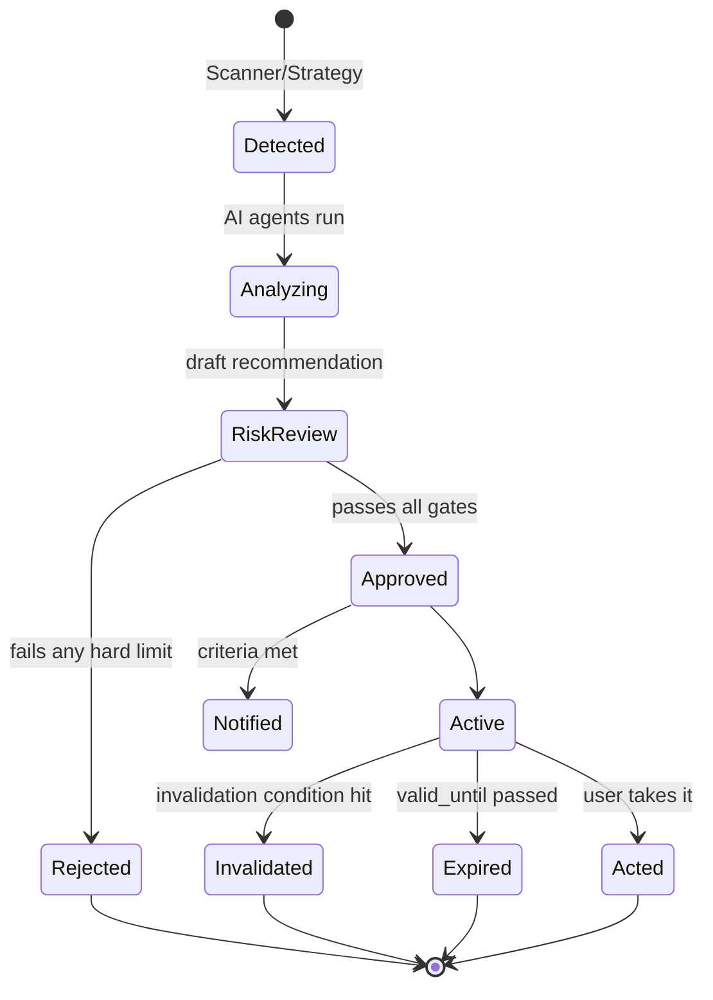

# 05 — Service Architecture

This document defines the internal service/module boundaries, how they collaborate,
and the engineering patterns (Clean Architecture, SOLID, DI) that keep each module
independently maintainable.

## 1. Layered Model (per module)

Every module is structured in four layers with dependencies pointing inward:

```
        ┌──────────────────────────────────────────┐
        │  api/           (FastAPI routers, DTOs)   │  ← delivery
        ├──────────────────────────────────────────┤
        │  application/   (use cases, services)     │  ← orchestration
        ├──────────────────────────────────────────┤
        │  domain/        (entities, VOs, ports)    │  ← business core
        ├──────────────────────────────────────────┤
        │  infrastructure/(repos, adapters, LLM,    │  ← details
        │                  redis, http clients)     │
        └──────────────────────────────────────────┘
```

- **domain/** — pure Python. Entities, value objects, and **ports** (abstract
  interfaces). No framework imports. Fully unit-testable.
- **application/** — use cases that coordinate domain objects and ports to fulfill
  a request. Transaction boundaries live here (Unit of Work).
- **infrastructure/** — concrete adapters implementing the ports: SQLAlchemy
  repositories, Redis clients, external market-data clients, LLM clients.
- **api/** — thin. Translates HTTP ↔ application use cases. No business logic.

**Dependency Inversion:** application depends on `domain` ports; infrastructure
*implements* them. The DI container wires concrete adapters at startup, so a
module can be tested with fakes and later re-pointed at a different provider or
extracted into its own service.

## 2. Dependency Injection

A lightweight DI container (`app/core/di.py`) provides:
- **Singletons:** settings, DB engine, Redis pool, LLM client.
- **Scoped:** DB session / Unit of Work per request.
- **Providers:** each use case declares its port dependencies; the container
  resolves the configured implementation.

FastAPI's `Depends` is used at the edge; deeper wiring uses explicit constructor
injection (no service locators inside the domain).

## 3. Module Catalog & Responsibilities



| Module | Owns | Depends on (ports) | Exposes |
|--------|------|--------------------|---------|
| **Market Data** | Instrument master, quotes, candles, option chains, indicator compute | External data provider client, Redis, DB | Snapshot cache, candle/indicator reads |
| **Scanner** | Universe definitions, filtering, indicator screening | Market Data (read), Redis | Setups (candidates) |
| **Strategy** | Deterministic strategy rules → qualified setups | Scanner output, indicators | Qualified setups + features |
| **AI Recommendation** | Agent execution + fusion + ranking | Strategy setups, LLM client, Market Data | Draft recommendations |
| **Risk Mgmt** | Sizing, limit checks, **terminal gate**, invalidation | Portfolio (exposure), Risk profiles | Pass/reject + sized recommendation |
| **Portfolio** | Holdings, transactions, exposure, P&L | Market Data (marks), DB | Exposure, P&L |
| **Journal** | Trade logging, outcomes | Recommendations, Portfolio | Journal entries |
| **Backtesting** | Historical simulation | Strategy, Market Data (history) | Runs, metrics |
| **Notifications** | Criteria eval, channel dispatch | Risk output, user prefs, n8n | Alerts |
| **Analytics** | Performance, attribution, behavior | Journal, Portfolio, Recs | Reports |
| **Admin** | User mgmt, flags, agent config | All (read/admin) | Admin ops |
| **Auth / Users** | Identity, JWT, RBAC, profiles | DB, Redis | Tokens, principals |

## 4. Inter-Module Communication

Two mechanisms, chosen deliberately:

| Type | Mechanism | Used for |
|------|-----------|----------|
| **Synchronous** | Direct in-process call through the module's **application service interface** | Request-path reads and quick writes |
| **Asynchronous** | **Domain events on Redis pub/sub + Celery tasks** | Pipeline stages (scan→strategy→AI→risk), notifications, backtests |

Modules never reach into another module's repositories or tables directly — only
through its published application interface or via events. This is what preserves
the "independently maintainable / extractable" property.

### Domain events (examples)

| Event | Emitted by | Consumed by |
|-------|-----------|-------------|
| `MarketSnapshotUpdated` | Market Data | Scanner |
| `SetupDetected` | Strategy | AI Recommendation |
| `RecommendationDrafted` | AI Recommendation | Risk Mgmt |
| `RecommendationApproved` | Risk Mgmt | Notifications, Portfolio, Analytics |
| `RecommendationRejected` | Risk Mgmt | Analytics (learning loop) |
| `TradeJournaled` | Journal | Analytics |

## 5. The Pipeline as a State Machine

A setup progresses through explicit states; every transition is logged for audit.



## 6. Worker & Scheduling Model

- **Celery Beat** schedules scans **only during NSE trading windows** (uses
  `shared/market_calendar`): pre-open, regular session, and a post-close EOD job.
- Task queues are segregated: `scan`, `ai`, `backtest`, `notify` — each with its
  own worker pool so a slow LLM call never starves the scanner.
- Long/expensive work (backtests) runs on a low-priority queue.

| Queue | Concurrency model | Notes |
|-------|-------------------|-------|
| `scan` | Many light workers | CPU-bound indicator math, short tasks |
| `ai` | Few workers, high timeout | LLM latency; bounded parallel agents |
| `backtest` | Batch workers | Off-hours friendly |
| `notify` | Light | Hands off to n8n |

## 7. Error Handling & Resilience

| Pattern | Where |
|---------|-------|
| **Circuit breaker** | Around external market-data and LLM clients |
| **Retry with backoff + jitter** | Transient provider failures |
| **Timeouts everywhere** | No unbounded external calls |
| **Graceful degradation** | If LLM agents fail, fall back to deterministic Strategy+Risk output (clearly labeled "reduced-AI") rather than nothing |
| **Dead-letter queue** | Failed tasks parked for inspection |
| **Bulkheads** | Separate worker pools/queues isolate failures |

> Degradation rule: the system may drop AI enrichment, but it will **never** drop
> risk gating. A recommendation without a passed risk check is never shown.

## 8. Testing Strategy per Layer

| Layer | Test type | Notes |
|-------|-----------|-------|
| `domain` | Pure unit tests | Fast, no I/O; indicators have golden-value tests |
| `application` | Use-case tests with fake ports | Verifies orchestration + transactions |
| `infrastructure` | Integration tests (real Postgres/Redis via testcontainers) | Repos, adapters |
| `api` | Contract tests vs OpenAPI | Ensures response shape/fields (esp. recommendation completeness) |
| pipeline | End-to-end scenario tests | Seeded market → expected recommendation |
| backtest | Regression tests | Strategy metrics locked to golden results |

## 9. Configuration & Feature Flags

- Typed settings via Pydantic `Settings`, loaded from env per environment.
- **Feature flags** gate risky features (new agents, new strategies) and enable
  safe incremental rollout — aligned with the "validate each stage" principle.
- Agent enable/disable and fusion weights are **runtime-configurable** via Admin,
  not hardcoded — so the AI panel can be tuned without redeploys.

## 10. Extraction Path (monolith → services)

When load demands it, these are the first extractions, in order, each already
isolated behind a port + event interface:

1. **Market Data Service** (highest throughput, external I/O heavy).
2. **AI Recommendation Service** (LLM cost/latency isolation, independent scaling).
3. **Scanner Service** (CPU-bound bursts).

No consumer code changes on extraction — only the transport behind the port
(in-process call → RPC/HTTP) changes.
