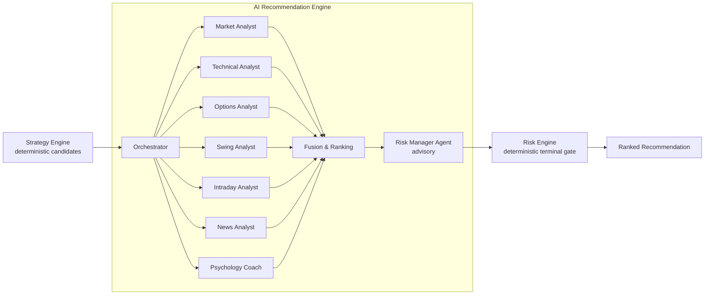
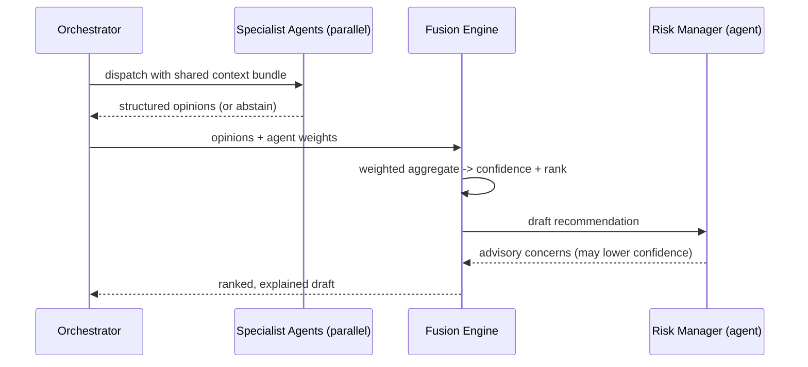
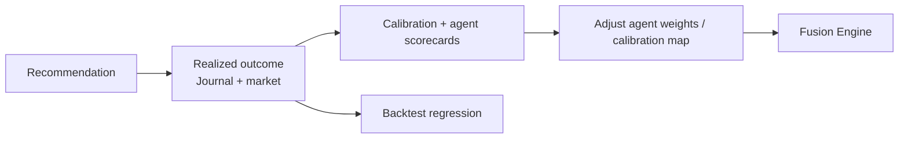

# 06 — AI Agent System

## 1. Philosophy

The AI is a **panel of specialists**, not a single oracle. Each agent has a narrow
mandate, produces a **structured, scored, explainable opinion**, and an
**orchestrator fuses these into one ranked recommendation**. This design:

- makes reasoning **auditable** (each agent's contribution is stored);
- lets us **weight, disable, or A/B** individual agents without touching the rest;
- keeps the **deterministic quant core in charge of numbers** (entry, stop, size)
  while the LLM handles judgement, synthesis, and explanation.

> **Hard boundary:** LLM agents *interpret and explain*. They never invent prices,
> never compute position size, and never override the Risk Engine. All numeric
> trade parameters come from deterministic code; the Risk Engine has final veto.

## 2. Where AI Sits in the Pipeline



Deterministic candidates come *first*; agents enrich only what already passed
objective strategy rules. This keeps LLM cost bounded and grounds every agent in
real, precomputed features.

## 3. Agent Roster

| Agent | Mandate | Key inputs | Output |
|-------|---------|-----------|--------|
| **Market Analyst** | Overall regime, index trend, breadth, macro backdrop | Indices, VIX, breadth, sector rotation | Regime label + directional bias + confidence |
| **Technical Analyst** | Price structure, indicators, patterns for the instrument | Candles, EMA/RSI/MACD/ATR/VWAP/Supertrend | Setup quality, key levels, stance |
| **Options Analyst** | Option-chain read, strategy selection, greeks/IV | Option chain, OI, IV, greeks | Suggested option structure, OI signal |
| **Swing Analyst** | Multi-day setup validity, sector context | Daily candles, sector rotation | Swing viability, holding horizon |
| **Intraday Analyst** | Session structure, VWAP, momentum, liquidity | Intraday candles, VWAP, volume | Intraday timing, entry window |
| **News Analyst** | Catalysts, event risk, sentiment, blackout windows | News/sentiment feed, earnings calendar | Catalyst/risk flags, event blackout |
| **Psychology Coach** | Behavioral guardrails, tilt detection, discipline | Journal, recent P&L, streaks | Behavioral cautions, position on FOMO |
| **Risk Manager (agent)** | *Advisory* risk read before the hard gate | Draft rec, exposure | Concerns, suggested trims (advisory) |
| **Portfolio Manager (agent)** | Correlation, concentration vs existing book | Holdings, exposure | Fit/conflict with current portfolio |

Each agent returns a **strict JSON contract** validated with Pydantic:

```json
{
  "agent": "technical",
  "stance": "bullish",            // bullish | bearish | neutral | veto
  "score": 76,                    // 0-100 conviction
  "key_points": ["Pullback to rising 21-EMA", "Supertrend bullish on 1h"],
  "risks": ["RSI approaching 70 on lower TF"],
  "confidence_in_self": 0.7,      // agent's calibrated self-uncertainty
  "features_used": ["ema_21","supertrend","vwap"]
}
```

Invalid/malformed agent output is discarded (that agent abstains); it never
corrupts the fusion.

## 4. Orchestration & Fusion



### Fusion rules
1. **Relevance gating:** only agents relevant to the `trade_type` contribute
   (e.g. Options Analyst weighted ~0 for a pure equity swing).
2. **Weighted confidence:** `confidence = Σ(weight_i × score_i) / Σ(weight_i)`,
   weights runtime-configurable per agent via Admin.
3. **Veto handling:** a `veto` from Risk Manager or News Analyst (e.g. earnings
   blackout) **caps or zeroes** confidence — it can only lower, never raise.
4. **Disagreement penalty:** high variance across agents reduces confidence and is
   surfaced in the explanation ("analysts disagree on…"). Honesty about
   uncertainty is a product requirement.
5. **Calibration:** raw scores pass through a calibration map (fit on historical
   outcomes via the Journal/Backtest loop) so "78" means roughly a 78%-context
   setup, not marketing.
6. **Ranking:** approved drafts are ranked by `confidence × expected RR`, then
   deduplicated per instrument.

## 5. Explainability (first-class)

Every recommendation persists:
- each agent's full structured opinion (`agent_opinions` table),
- the fusion weights applied,
- the final synthesized `market_context`, `technical_reasoning`, `risk_factors`,
  and `invalidation` narrative.

The `/recommendations/{id}/explanation` endpoint returns the agent-by-agent
breakdown so the user can see *why* — and *who dissented*.

## 6. Prompting & Grounding

| Concern | Approach |
|---------|----------|
| **Grounding** | Agents receive a compact, precomputed **feature bundle** (numbers already calculated by the quant core) — not raw price history. They interpret facts; they don't do arithmetic. |
| **Structured output** | Enforced JSON schema per agent (Pydantic-validated, retried once on parse failure, then abstain). |
| **Determinism** | Low temperature; the numeric trade plan is deterministic regardless. |
| **Prompt versioning** | Prompts are versioned assets under `ai_engine/orchestration`; changes are flagged and A/B-tested. |
| **Cost control** | Only strategy-qualified setups reach agents; agents run in parallel with per-call timeouts and a token budget. |
| **Model choice** | Model per agent is configurable; use the strongest models for synthesis/fusion, lighter models for routine reads. Default to the latest, most capable Claude models. |

## 7. The Learning Loop

The system improves without ever letting AI override risk:



- **Agent scorecards:** track each agent's hit-rate and calibration over time;
  under-performing agents get down-weighted (via Admin, reviewable).
- **Backtest regression:** strategy + fusion changes are validated on history
  before shipping — "validate each stage."
- Human-in-the-loop: weight changes are proposed automatically but **applied
  under review**, never silently.

## 8. Guardrails & Failure Modes

| Risk | Mitigation |
|------|------------|
| Hallucinated prices/levels | Agents forbidden from emitting trade numbers; numbers are deterministic |
| Overconfidence | Calibration + disagreement penalty + honest uncertainty display |
| LLM outage | Graceful degradation to deterministic Strategy+Risk output, labeled "reduced-AI" |
| Prompt injection via news text | News content sandboxed, treated as data, summarized defensively; never executed as instructions |
| Cost blowout | Setup pre-filtering, token budgets, caching of stable context |
| Silent drift | Prompt/version pinning + scorecards + regression gates in CI |

## 9. What the AI is *not*

- Not an autotrader (V1 executes nothing).
- Not a price predictor sold as certainty — it is a **calibrated, explainable
  ranker of setups that already passed objective rules and hard risk gates.**
