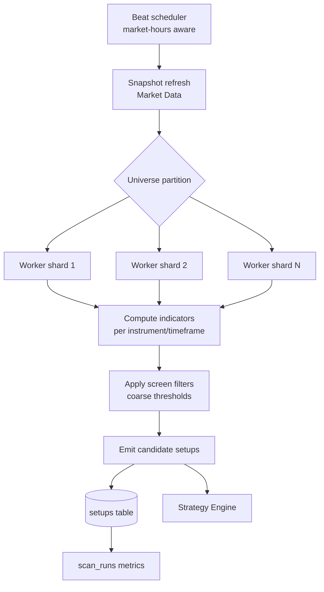

# 07 — Scanner Engine

## 1. Purpose

Continuously monitor the market during trading hours, compute indicators across
large universes, and emit **candidate setups** to the Strategy Engine. The scanner
is the "always-on eyes" of the platform — its job is breadth and speed; judgement
happens downstream.

## 2. Monitored Universes & Instruments

| Universe | Contents |
|----------|----------|
| Indices | Nifty, Bank Nifty, Sensex, India VIX |
| Nifty 500 | Broad equity universe |
| F&O stocks | Derivative-eligible equities |
| Derivatives | Nifty & Bank Nifty option chains, futures |

Universe membership is data-driven (`instruments.in_nifty500`, `in_fno`) and
refreshed from the instrument master (daily pre-open).

## 3. Signals Computed

| Category | Signals |
|----------|---------|
| Trend/MA | EMA (9/21/50/200), Supertrend |
| Momentum | RSI(14), MACD |
| Volatility | ATR(14), India VIX context |
| Volume/flow | Volume, relative volume, VWAP |
| Derivatives | Open Interest, OI change, IV, PCR |
| Market internals | Market breadth (adv/decl), sector rotation |

All indicator math lives in the pure, unit-tested `shared/indicators` package —
deterministic and provider-agnostic (golden-value tests guarantee correctness).

## 4. Pipeline



### Steps
1. **Schedule** — Celery Beat triggers scans on a cadence per timeframe (e.g. 1m
   for intraday hot list, 5m/15m for broad F&O, EOD for swing) only within NSE
   session windows.
2. **Snapshot** — Market Data publishes the latest normalized snapshot to Redis.
3. **Shard** — the universe is partitioned across scanner workers for parallelism.
4. **Compute** — indicators calculated (or read from precomputed
   `market_indicators`).
5. **Screen** — coarse, cheap filters reduce the universe to interesting names
   (e.g. price crossing VWAP + rising Supertrend + RVOL > 1.5).
6. **Emit** — surviving candidates become `setups`, idempotent per
   `(instrument, strategy, bar_ts)`.

## 5. Screening Configuration

Filters are **declarative and configurable** (via Admin, stored/feature-flagged),
so screens can be tuned without redeploys. Example (illustrative):

```yaml
screens:
  intraday_momentum:
    timeframe: 5m
    conditions:
      - rvol > 1.5
      - close > vwap
      - supertrend_dir == 1
      - rsi_14 between [55, 72]
    universe: fno
  swing_pullback:
    timeframe: 1d
    conditions:
      - close > ema_50
      - pullback_to: ema_21
      - supertrend_dir == 1
    universe: nifty500
  banknifty_oi_shift:
    timeframe: 5m
    conditions:
      - oi_change_pct > threshold
      - iv_regime: elevated
    universe: banknifty_options
```

The scanner's screens are **coarse and permissive** — precision belongs to the
Strategy Engine and the Risk gate. Over-filtering here would starve the pipeline;
the design favors recall now, precision later.

## 6. Performance Design

| Concern | Approach |
|---------|----------|
| Throughput | Universe sharded across workers on the `scan` queue |
| Latency target | Full F&O scan tick < 10 s (see [01](01-architecture.md) §8) |
| Recompute cost | Incremental — only the latest bar's indicators recomputed; history cached |
| Hot path | Latest snapshot served from Redis, not Postgres |
| Backpressure | If a tick overruns, skip-and-log rather than pile up (freshness > completeness) |
| Idempotency | `(instrument, strategy, bar_ts)` unique key prevents duplicate setups |

## 7. Market-Hours Awareness

The `shared/market_calendar` module encodes:
- NSE session windows (pre-open 09:00–09:15, regular 09:15–15:30 IST),
- trading holidays,
- special sessions.

Scans and beats consult it so no compute is wasted off-hours, and an EOD job runs
after close to prepare swing setups and daily rollups.

## 8. Outputs & Handoff

- **To Strategy Engine:** qualified candidate stream (in-process + `SetupDetected`
  event).
- **To storage:** `setups` + `scan_runs` (for analytics on scanner efficacy — how
  many setups survive to recommendations, false-positive rate).
- **To UI (Scanner page):** live setups via the WS `alerts`/scanner channel.

## 9. Observability

| Metric | Why |
|--------|-----|
| Scan duration per universe | Detect slowdowns/regressions |
| Instruments scanned / setups found | Screen efficacy & drift |
| Setup→recommendation conversion | Downstream quality |
| Skipped ticks (backpressure) | Capacity signal |
| Provider errors / circuit-breaker trips | Data reliability |

These feed Grafana dashboards and alerting (see [10](10-deployment.md)).
