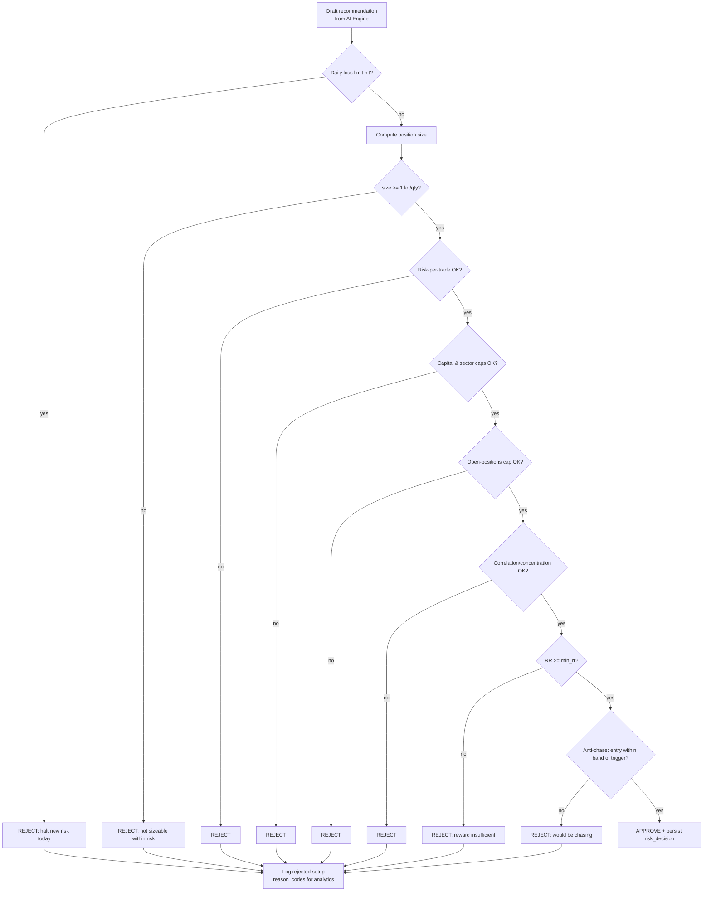

# 08 — Risk Management Engine

> The Risk Management Engine is the **terminal gate** of the recommendation
> pipeline. The AI can rank and explain, but a recommendation reaches the user
> **only if it passes every hard risk check.** This is the platform's most
> important promise.

## 1. Non-Negotiable Rules (from the founding brief)

1. **Never** recommend trades that exceed predefined risk limits.
2. **Never** increase exposure after losses (anti-martingale by default).
3. **Never** chase trades (entry must respect the setup, not momentum).
4. **Always** calculate position size.
5. **Always** calculate expected risk (max loss in ₹ and % of capital).
6. **Always** explain uncertainty.

Each rule maps to a concrete, testable check below.

## 2. Position Sizing

Sizing is deterministic and always computed **before** a recommendation is
surfaced. Default method: **fixed-fractional risk per trade**.

```
risk_per_unit   = |entry - stop_loss|
risk_budget_₹   = capital × (max_risk_per_trade_pct / 100)
raw_size        = floor(risk_budget_₹ / risk_per_unit)

# instrument constraints
size            = round_to_lot(raw_size, lot_size)      # F&O lots / equity qty
capital_used    = size × entry
expected_risk_₹ = size × risk_per_unit
```

Then a cascade of caps is applied (the tightest wins):

| Cap | Rule |
|-----|------|
| Risk-per-trade | `expected_risk_₹ ≤ capital × max_risk_per_trade_pct` |
| Capital-per-trade | `capital_used ≤ capital × max_capital_per_trade_pct` |
| Open positions | `open_positions < max_open_positions` |
| Sector exposure | `sector_exposure + capital_used ≤ capital × max_sector_exposure_pct` |
| Daily loss | `today_realized_loss < capital × max_daily_loss_pct` (else **halt new recs**) |
| Correlation | reject if highly correlated with an existing open position (concentration) |

If, after caps, `size == 0`, the setup is **rejected** (it cannot be taken within
risk limits) — it is never shown as an un-sizeable "idea."

## 3. The Hard Gate (decision flow)



Every decision — pass **or** reject — writes an immutable `risk_decisions` row
with the full `checks` JSON and `reason_codes`. This is the audit backbone.

## 4. Anti-Martingale & Loss-Aware Behavior

- **After a loss / drawdown:** the engine **reduces** allowable risk (or pauses),
  never increases it. Optional streak-based de-risking (e.g. after N consecutive
  losses, cut `max_risk_per_trade_pct` by a factor until a green day).
- **Daily loss circuit breaker:** once `today_realized_loss ≥ max_daily_loss_pct`,
  the engine halts *new* recommendations for the day and the UI states why.
- **No revenge trades:** the Psychology Coach agent's tilt signal can further
  tighten limits; risk only ratchets one direction — safer.

## 5. Anti-Chase Rule

A recommendation is rejected as "chasing" if the current price has already run too
far from the setup's trigger level (configurable band, e.g. > 0.5R beyond the
intended entry). The user is offered the *setup*, not a late entry.

## 6. Invalidation Conditions

Every recommendation carries explicit, machine-checkable invalidation conditions,
e.g.:
- price closes beyond the stop on the setup timeframe,
- the governing index breaks a key level,
- an event blackout begins (earnings/news, from News Analyst),
- `valid_until` elapses.

A background monitor evaluates active recommendations against live data and
transitions them to `invalidated`/`expired`, pushing a WS update so stale ideas
never linger on screen.

## 7. Expected Risk & Reward Transparency

Each recommendation always shows:
- **Expected risk**: max loss in ₹ and as % of capital.
- **Risk/Reward** at each target (T1/T2/T3) and blended.
- **Position size** and **max capital allocation**.
- **Uncertainty**: calibrated confidence + any analyst disagreement note.

## 8. Configurability & Safety

- Limits live in `risk_profiles` (per user), with sane, conservative defaults.
- Limits are **server-enforced** — never trusted from the client.
- Changes to risk limits are audit-logged.
- Risk logic is pure and deterministic in the `domain` layer → exhaustively
  unit-tested with boundary cases (exactly-at-limit, one-below, one-above).

## 9. Testing the Gate (must-pass suite)

| Scenario | Expected |
|----------|----------|
| Risk-per-trade exactly at limit | Pass |
| Risk-per-trade one paisa over | Reject `risk_limit_exceeded` |
| Size rounds to 0 lots | Reject `not_sizeable` |
| Daily loss limit already hit | Reject all new recs `daily_loss_halt` |
| Post-loss streak | Reduced size, never increased |
| Entry beyond chase band | Reject `chasing` |
| RR below minimum | Reject `insufficient_rr` |
| Sector cap breach | Reject `sector_concentration` |
| Correlated with open position | Reject `correlation_concentration` |

These are release-gating tests — the platform does not ship if the gate leaks.
