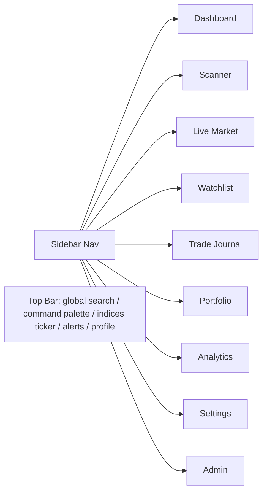

# 09 — Frontend & UI/UX

## 1. Design Language

**Professional, institutional, dark-first** — a trading terminal, not a consumer
app. Dense but legible, calm under fast-moving data, and honest about uncertainty.

| Principle | Expression |
|-----------|-----------|
| Information density | Compact tables, tiles, and panels; no wasted space |
| Calm under motion | Subtle transitions; numbers update in place, no jarring reflow |
| Trust through transparency | Every recommendation is expandable into its full reasoning |
| Dark theme default | Reduced eye strain for long sessions; light theme available |
| Responsive | Desktop-first (primary), tablet-capable, mobile for monitoring/alerts |
| Accessibility | WCAG AA contrast, keyboard nav, screen-reader labels on data |

### Visual system
- **Palette:** neutral charcoal base; **green = long/gain**, **red = short/loss**,
  amber = caution/uncertainty, blue = neutral/info. Color is never the *only*
  signal (icons/labels accompany it — accessibility).
- **Typography:** a clean sans for UI, tabular/monospaced figures for prices and
  P&L so digits align.
- **Components:** built on a Tailwind-based design system in `components/ui`.

## 2. Information Architecture



A persistent **top bar** shows a live indices ticker (Nifty, Bank Nifty, Sensex,
VIX), a global command palette (⌘K) for fast navigation/search, and the alerts
bell. A left **sidebar** holds primary navigation.

## 3. Pages & Wireframes

### 3.1 Dashboard — the cockpit
```
┌───────────────────────────────────────────────────────────────────────┐
│ Top bar:  NIFTY ▲0.42  BANKNIFTY ▼0.18  SENSEX ▲0.30  VIX 13.8   🔔 ⌘K │
├───────────────┬───────────────────────────────┬───────────────────────┤
│ Market Regime │  Top Recommendations (ranked) │  Portfolio Snapshot   │
│  Uptrend      │  #1 RELIANCE  swing  78% ▲    │  Equity ₹5.00L        │
│  Breadth +ve  │  #2 HDFCBANK  intra  71% ▲    │  Day P&L +₹2,340      │
│  VIX low      │  #3 NIFTY 24500CE opt 69%     │  Open 3 / Max 5       │
│               │  [expand → full reasoning]    │  Risk used 1.2%/3%    │
├───────────────┴───────────────────────────────┴───────────────────────┤
│ Live Alerts feed        │  Sector Rotation heatmap  │  Watchlist movers │
└─────────────────────────┴───────────────────────────┴───────────────────┘
```
- At-a-glance: market regime, ranked recommendations, portfolio & **risk budget
  used vs limit**, live alerts, sector rotation.

### 3.2 Scanner
```
┌ Filters: [Universe ▾][Type ▾][Timeframe ▾][Min confidence ▾]  [Save screen]┐
├────────────────────────────────────────────────────────────────────────────┤
│ Symbol   Type   Signal          RVOL  RSI  Supertrend  Setup        Age    │
│ TATAMOTORS EQ   VWAP reclaim    2.1   61   ▲           Momentum     2m     │
│ NIFTY-FUT  FUT  OI build long   1.4   58   ▲           Trend cont.  5m     │
│ …live-updating rows; click → detail drawer with mini-chart + agent notes   │
└────────────────────────────────────────────────────────────────────────────┘
```
- Live-updating table of candidate setups; saved screens; row → detail drawer.

### 3.3 Live Market
- Full **TradingView** chart (advanced charts) with the platform's indicators
  overlaid; option-chain panel for indices; index/VIX widgets; depth/volume.

### 3.4 Watchlist
- User-defined lists; live quotes, mini-sparklines, quick-add to journal, alert
  toggles per instrument.

### 3.5 Recommendation Detail (drawer/page — the trust surface)
```
┌ RELIANCE — Swing — LONG                              Confidence 78%  Rank #2 ┐
│ Entry 2915  •  Stop 2872  •  RR 2.4  •  Size 34  •  Max alloc ₹99,110       │
│ Targets: T1 2975 (40%)  T2 3020 (35%)  T3 3080 (25%)                        │
│ Expected risk: ₹1,462 (0.29% of capital)                                    │
├─────────────────────────────────────────────────────────────────────────────┤
│ Market context   │ Nifty uptrend, energy leading, breadth +ve               │
│ Technical        │ Pullback to rising 21-EMA, Supertrend bullish 1h…        │
│ Risk factors     │ Earnings in 6 sessions; IV elevated                      │
│ Invalidation     │ 15m close < 2872, or Nifty breaks day low                │
├─────────────────────────────────────────────────────────────────────────────┤
│ Analyst panel (who said what)                                               │
│  Technical  ▲76   Options n/a   Intraday ▲70   News ⚠ event   Risk ✓ passed │
│  [disagreement note if any]                                                 │
├─────────────────────────────────────────────────────────────────────────────┤
│ [ Add to Journal ]   [ Dismiss ]                                            │
└─────────────────────────────────────────────────────────────────────────────┘
```
- **This is the core screen.** It renders every required field and the
  agent-by-agent breakdown. No hidden reasoning.

### 3.6 Trade Journal
- Log/track trades (auto-draft from acted recommendations); outcome, R-multiple,
  emotional state, "followed plan?" — feeds Analytics behavioral insights.

### 3.7 Portfolio
- Holdings, live P&L, exposure vs limits (visualized as gauges), sector
  allocation, correlation heatmap, transaction ledger, statement import.

### 3.8 Analytics
- Equity curve, win rate, expectancy, profit factor, max drawdown; attribution by
  strategy/segment/sector; **behavioral** insights (plan adherence, tilt, best/worst
  times of day).

### 3.9 Settings
- Profile & capital, **risk profile editor** (limits with live "what this means"
  preview), notification channels, theme, connected data sources.

### 3.10 Admin
- User management, feature flags, **agent configuration** (enable/disable, weights,
  model per agent), scanner screen tuning, system health.

## 4. Real-Time UX

| Mechanism | Use |
|-----------|-----|
| WebSocket | Live quotes, new/invalidated recommendations, alerts, P&L |
| Optimistic UI | Journal/watchlist edits feel instant |
| Reconnection | Auto-reconnect with backoff; stale badge when disconnected |
| In-place updates | Prices/P&L animate in place (flash green/red), never reflow tables |
| Toasts + bell | New high-confidence recs surface as toast + persistent bell item |

## 5. Component & State Architecture

| Layer | Choice |
|-------|--------|
| Framework | Next.js App Router (React Server Components for data pages) |
| Styling | Tailwind CSS + design-system primitives (`components/ui`) |
| Charts | TradingView Advanced Charts (main), lightweight sparklines for tiles |
| Server state | TanStack Query (caching, background refetch) |
| Client state | Zustand (UI state, WS connection, subscriptions) |
| Forms | React Hook Form + Zod (validation mirrors backend contracts) |
| API types | **Generated from backend OpenAPI** → zero contract drift |
| Auth | Access token in memory, refresh via httpOnly cookie; route guards |

## 6. Performance & Quality

- Server-render data-heavy pages; stream where possible for fast first paint.
- Virtualized tables for large universes (scanner, instrument lists).
- Code-split per route; lazy-load the heavy TradingView bundle.
- Lighthouse budget + bundle-size checks in CI.
- Storybook for the design system; visual regression on key components.
- E2E (Playwright) for critical flows: login → view recommendation → journal it.

## 7. Empty, Loading & Error States (designed, not afterthoughts)

- **No setups:** "Market quiet — no high-quality setups right now." (silence is a
  feature).
- **Daily loss limit hit:** explicit banner explaining new recommendations are
  paused and why.
- **Reduced-AI mode:** clear badge when LLM enrichment is degraded.
- **Disconnected:** stale-data badge; numbers dim until reconnected.
