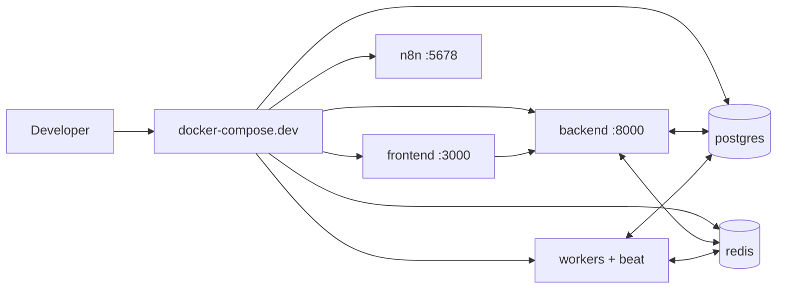
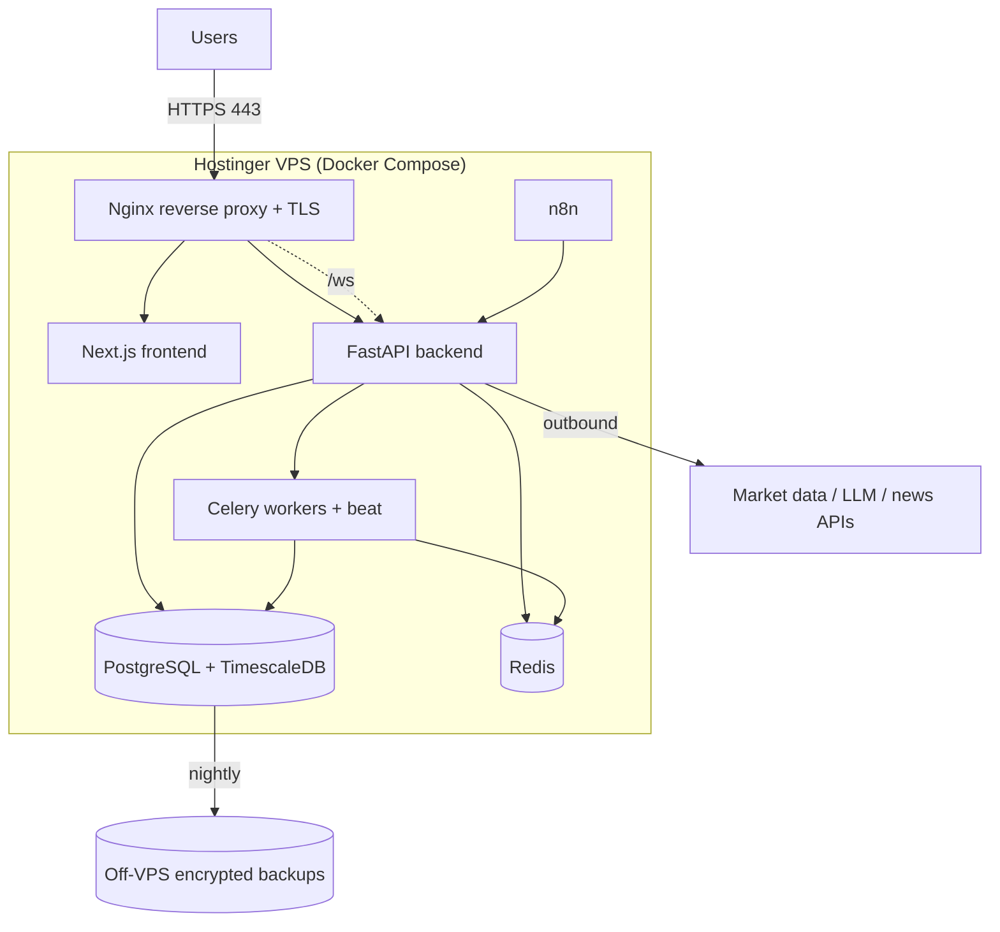
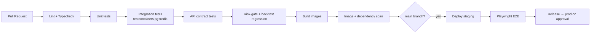

# 10 — Deployment & DevOps

## 1. Containerization

Every component ships as a Docker image; the same topology runs locally and in
production. Multi-stage builds keep images small and reproducible.

| Image | Base | Contents |
|-------|------|----------|
| `bkn-backend` | `python:3.12-slim` | FastAPI app (Uvicorn/Gunicorn) |
| `bkn-worker` | same as backend | Celery workers + beat (same code, different entrypoint) |
| `bkn-frontend` | `node:20-alpine` → runtime | Next.js standalone build |
| `postgres` | `timescale/timescaledb:pg16` | DB + TimescaleDB extension |
| `redis` | `redis:7-alpine` | Cache / pub-sub / broker |
| `n8n` | `n8nio/n8n` | Automation workflows |
| `nginx`/`traefik` | official | Reverse proxy / TLS termination |

## 2. Local Development

`docker-compose.dev.yml` brings up the full stack with one command.

```
make up            # start full stack (compose)
make migrate       # alembic upgrade head
make seed          # load instrument master, calendars, demo data
make test          # backend + frontend test suites
make lint          # ruff + mypy + eslint + tsc
make down          # tear down
```

Hot-reload for backend (uvicorn `--reload`) and frontend (`next dev`); code
mounted as volumes. Secrets from `.env` (never committed; `.env.example`
provided).



## 2a. Production Hosting — Hostinger VPS

Version 1 targets a **Hostinger VPS** (KVM plan) running the full stack via Docker
Compose behind Nginx. This is deliberately simple and cost-appropriate for the
launch scale; the topology is identical to local dev, so there is no environment
surprise. Kubernetes is explicitly deferred until scale demands it (see §7).



### Nginx & SSL
- **Nginx** is the single public entry point (ports 80/443). It:
  - terminates TLS and redirects all HTTP → HTTPS,
  - reverse-proxies `/` to the Next.js container and `/api` to FastAPI,
  - upgrades and proxies `/api/v1/ws` (WebSocket `Upgrade`/`Connection` headers),
  - sets security headers (HSTS, CSP, X-Frame-Options), gzip/brotli, and sane
    proxy timeouts for streaming.
- **SSL/TLS** via **Let's Encrypt** using Certbot (or the `nginx-proxy` +
  `acme-companion` pattern) with **automatic renewal** (cron/systemd timer).
  TLS 1.2+ only; modern cipher suite.
- Only 22 (SSH, key-only), 80, and 443 are exposed; Postgres/Redis bind to the
  Docker network and are **never** published to the host's public interface.

### VPS hardening (baseline)
- SSH key-only auth, non-root deploy user, `ufw` firewall, `fail2ban`.
- Unattended security updates; Docker daemon locked down.
- Nightly encrypted DB backups shipped **off the VPS** (object storage) — the VPS
  is not the only copy.

### Environment variables
- All config injected via a root `.env` on the VPS (chmod 600, never committed);
  `infra/env/.env.prod.example` documents every key with safe placeholders.
- Categories: DB/Redis DSNs, JWT signing keys, market-data & LLM API keys,
  n8n creds, SMTP/Telegram tokens, feature-flag defaults, `BKN_ENV=production`.
- Rotatable; no secret ever appears in images, logs, or the repo.

## 3. Environments & Promotion

| Env | Trigger | Data | Purpose |
|-----|---------|------|---------|
| `local` | manual | mock/seed | development |
| `staging` | merge to `develop` | paper/delayed feed | validation, QA, demos |
| `production` | tagged release / manual approve | live (read-only V1) | users |

Config is environment-injected (12-factor); images are identical across envs —
only configuration differs.

## 4. CI/CD (GitHub Actions)



### Pipeline stages
| Stage | Tooling | Gate |
|-------|---------|------|
| Lint/format | ruff, black-compatible, eslint, prettier | must pass |
| Type check | mypy (strict), tsc | must pass |
| Unit | pytest, vitest/jest | must pass, coverage floor |
| Integration | pytest + testcontainers (Postgres, Redis) | must pass |
| Contract | schemathesis / generated-client checks vs OpenAPI | must pass |
| **Risk & backtest regression** | golden-value suites | **release-gating** |
| Security | dependency audit, image scan, secret scan | no criticals |
| E2E | Playwright on staging | must pass before prod |
| Build/publish | Docker buildx → registry | tagged, immutable |

The **risk-gate regression suite is a hard release gate** — the platform cannot
ship if the Risk Engine's must-pass suite ([08](08-risk-management.md) §9) fails.

### Deploy mechanism (Hostinger)
On approved release, GitHub Actions pushes tagged images to the registry, then
connects to the VPS over SSH (deploy key) and runs a `deploy` make target that:
`docker compose pull` → run Alembic migrations job → `docker compose up -d`
(rolling per-service) → health-check → auto-rollback to the previous tag on
failure. The compose file and `.env` live on the VPS; only image tags change.

## 5. Database Operations

- **Migrations:** Alembic, run as a pre-deploy job; forward-only, reviewed.
- **Backups:** nightly full + WAL archiving; RPO ≤ 5 min (see [01](01-architecture.md) §8).
- **Restore drills:** periodic restore verification into staging.
- **TimescaleDB:** compression policy on chunks > 7 days; retention policies per
  table; continuous aggregates for higher timeframes.

## 6. Observability

| Signal | Tool | Notes |
|--------|------|-------|
| Metrics | Prometheus + Grafana | API latency, pipeline duration, queue depth, scan efficacy |
| Logs | Structured JSON → Loki (or hosted) | correlation IDs per request & per recommendation |
| Traces | OpenTelemetry | end-to-end recommendation pipeline trace |
| Errors | Sentry (or similar) | backend + frontend |
| Uptime | Blackbox probes | trading-hours SLO alerting |

### Key alerts
- Market-data provider degraded / circuit breaker open.
- Scan tick overrun / backpressure sustained.
- LLM error rate high → reduced-AI mode engaged.
- Recommendation pipeline stalled during trading hours.
- Risk-decision write failures (must never silently drop).

## 7. Scaling Plan

| Bottleneck | Response |
|-----------|----------|
| API throughput | Horizontal replicas behind proxy; stateless app |
| Scan CPU bursts | Add `scan` workers; shard universe finer |
| LLM latency/cost | Add `ai` workers; cache stable context; extract AI service |
| DB read load | Read replicas; continuous aggregates; partition pruning |
| WS fan-out | Redis pub/sub scales fan-out; multiple gateway replicas |

Extraction order for services follows [05](05-service-architecture.md) §10.

## 8. Secrets & Config Management

- No secrets in the repo or images; injected via environment / secret manager.
- Separate credentials per environment; least privilege.
- Rotating DB and broker/provider credentials; short-lived JWT signing keys with
  rotation support.
- See [12-security-compliance.md](12-security-compliance.md).

## 9. Runbooks (to author during Phase 0/1)

- Provider outage → switch to backup feed / degrade gracefully.
- LLM outage → confirm reduced-AI mode, notify, monitor.
- DB failover & restore.
- Emergency "pause all recommendations" kill-switch (feature flag).

## 10. Cost Controls

- LLM calls only on strategy-qualified setups; token budgets; response caching.
- Off-hours scaling down of workers (market-hours-aware).
- Tiered data retention (compress/aggregate old time-series).
