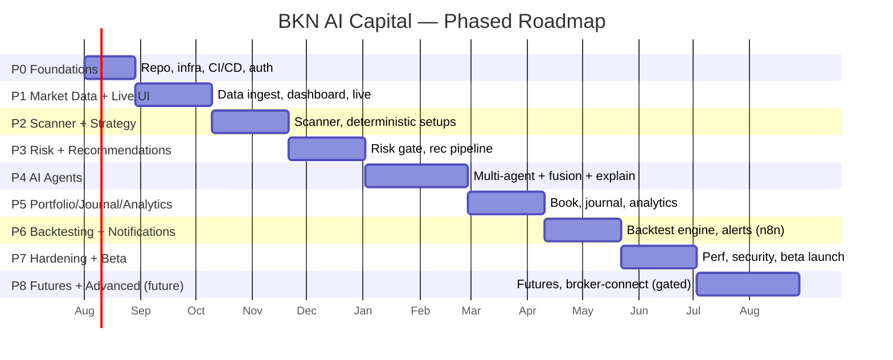

# 11 — Development Roadmap, Milestones & Sprint Plan

## 1. Guiding Cadence

- **Build incrementally, validate each stage, never assume AI predictions
  substitute for sound risk management.**
- Two-week sprints. Every phase ends with a demo + go/no-go review.
- **Vertical slices**: each early sprint delivers something usable end-to-end
  (thin but real), not a horizontal layer with no payoff.
- Risk management and explainability are built **early**, not bolted on.

## 2. Phase Overview

## 3. Milestones

| Milestone | Definition of Done | Phase |
|-----------|--------------------|-------|
| **M0 — Skeleton live** | CI/CD green, auth works, one containerized stack deploys to staging | P0 |
| **M1 — Live market visible** | Real-time indices + quotes on Dashboard/Live Market via WS | P1 |
| **M2 — Scanner emits setups** | Continuous scans produce deterministic setups on Scanner page | P2 |
| **M3 — First risk-gated recommendation** | End-to-end rec (deterministic, fully risk-gated, all required fields) shown & explainable | P3 |
| **M4 — AI panel online** | Multi-agent analysis + fusion + per-agent explanation on every rec | P4 |
| **M5 — Full trading workspace** | Portfolio, journal, analytics integrated and coherent | P5 |
| **M6 — Backtest + alerts** | Users can backtest strategies; criteria alerts fire via n8n | P6 |
| **M7 — Beta launch** | Hardened, observable, secure; invited beta users onboarded | P7 |

**M3 is the keystone milestone**: it proves the platform's core promise — a
transparent, fully risk-managed recommendation — *before* any AI complexity.

## 4. Sprint Plan (Phases 0–4, detailed)

> Estimates assume a small senior team. Solo pace ≈ 1.5–2× duration. Each sprint =
> 2 weeks.

**18 sprints, each an independently-deployable increment.** Every sprint ends
with something that builds, passes the gates, and ships to staging (and to prod
once past M0) — no sprint leaves the trunk in a half-wired state. "Independently
deployable" means: behind a feature flag if incomplete, additive migrations only,
and safe to release even if the *next* sprint slips.

| # | Sprint | Deployable increment (what ships) | Phase | Milestone |
|---|--------|-----------------------------------|-------|-----------|
| **S1** | Skeleton & CI | Monorepo scaffold (Clean-Arch backend, Next.js shell), Docker Compose stack, Postgres+TimescaleDB+Redis, base CI (lint/type/unit) — a deployable "hello" stack | P0 | |
| **S2** | Auth & profiles | Register/login/refresh (JWT), RBAC, Users/Profile + risk-profile CRUD, structured logging, staging deploy pipeline | P0 | **M0** |
| **S3** | Nginx + SSL + prod | Nginx reverse proxy, Let's Encrypt TLS, Hostinger VPS bring-up, prod deploy path, `.env` management — public HTTPS app online | P0 | |
| **S4** | Instrument master & data ingest | Instrument master + seed, market-data provider adapter, candle/quote persistence, market calendar | P1 | |
| **S5** | Indicators & snapshot cache | Pure indicators lib (EMA/RSI/MACD/ATR/VWAP/Supertrend) with golden tests, Redis snapshot cache | P1 | |
| **S6** | Realtime + Live Market | WebSocket gateway + channels, indices ticker, Live Market page (TradingView + live quotes), Dashboard v1 | P1 | **M1** |
| **S7** | Scanner Engine | Universe sharding, indicator screening, `scan_runs`/`setups`, market-hours beat scheduling | P2 | |
| **S8** | Strategy Engine | 2–3 deterministic strategies (intraday momentum, swing pullback, index OI) → qualified setups + features | P2 | |
| **S9** | Scanner page | Live setups table, filters, saved screens, scanner observability metrics | P2 | **M2** |
| **S10** | Risk Engine core | Position sizing + all hard-limit checks (daily/weekly/heat/drawdown/exposure/correlation), `risk_decisions` audit, must-pass risk suite (release-gating), emergency-stop flag | P3 | |
| **S11** | Recommendation assembly | Deterministic rec with **all required fields** (incl. expected hold/volatility), T1/T2/T3, RR, invalidation; recommendations API + WS `recommendations` channel | P3 | |
| **S12** | Recommendation UI + monitors | Recommendation Detail (full reasoning surface), invalidation monitor, anti-chase + daily/weekly circuit breakers | P3 | **M3** |
| **S13** | AI foundation + first agents | AI Engine scaffolding, LLM client adapter, structured-output contracts, Scanner Agent + Market Intelligence + Technical Analysis agents (flagged) | P4 | |
| **S14** | Specialist agents | Options, Intraday, Swing, News agents; feature-bundle grounding; abstain/validation handling | P4 | |
| **S15** | Fusion + explainability | Orchestrator + Fusion (weighting/veto/disagreement/calibration), Journal Coach + Risk Manager + Portfolio Manager (advisory) agents, `agent_opinions`, Explanation endpoint + Analyst Panel UI, reduced-AI degradation, agent config in Admin | P4 | **M4** |
| **S16** | Portfolio & Journal | Portfolio (holdings, live P&L, exposure/heat gauges), Trade Journal (auto-draft from recs), statement import | P5 | |
| **S17** | Analytics & Notifications | Analytics (equity curve, expectancy, attribution, behavioral), Notification Service via n8n (criteria alerts, EOD report), News ingest | P5/P6 | **M5** |
| **S18** | Backtesting + Hardening + Beta | Backtesting Engine (historical sim, metrics, regression harness), perf/security review, runbooks, load test, beta onboarding | P6/P7 | **M6/M7** |

> **Post-V1 (future phases, decomposed at kickoff):** Futures support, advanced
> options strategies, calibration learning-loop maturation, and an *opt-in,
> heavily-gated, legally-reviewed* broker-connect exploration. Never default-on.

## 5. Cross-Cutting Workstreams (every sprint)

| Workstream | Ongoing expectation |
|-----------|---------------------|
| Testing | Coverage floor maintained; new code ships with tests |
| Docs | ADRs for significant decisions; API docs auto-generated |
| Security | Dependency/image/secret scans stay green |
| Observability | New pipeline stages get metrics + traces |
| UX polish | Empty/loading/error states designed, not deferred |

## 6. Definition of Done (per user story)

- [ ] Meets acceptance criteria; typed end to end.
- [ ] Unit + integration tests; contract tests if API-facing.
- [ ] Passes lint, type-check, and (if risk-adjacent) the risk-gate suite.
- [ ] Structured logging + relevant metrics added.
- [ ] Docs/ADR updated; OpenAPI regenerated; TS client regenerated.
- [ ] Reviewed, demoed, deployed to staging.

## 7. Risks & Mitigations (delivery-level)

| Risk | Mitigation |
|------|------------|
| Market-data provider limits/cost | Adapter pattern + caching; evaluate providers early (S3) |
| LLM cost/latency | Setup pre-filtering, budgets, caching; AI is Phase 4, after value already exists |
| Scope creep ("Bloomberg for India") | Phase gates + vertical slices; M3 proves value before AI |
| Risk-logic bugs | Release-gating must-pass suite; pure, exhaustively tested domain |
| Regulatory ambiguity | Advisory-only V1; see [12](12-security-compliance.md); legal review before any broker-connect |

## 8. First Two Weeks (concrete kickoff checklist)

1. Approve this design set (prerequisite — no app code before approval).
2. Stand up the monorepo scaffold + Docker Compose stack.
3. Wire CI (lint, type, unit) and a staging deploy.
4. Choose the initial market-data provider; spike its adapter.
5. Implement Auth + risk-profile CRUD (M0).
6. Demo, review, proceed to Phase 1.
