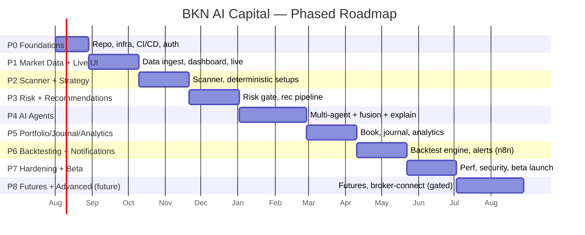

# 11 — Development Roadmap, Milestones & Sprint Plan

## 1. Guiding Cadence

- **Build incrementally, validate each stage, never assume AI predictions
  substitute for sound risk management.**
- Two-week sprints. Every phase ends with a demo + go/no-go review.
- **Vertical slices**: each early sprint delivers something usable end-to-end
  (thin but real), not a horizontal layer with no payoff.
- Risk management and explainability are built **early**, not bolted on.

## 2. Phase Overview

## 3. Milestones

| Milestone | Definition of Done | Phase |
|-----------|--------------------|-------|
| **M0 — Skeleton live** | CI/CD green, auth works, one containerized stack deploys to staging | P0 |
| **M1 — Live market visible** | Real-time indices + quotes on Dashboard/Live Market via WS | P1 |
| **M2 — Scanner emits setups** | Continuous scans produce deterministic setups on Scanner page | P2 |
| **M3 — First risk-gated recommendation** | End-to-end rec (deterministic, fully risk-gated, all required fields) shown & explainable | P3 |
| **M4 — AI panel online** | Multi-agent analysis + fusion + per-agent explanation on every rec | P4 |
| **M5 — Full trading workspace** | Portfolio, journal, analytics integrated and coherent | P5 |
| **M6 — Backtest + alerts** | Users can backtest strategies; criteria alerts fire via n8n | P6 |
| **M7 — Beta launch** | Hardened, observable, secure; invited beta users onboarded | P7 |

**M3 is the keystone milestone**: it proves the platform's core promise — a
transparent, fully risk-managed recommendation — *before* any AI complexity.

## 4. Sprint Plan (Phases 0–4, detailed)

> Estimates assume a small senior team. Solo pace ≈ 1.5–2× duration. Each sprint =
> 2 weeks.

### Phase 0 — Foundations (Sprints 1–2)
**Goal:** a deployable skeleton with auth, CI/CD, and the module scaffolding.

| Sprint | Deliverables |
|--------|--------------|
| **S1** | Monorepo scaffold (backend Clean-Arch skeleton, Next.js shell); Docker Compose stack; Postgres+TimescaleDB+Redis up; base CI (lint, type, unit) |
| **S2** | Auth module (register/login/refresh, JWT, RBAC); Users/Profile + risk profile CRUD; staging deploy pipeline; structured logging + config; **M0** |

### Phase 1 — Market Data + Live UI (Sprints 3–5)
**Goal:** real-time market visibility.

| Sprint | Deliverables |
|--------|--------------|
| **S3** | Instrument master + seed; market-data provider adapter (port + one implementation); candle/quote persistence; market calendar |
| **S4** | Redis snapshot cache; WebSocket gateway + channels; indicators library (EMA/RSI/MACD/ATR/VWAP/Supertrend) with golden tests |
| **S5** | Dashboard v1 (indices ticker, portfolio placeholder), Live Market page with TradingView + live quotes; **M1** |

### Phase 2 — Scanner + Strategy (Sprints 6–8)
**Goal:** the market's "always-on eyes."

| Sprint | Deliverables |
|--------|--------------|
| **S6** | Scanner Engine: universe sharding, indicator screening, `scan_runs`/`setups`; beat scheduling (market-hours aware) |
| **S7** | Strategy Engine: 2–3 deterministic strategies (intraday momentum, swing pullback, index OI) → qualified setups with features |
| **S8** | Scanner page (live setups table, filters, saved screens); scanner observability metrics; **M2** |

### Phase 3 — Risk + Recommendations (Sprints 9–11)
**Goal:** the keystone — a fully risk-gated, explainable recommendation (no LLM yet).

| Sprint | Deliverables |
|--------|--------------|
| **S9** | Risk Engine: position sizing, all hard-limit checks, `risk_decisions` audit; must-pass risk test suite (release-gating) |
| **S10** | Recommendation assembly (deterministic): all required fields, T1/T2/T3, RR, invalidation; recommendations API + WS `recommendations` channel |
| **S11** | Recommendation Detail UI (full reasoning surface); invalidation monitor; anti-chase + daily-loss circuit breaker; **M3** |

### Phase 4 — AI Agents (Sprints 12–15)
**Goal:** enrich recommendations with an explainable multi-agent panel — without
ever bypassing risk.

| Sprint | Deliverables |
|--------|--------------|
| **S12** | AI Engine scaffolding; LLM client adapter; structured-output contracts; Market + Technical agents |
| **S13** | Options, Intraday, Swing, News agents; feature-bundle grounding; agent abstain/validation handling |
| **S14** | Orchestrator + Fusion (weighting, veto, disagreement penalty, calibration); Psychology Coach + Risk Manager (advisory) agents; `agent_opinions` persistence |
| **S15** | Explanation endpoint + Analyst Panel UI; reduced-AI graceful degradation; agent config in Admin; scorecards scaffold; **M4** |

### Phases 5–8 (planned, sprint-decomposed at phase kickoff)

| Phase | Sprints | Headline deliverables | Milestone |
|-------|---------|----------------------|-----------|
| **P5 Portfolio/Journal/Analytics** | S16–S18 | Portfolio (holdings, P&L, exposure gauges), Trade Journal (auto-draft from recs), Analytics (equity curve, expectancy, behavioral) | M5 |
| **P6 Backtesting/Notifications** | S19–S21 | Backtesting Engine (historical sim, metrics, regression harness), Notification Service via n8n (criteria alerts, EOD reports), News ingest | M6 |
| **P7 Hardening/Beta** | S22–S24 | Perf tuning, security review, observability/runbooks, load tests, kill-switch, beta onboarding | M7 |
| **P8 Futures/Advanced (future)** | S25+ | Futures support, advanced options strategies, calibration learning loop maturation, *opt-in gated* broker-connect exploration | — |

## 5. Cross-Cutting Workstreams (every sprint)

| Workstream | Ongoing expectation |
|-----------|---------------------|
| Testing | Coverage floor maintained; new code ships with tests |
| Docs | ADRs for significant decisions; API docs auto-generated |
| Security | Dependency/image/secret scans stay green |
| Observability | New pipeline stages get metrics + traces |
| UX polish | Empty/loading/error states designed, not deferred |

## 6. Definition of Done (per user story)

- [ ] Meets acceptance criteria; typed end to end.
- [ ] Unit + integration tests; contract tests if API-facing.
- [ ] Passes lint, type-check, and (if risk-adjacent) the risk-gate suite.
- [ ] Structured logging + relevant metrics added.
- [ ] Docs/ADR updated; OpenAPI regenerated; TS client regenerated.
- [ ] Reviewed, demoed, deployed to staging.

## 7. Risks & Mitigations (delivery-level)

| Risk | Mitigation |
|------|------------|
| Market-data provider limits/cost | Adapter pattern + caching; evaluate providers early (S3) |
| LLM cost/latency | Setup pre-filtering, budgets, caching; AI is Phase 4, after value already exists |
| Scope creep ("Bloomberg for India") | Phase gates + vertical slices; M3 proves value before AI |
| Risk-logic bugs | Release-gating must-pass suite; pure, exhaustively tested domain |
| Regulatory ambiguity | Advisory-only V1; see [12](12-security-compliance.md); legal review before any broker-connect |

## 8. First Two Weeks (concrete kickoff checklist)

1. Approve this design set (prerequisite — no app code before approval).
2. Stand up the monorepo scaffold + Docker Compose stack.
3. Wire CI (lint, type, unit) and a staging deploy.
4. Choose the initial market-data provider; spike its adapter.
5. Implement Auth + risk-profile CRUD (M0).
6. Demo, review, proceed to Phase 1.
