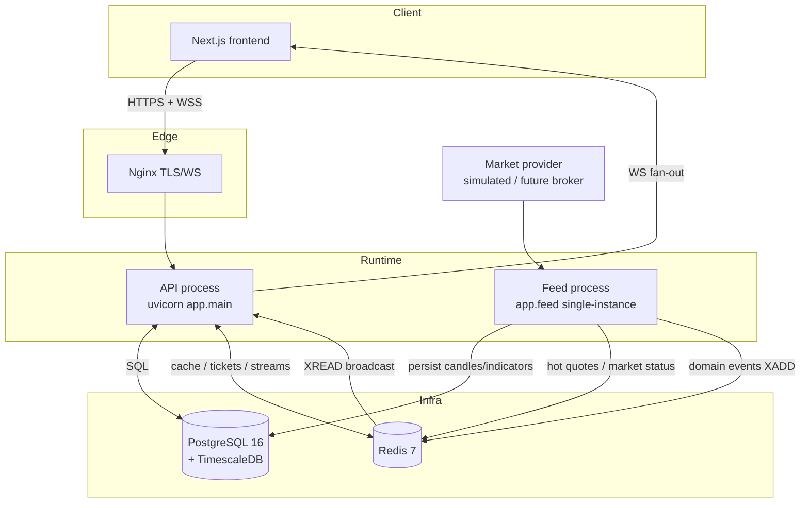
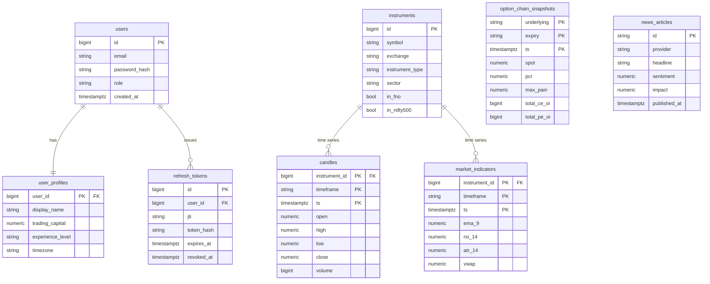
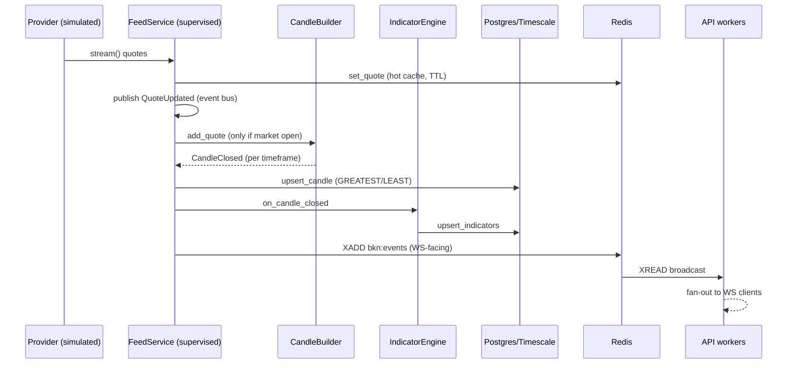
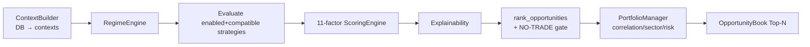
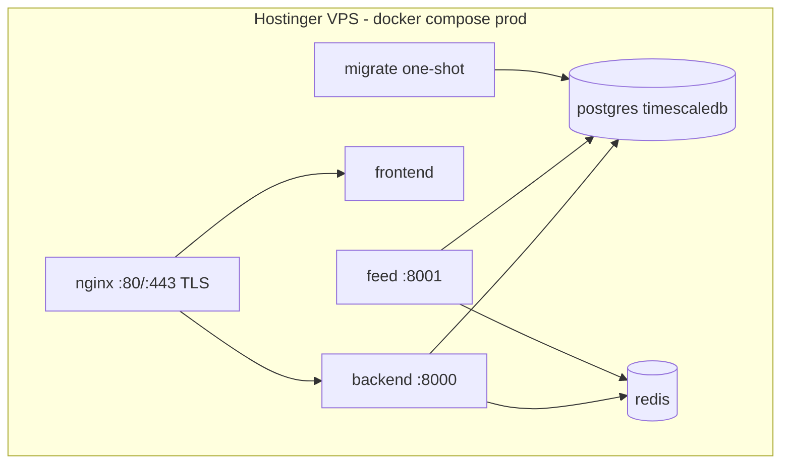

# BKN AI Capital — Complete Engineering Review

**Document type:** Technical due-diligence report
**Prepared for:** Independent Senior Software Architect & Quantitative Systems Reviewer
**Prepared by:** Engineering (CTO / Principal Architect / CQRO / EM)
**Branch under review:** `claude/bkn-ai-capital-init-lzgo56` (PR #2)
**Status of build at review:** CI green (backend + Postgres/TimescaleDB integration + frontend + docker)

> **Scope & honesty note.** This report distinguishes rigorously between what is
> **built and tested**, what is **scaffolded** (directory/stub only), and what is
> **designed but not implemented**. Several capabilities named in the section
> headings requested by the reviewer (walk-forward testing, optimization engine,
> AI learning, standalone risk engine, most frontend pages, real broker feeds) are
> **not yet implemented**; each such section says so explicitly rather than
> describing aspirational behavior. The platform is **advisory-only (V1)** and
> contains **no order-execution path**. The "AI" is a **deterministic, rule-based
> multi-agent system**, not a machine-learning or LLM system — a deliberate choice
> driven by the explainability mandate.

---

## Table of Contents

1. Project Overview
2. Sprint Review
3. Project Structure
4. Backend Review
5. Frontend Review
6. Database Review
7. Real-Time Market Engine
8. Scanner Engine
9. AI System
10. Risk Engine
11. Research Lab
12. Testing
13. Security Review
14. Performance Review
15. Deployment Review
16. Current Limitations
17. Project Metrics
18. Project Scorecard
19. Next Roadmap
20. Self Critique

---

# SECTION 1 — PROJECT OVERVIEW

## 1.1 Current project status

BKN AI Capital is an institutional-grade, AI-assisted **decision-support** platform
for the Indian (NSE) equity and F&O markets. V1 is **advisory only** — it analyzes
the market, ranks opportunities, convenes a multi-agent committee, and produces
fully-explained recommendations. **It does not place orders.**

At the time of this review the following layers are **implemented, tested, and CI-verified**:

| Layer | State |
|---|---|
| Foundational backend (auth, config, DB, Redis, health, observability) | ✅ Built |
| Real-time market-data platform (provider abstraction, WS client, candle builder, indicator engine, option-chain, news) | ✅ Built (simulated provider) |
| Production hardening (dedicated feed service, single-instance lock, task supervisor, Redis-Streams fan-out, market calendar, security) | ✅ Built |
| Alpha Engine (regime, 13 strategy plugins, 11-factor scoring, opportunity book, explainability, portfolio awareness) | ✅ Built |
| AI Investment Committee (7 agents + CIO) | ✅ Built |
| Backtesting harness (single-timeframe replay + earned stats) | ✅ Built |
| Frontend | ⚠️ Shell (one live-dashboard feature + placeholder pages) |
| Broker/live data integration | ❌ Not built (simulated provider only) |
| Standalone Risk Engine, Research Lab (walk-forward/optimization), execution | ❌ Not built |

**Headline numbers:** ~11,074 LOC backend application code, ~3,046 LOC backend
tests (169 test functions), ~1,200 LOC frontend, **84% backend line coverage**,
26 REST endpoints, 8 database tables, 13 strategies, 7 AI agents, 3 Alembic
migrations, 4 CI jobs.

## 1.2 Overall architecture

The system is a **modular monolith in code, service-oriented at runtime**. A single
codebase (`app.*`) is deployed as two distinct runtime processes plus supporting
infrastructure.



**Key architectural invariant:** ingestion happens **only** in the dedicated
single-instance `feed` process (guarded by a Redis lock); API workers never
ingest. API workers consume WS-facing domain events off a **Redis Stream**, so the
realtime path scales horizontally to N API workers.

## 1.3 Development philosophy

- **Clean architecture / SOLID / dependency injection.** Domain logic is pure and
  I/O-free; adapters (providers, repositories, Redis) are injected.
- **Pure core, thin I/O shell.** The Alpha Engine, committee, and backtester are
  **pure and deterministic** over provided data — the same code runs live and in
  backtest, and is unit-testable without a database.
- **Explainability over black boxes.** Every recommendation cites the exact rules /
  indicators / conditions behind it. This drove the choice of deterministic agents
  over an LLM.
- **No forced trades.** The engine abstains (NO-TRADE) when conditions are poor;
  strategies return `None` by default; the Risk Manager holds a hard veto.
- **Quality gates as law.** Every commit passes Ruff, Black, MyPy `--strict`, and
  pytest on both SQLite and real Postgres/TimescaleDB + Redis before merge.

## 1.4 Current maturity level

**TRL ≈ 5–6 (prototype validated in a simulated environment).** The backend
decision pipeline is production-grade in engineering terms (typed, tested,
observable, hardened). It is **not production-ready as a trading product** because
it runs on a **simulated data provider**, has **no broker integration**, **no live
strategy validation on real market data**, and only a **shell frontend**. The
distance to a usable advisory product is primarily *integration and frontend*, not
*core architecture*.

## 1.5 Remaining roadmap (high level)

See Section 19 for detail. In brief: real market-data/broker provider →
persistence of recommendations & committee decisions → standalone Risk Engine →
full frontend → intraday backtesting + walk-forward validation → (much later, and
only if justified) execution.

---

# SECTION 2 — SPRINT REVIEW

> Sprint numbering below reflects the delivery sequence on this branch. "Sprint 1"
> = foundational infra; "Sprint 2/2.5" = market data + hardening; "Sprint 3" =
> Alpha Engine; "Sprint 4" = AI Committee; "Sprint 5" = Backtesting. Estimated
> completion % is **relative to that sprint's stated objective**, not to the whole
> product.

## Sprint 1 — Foundational Infrastructure

| Field | Detail |
|---|---|
| **Objectives** | Production-quality backend skeleton: FastAPI app factory, async SQLAlchemy + Alembic, JWT auth, config, Redis, health, logging, Docker, CI, tests; Next.js shell. |
| **Features built** | App factory, settings (pydantic-settings), async engine + session DI, User/UserProfile/RefreshToken models, register/login/refresh/logout, Argon2id hashing, JWT access+refresh, health live/ready, structlog JSON logging, docker-compose, GitHub Actions CI. |
| **Files created** | `app/main.py`, `app/core/{config,database,redis,security,logging,dependencies,errors}.py`, `app/modules/{auth,users,health}/*`, `migrations/*`, `docker-compose.yml`, `.github/workflows/ci.yml`. |
| **Major decisions** | Modular monolith; async-first; `BigInteger().with_variant(Integer,"sqlite")` PK pattern for portable tests; `database_url` as validated `str` (not `PostgresDsn`) to allow the SQLite test URL. |
| **Problems → solved** | mypy on untyped `redis.from_url` → typed classmethod; prettier failures → `format:check` gate; SQLite autoincrement on BigInteger PK → variant pattern; 204 body error → `response_class=Response`. |
| **Known limitations** | Frontend is a shell; no real provider. |
| **Test coverage** | 100% of Sprint-1 modules pass; baseline ~84%. |
| **Estimated completion** | **100%** of objective. |

## Sprint 2 / 2.5 — Real-Time Market Intelligence + Production Hardening

| Field | Detail |
|---|---|
| **Objectives** | Complete real-time market-intelligence layer (12 modules) — no trading logic. Then harden to production for market-data ingestion (R0–R3). |
| **Features built** | Provider abstraction (`MarketProvider` ABC) + `SimulatedMarketProvider`; resilient WebSocket client (reconnect/backoff/heartbeat); instrument master; quote hot-cache (Redis, TTL); multi-timeframe candle builder (gap recovery, OHLC validation); incremental indicator engine (EMA/RSI/ATR/MACD/Supertrend/ADX/Bollinger/session-VWAP); option-chain engine (Black-Scholes greeks, PCR, max-pain); news engine (dedup, sentiment, categorization); async event bus (bounded queues, DLQ, metrics); Prometheus metrics; WS gateway. **Hardening:** dedicated `feed` process; `SingleInstanceLock` (Redis SET NX PX); task `Supervisor` (restart/backoff/circuit-breaker/heartbeat/watchdog); Redis-Streams `EventStreamBridge` for cross-instance fan-out; NSE market calendar (holidays, sessions, expiry, muhurat); security hardening (httpOnly refresh cookie, WS single-use tickets, token-bucket rate limiting, progressive lockout, refresh-reuse family revocation, prod-secret guard); TimescaleDB hypertables + compression/retention. |
| **Files created** | `app/modules/market_data/**`, `app/modules/news/**`, `app/shared/{events,indicators,market_calendar,supervision}/**`, `app/feed/**`, `app/websocket/**`, `app/core/rate_limit.py`, `app/modules/auth/{cookies,tickets}.py`, migrations 0002/0003. |
| **Major decisions** | Ingestion isolated to a single feed process behind a Redis lock; broadcast (not consumer-group) Redis-Stream semantics so every API worker delivers every event to its own clients; incremental O(1) indicators to hit sub-5ms updates; natural composite PK `(underlying, expiry, ts)` for the option hypertable. |
| **Problems → solved** | structlog `event=` kwarg collision → `event_type=`; refresh-reuse revocation rolled back by the raise → committed in a separate session; **TimescaleDB rejected the option-chain hypertable** (unique index must include the partition column) → natural composite PK; **asyncpg "Event loop is closed"** across pytest's per-test loops → `NullPool` under test; **naive vs tz-aware datetimes** on Postgres → ORM timestamps made `DateTime(timezone=True)` to match migrations. |
| **Known limitations** | Simulated provider only; no real broker; no 24-h soak or WS load test executed. |
| **Performance** | Indicator update ~0.6 ms; quote processing sub-10 ms target; incremental indicators verified <5 ms best-of-N. |
| **Test coverage** | Market-data + shared modules broadly 80–99%; real-Postgres + real-Redis CI job added and green. |
| **Estimated completion** | **~95%** of objective (soak/load tests deferred). |

## Sprint 3 — Institutional Alpha Engine

| Field | Detail |
|---|---|
| **Objectives** | Regime engine, plugin strategy library, scanner, 11-factor scoring, opportunity book with NO-TRADE, explainability, portfolio awareness. No committee/execution. |
| **Features built** | `MarketRegime` (14 states) + `RegimeEngine`; `Strategy` plugin framework + registry (enable/disable, no hardcoding); **13 strategies** across breakout/trend/momentum/volatility/gap families; `ScoringEngine` (11 dimensions → weighted composite + confidence, hard hostile-regime penalty); `AlphaScanner` orchestration; `OpportunityBook` (rank, Top-N, NO-TRADE); `Explanation` builder; `PortfolioManager` (correlation dedup, sector caps, risk budget); repository-backed `ContextBuilder`; read-only `/alpha` API. |
| **Files created** | `app/modules/strategy/**` (base, registry, regime_types, ta, library/*), `app/modules/scanner/**` (regime, macro_events, engine, context, opportunity, explain, service, api), `app/modules/ai_engine/scoring.py`. |
| **Major decisions** | Pure orchestration over provided contexts (I/O in `ContextBuilder`); light `scanner/__init__` to break a scanner→ai_engine→scanner import cycle; NO-TRADE returns an empty book with a reason. |
| **Problems → solved** | Circular import (fixed via light package `__init__` + submodule imports); VCP contraction measured on pre-breakout bars; NO-TRADE consistency (empty opportunities). |
| **Known limitations** | Only 13 of the ~34 briefed strategies; `StrategyStats` were unproven defaults until Sprint 5; sector/correlation use proxies (same-sector→0.8) not a real correlation matrix. |
| **Test coverage** | 34 alpha tests; module coverage 95–100% for engine/opportunity/regime. |
| **Estimated completion** | **~60%** of the *briefed* library (framework 100%; 13/34 strategies). |

## Sprint 4 — AI Investment Committee

| Field | Detail |
|---|---|
| **Objectives** | Multi-agent decision system: 7 independent agents + CIO synthesis, fully explainable, with observability, tests, benchmarks, diagrams. |
| **Features built** | `Agent` ABC + `Finding` (cited) + `AgentReport` + `CommitteeBrief` + `PortfolioState`; 7 agents (Strategist, Technical, Options, News, **Risk Manager w/ hard veto**, **Devil's Advocate** (asymmetric), Portfolio Manager); `ChiefInvestmentOfficer` (role-weighted signed vote → recommendation ladder, veto→REJECT); `InvestmentCommittee` orchestrator (agent isolation); Prometheus metrics; `/committee` API. |
| **Files created** | `app/modules/committee/**` (base, cio, committee, metrics, service, api, agents/*). |
| **Major decisions** | Deterministic rule agents (not LLM) to satisfy "no black box"; `AgentReport.metrics` for structured numeric outputs (position size); Risk Manager veto is unconditional. |
| **Problems → solved** | Line-length/format churn; hostile-regime brief has an empty book → committee reviews the constructed opportunity directly. |
| **Known limitations** | Role weights and thresholds are hand-tuned, not calibrated; agents share the same underlying data (independence is of *perspective*, not of *data source*). |
| **Performance** | Full 7-agent + CIO deliberation ≈ **1 ms**; benchmark asserts <25 ms. |
| **Test coverage** | 17 committee tests; core files 97–99%, agents 66–88%. |
| **Estimated completion** | **100%** of objective. |

## Sprint 5 — Backtesting Harness

| Field | Detail |
|---|---|
| **Objectives** | Replay strategies over history to produce earned `StrategyStats`, fed back into live scoring/committee; false-positive analysis; performance. |
| **Features built** | `Trade`/`TradeOutcome`/`BacktestResult` (win rate, profit factor, expectancy-R, max drawdown-R, false-positive rate, equity curve); pure `simulate_trade` (stop/target/time-stop, stop-first, R-multiple); `Backtester` (causal bar-by-bar replay, incremental indicators, optional benchmark for RS/index-trend, one-position-at-a-time); `apply_to_registry` (opt-in promotion); `/backtest` API. |
| **Files created** | `app/modules/backtesting/**` (models, simulator, engine, stats, service, api). |
| **Major decisions** | Same plugin code live and in backtest; opt-in stat promotion; window capped at `required_history` for O(n·k). |
| **Problems → solved** | Perf micro-benchmark flakiness under coverage → **scaling test** that surfaced a real **O(trades×n) tail-copy** bug (now O(max_holding_bars)); skip wall-clock assertion under coverage. |
| **Known limitations** | **Single-timeframe** replay only; intraday/session strategies (ORB/VWAP/gap/CPR) abstain; no walk-forward, no transaction costs/slippage, no position sizing/compounding in the equity model (R-multiples only); no survivorship-bias handling. |
| **Test coverage** | 15 backtesting tests; engine 91%, models 97%, simulator 94%. |
| **Estimated completion** | **~70%** of a research-grade backtester (single-timeframe done; walk-forward/costs/intraday pending). |

---

# SECTION 3 — PROJECT STRUCTURE

```
peace_maker/
├── backend/
│   ├── app/
│   │   ├── main.py                  # FastAPI app factory (API process entrypoint)
│   │   ├── api/v1/router.py         # aggregates every module router under /api/v1
│   │   ├── core/                    # cross-cutting infra (no domain logic)
│   │   │   ├── config.py            # pydantic-settings; prod-secret guard; CSV parsing
│   │   │   ├── database.py          # async engine (NullPool under test), session DI, Base
│   │   │   ├── redis.py             # shared async Redis client lifecycle
│   │   │   ├── security.py          # JWT encode/verify, Argon2id hashing
│   │   │   ├── rate_limit.py        # TokenBucket + LoginGuard (progressive lockout)
│   │   │   ├── dependencies.py      # DbSession / CurrentUser DI aliases
│   │   │   ├── logging.py           # structlog config (JSON in prod)
│   │   │   └── errors.py            # typed error → HTTP mapping
│   │   ├── feed/                    # DEDICATED feed process (app.feed)
│   │   │   ├── service.py           # supervised ingestion pipeline
│   │   │   ├── lock.py              # SingleInstanceLock (Redis SET NX PX)
│   │   │   ├── app.py               # feed health/metrics ASGI (:8001)
│   │   │   └── __main__.py          # `python -m app.feed`
│   │   ├── websocket/               # WS gateway + channels (API-side fan-out)
│   │   ├── shared/                  # pure, reusable domain kernels
│   │   │   ├── events/              # EventBus, typed events, Redis-Stream bridge
│   │   │   ├── indicators/          # incremental + batch technical indicators
│   │   │   ├── market_calendar/     # NSE sessions/holidays/expiry (pure)
│   │   │   └── supervision/         # Supervisor, Backoff, CircuitBreaker
│   │   └── modules/                 # bounded contexts (domain modules)
│   │       ├── auth/                # register/login/refresh/logout, cookies, WS tickets
│   │       ├── users/               # profile
│   │       ├── health/              # live/ready probes
│   │       ├── market_data/         # providers, cache, candle_builder, indicator_engine,
│   │       │                        #   option_chain_engine, repository, orm, api, metrics
│   │       ├── news/                # providers, normalize, service, orm, api
│   │       ├── strategy/            # plugin framework + regime types + ta + library/*
│   │       ├── scanner/             # regime engine, scan orchestrator, opportunity book,
│   │       │                        #   explainability, portfolio-aware pruning, api
│   │       ├── ai_engine/           # 11-factor ScoringEngine
│   │       ├── committee/           # 7 agents + CIO + orchestrator + api
│   │       ├── backtesting/         # simulator + engine + stats wiring + api
│   │       ├── portfolio/           # correlation/sector/risk-budget awareness
│   │       ├── risk/                # STUB (no implementation; logic lives in committee/portfolio)
│   │       ├── journal/             # STUB
│   │       ├── analytics/           # STUB
│   │       ├── notifications/       # STUB
│   │       └── admin/               # STUB
│   ├── migrations/                  # Alembic (async env) — 3 revisions
│   └── tests/                       # unit/ + integration/ (169 tests, 84% coverage)
├── frontend/                        # Next.js 14 App Router (SHELL)
│   └── src/
│       ├── app/                     # (auth)/login + (app)/{dashboard,scanner,...} pages
│       ├── features/market/         # LiveDashboard (the one real feature)
│       ├── lib/{api,auth,ws}/       # API client, auth, market WebSocket hook
│       ├── stores/                  # Zustand auth store
│       └── components/              # ui/ + layout/ primitives
├── infra/                           # compose (dev/prod), nginx, certs, db init, observability
├── automation/n8n/                  # workflow automation (n8n) scaffolding
└── docs/                            # design docs, ADRs, sprint reports, this review
```

**Why each stub module exists:** `risk`, `journal`, `analytics`, `notifications`,
and `admin` are intentional placeholders reserving the bounded-context boundary for
future sprints. Their absence is a **known gap**, not an oversight — e.g. the
standalone Risk Engine (weekly limits, emergency stop, portfolio-heat service) is
scheduled but unbuilt; today risk logic lives inside the committee's `RiskManager`
agent and `portfolio/awareness.py`.

**Two runtime services from one codebase:** `app.main:app` (API) and `app.feed`
(ingestion). This is the crux of the horizontal-scaling design.

---

# SECTION 4 — BACKEND REVIEW

## 4.1 FastAPI architecture
App-factory pattern (`create_app`): builds the app, mounts `api_router` under
`/api/v1`, installs middleware (CORS, correlation-id), exposes `/metrics`,
`/openapi.json`, and health routes. Each domain module owns an `APIRouter`
aggregated in `api/v1/router.py`. Endpoints are thin: they resolve DI, call a
service, and return typed dicts / Pydantic models.

## 4.2 Dependency injection
FastAPI `Depends` with `Annotated` aliases: `DbSession = Annotated[AsyncSession,
Depends(get_session)]` yields a transactional session (commit on success, rollback
on error); `CurrentUser = Annotated[User, Depends(get_current_user)]` enforces
auth. Services receive their session/repo by constructor injection, keeping them
unit-testable.

## 4.3 Authentication
Register/login issue an **access JWT** (15 min) + **refresh token**. Passwords use
**Argon2id**. Refresh is delivered/consumed via an **httpOnly cookie** (`bkn_refresh`,
path `/api/v1/auth`), never the JSON body. Refresh **rotation** with **reuse
detection**: presenting a used refresh token revokes the entire token family
(committed in a separate session so it survives the raise/rollback).

## 4.4 Authorization
Route-level auth via the `CurrentUser` dependency. RBAC scaffolding exists
(role on user), but fine-grained role gating is minimal — most protected routes
require *authenticated*, not *privileged*. This is a known gap for admin surfaces.

## 4.5 Redis
Single shared async client (`app/core/redis.py`). Uses: quote hot-cache (TTL so
stale data can't linger if the feed stops), market-status, WS single-use tickets
(`ws:ticket:*`, 30 s, getdel), rate-limit token buckets, single-instance feed lock,
and the domain-event stream (`bkn:events`).

## 4.6 PostgreSQL
PostgreSQL 16 via async SQLAlchemy 2.x + asyncpg. Explicit naming convention for
reliable Alembic autogenerate/downgrade. Tuned QueuePool in prod;
**NullPool under test** to avoid cross-event-loop reuse.

## 4.7 TimescaleDB
`candles`, `market_indicators`, `option_chain_snapshots` are **hypertables**
(partitioned on `ts`). Composite PKs include `ts` (required — every unique index
on a hypertable must contain the partition column). Compression on `candles`
(segmentby instrument_id, timeframe) + compression/retention policies (migration
0003). Hypertable creation is guarded to Postgres so the SQLite test path is a
no-op.

## 4.8 Caching
Redis quote cache with TTL; market-status cache; median-turnover and indicator
bundles recomputed rather than cached (deterministic). No HTTP response caching
layer yet.

## 4.9 WebSocket engine
`app/websocket/gateway.py` + `channels.py`: authenticated via single-use ticket
(not a JWT in the URL). The API process consumes domain events (locally or from the
Redis Stream) and fans them out to subscribed clients. **Coverage here is low (WS
gateway ~36%)** — the least-tested subsystem.

## 4.10 Market feed
See Section 7. Runs only in the `feed` process behind the Redis lock; supervised
loops for quote stream, option poll, session watch, news poll.

## 4.11 Indicators
Incremental O(1)-per-bar EMA/RSI/ATR/MACD/Supertrend + small bounded-window batch
ADX/Bollinger + session-anchored VWAP. `RollingIndicatorState` bundles them.

## 4.12 Option chain
`option_chain_engine.py` + `options_math.py`: Black-Scholes greeks, PCR, max-pain,
OI aggregation; persisted to the option hypertable.

## 4.13 News engine
Provider abstraction + `simulated` provider; dedup by stable content hash;
sentiment/impact scoring; category detection; persisted to `news_articles`.

## 4.14 Event bus
`app/shared/events/bus.py`: async, sync fire-and-forget `publish()`, bounded
per-subscriber queues + workers, dead-letter queue, metrics. `EventStreamBridge`
mirrors WS-facing events to Redis Streams for cross-instance fan-out.

## 4.15 Background workers & scheduler
The feed's supervised loops are the "workers." Celery is **designed, not built**.
There is **no cron/scheduler** in-process; polling intervals are loop-driven. This
is a gap for scheduled backtests/reports.

## 4.16 Error handling
Typed domain errors mapped to HTTP in `core/errors.py`; a broken strategy or agent
is **isolated** (logged, abstained) rather than crashing a scan/deliberation; feed
loops restart under the supervisor with backoff + circuit breaker.

## 4.17 Logging
`structlog` structured logging, JSON in prod, correlation-id middleware. Gotcha
codified: never pass `event=` (collides with structlog positional) — use
`event_type=`.

## 4.18 Monitoring
Prometheus metrics across market-data (throughput, latency, drops, WS uptime,
session phase, feed-leader) and committee (agent latency, stance distribution,
vetoes, decisions). `/metrics` endpoint. No Grafana dashboards committed;
OpenTelemetry tracing is designed, not implemented.

## 4.19 Performance
See Section 14. Indicator update ~0.6 ms; committee deliberation ~1 ms; backtest
O(n) after the tail-copy fix.

## 4.20 Security
See Section 13.

---

# SECTION 5 — FRONTEND REVIEW

> **Honest status: the frontend is a shell.** Next.js 14 App Router with
> TypeScript strict, Tailwind (dark-first), Zustand, TanStack Query, Vitest,
> ESLint/Prettier/Husky. ~1,200 LOC across 34 files. **One real feature**
> (`LiveDashboard`, 156 LOC) plus a market WebSocket hook (92 LOC) and API client.
> The `(app)/*` pages (dashboard, scanner, recommendations, portfolio, charts,
> analytics, journal, settings, admin) are **14–30 line placeholders**.

| Area | Status |
|---|---|
| Next.js App Router, route groups `(auth)` / `(app)` | ✅ Set up |
| State (Zustand auth store) | ✅ Minimal |
| TanStack Query + typed API client | ✅ Wired |
| Real-time (`useMarketSocket`) | ✅ Hook built; used by LiveDashboard |
| Auth flow (login page, token handling) | ✅ Basic |
| Dark theme / Tailwind design system | ✅ Primitives (Card/Button/EmptyState/layout) |
| Responsive design | ⚠️ Layout primitives only |
| Charts | ❌ Placeholder page |
| Scanner / Recommendations / Portfolio / Journal / Admin pages | ❌ Placeholders |
| Performance optimizations (code-split, memoization) | ❌ Not yet meaningful at this size |

The frontend is the **largest single gap** between "impressive backend" and
"usable product."

---

# SECTION 6 — DATABASE REVIEW

## 6.1 ER diagram



## 6.2 Tables (8)
`users`, `user_profiles`, `refresh_tokens` (identity); `instruments`, `candles`,
`market_indicators`, `option_chain_snapshots` (market); `news_articles`.

## 6.3 Indexes
Unique instrument identity `(symbol, exchange, instrument_type)`; partial index on
`in_fno`; symbol index; `published_at` index on news; hypertable chunk indexes on
`ts`; composite PKs double as covering indexes for time-series reads.

## 6.4 Relationships
`candles`/`market_indicators` → `instruments` (FK, CASCADE). `option_chain_snapshots`
keyed by natural `(underlying, expiry, ts)` (no FK — underlying is a symbol string).
`refresh_tokens`/`user_profiles` → `users`.

## 6.5 Hypertables / retention / compression
Hypertables: `candles` (7-day chunks), `market_indicators` (7-day),
`option_chain_snapshots` (1-day). Compression on `candles` (segmentby
`instrument_id, timeframe`) after 7 days; compression + retention policies in
migration 0003.

## 6.6 Connection pooling
Prod: tuned QueuePool (`pool_size`, `max_overflow`, `pool_timeout`, `pool_recycle`,
`pool_pre_ping`). Test: `NullPool` (cross-loop safety). SQLite: no pool kwargs.

## 6.7 Performance decisions
Numeric (not float) for prices; `timestamptz` everywhere (ORM aligned to
migrations); incremental indicator writes; GREATEST/LEAST-based candle upsert for
late/duplicate bars; dialect-aware upserts (pg vs sqlite).

---

# SECTION 7 — REAL-TIME MARKET ENGINE



- **Provider abstraction** — `MarketProvider` ABC; `create_provider()` factory;
  `SimulatedMarketProvider` today; a broker adapter is a drop-in.
- **Reconnect / heartbeat** — resilient WS client with exponential backoff,
  monotonic capped delays, resubscribe on reconnect, per-loop heartbeats; the
  supervisor restarts a crashed loop and opens a circuit breaker on repeated
  failure; a watchdog flags stale heartbeats.
- **Market calendar** — pure NSE calendar: holidays, pre-open/open/closing/muhurat
  phases, half-days, session-open timestamp (VWAP anchor), nearest weekly expiry.
- **Tick processing** — cumulative→incremental volume, hot-cache write, event
  publish, session-gated candle build; latency metric per quote.
- **Candle builder** — multi-timeframe bucketing, gap recovery, OHLC validation.
- **Indicator engine** — incremental bundle on `CandleClosed` (no DB reload).
- **Caching / storage** — Redis hot cache (live) + Timescale hypertables
  (historical).
- **Performance** — indicator update ~0.6 ms; single-instance ingestion avoids
  duplicate work; cross-instance fan-out via Redis Streams.

---

# SECTION 8 — SCANNER ENGINE



- **Pipeline** — pure orchestration over pre-built contexts; I/O isolated in
  `ContextBuilder` (loads candles, replays indicators, computes relative strength).
- **Strategy plugins** — `@register()` self-registering; enable/disable via
  `BKN_ALPHA_ENABLED_STRATEGIES`; each returns ≤1 fully-reasoned signal or `None`.
- **Market regime** — 14 states; every strategy gates on the active regime set;
  hostile regimes veto the whole book.
- **Ranking** — sort by composite; assign rank; Top-N.
- **Filtering / NO-TRADE** — `MIN_COMPOSITE=55` per-candidate; `MIN_BEST_COMPOSITE=60`
  book-level floor; hostile regime → NO-TRADE (empty book + reason).
- **Portfolio awareness** — greedy best-first: correlation dedup (proxy),
  sector caps, position-count cap, gross daily-risk budget.

---

# SECTION 9 — AI SYSTEM

> **Deterministic, rule-based multi-agent system** — chosen over an LLM to satisfy
> the "no black box, cite exact rules/indicators/conditions" mandate. The `Agent`
> interface (`review(brief) → report`) leaves a clean seam to swap any single agent
> for an LLM later without touching the CIO/orchestrator/API.

```mermaid
sequenceDiagram
    participant B as CommitteeBrief
    participant A as 7 Agents (independent)
    participant CIO as Chief Investment Officer
    B->>A: review() (each agent, isolated)
    A-->>CIO: AgentReport {stance, confidence, cited findings, veto?, metrics}
    CIO->>CIO: role-weighted signed vote → consensus∈[-1,1]
    CIO->>CIO: any veto → REJECT; else ladder
    CIO-->>B: CommitteeDecision (fully cited)
```

| Agent | Responsibility | Key inputs | Output signals |
|---|---|---|---|
| **Chief Market Strategist** | Regime, macro/event overlays, index trend, sector rotation | regime, index_trend, relative_strength, overlays | stance + cited findings |
| **Technical Analyst** | Price action, MTF, indicators, structure | signal RR, RSI/ADX/EMA, scorecard technical/volume | stance |
| **Options Analyst** | OI, PCR, IV, max-pain, positioning | option context (abstains if absent) | stance + `pcr` metric |
| **News Analyst** | Sentiment + economic/event calendar | news_score, event overlays | stance |
| **Risk Manager** | Sizing, correlation, heat, drawdown | portfolio state, stop distance, RR | stance + **hard veto** + `recommended_risk_pct` |
| **Devil's Advocate** | Invalidate the bull thesis (asymmetric — never supports) | counter-trend, RSI extremes, liquidity, RR, overlays | objections only |
| **Portfolio Manager** | Allocate? how much? reduce what? | heat headroom, conviction, sector | size + `recommended_qty/notional` |

**Decision flow / conflict resolution.** Agents are independent — they never see
each other's reports; only the CIO integrates them. The CIO computes
`Σ stance.score × confidence × role_weight / Σ weight` → **consensus** in [-1, 1]
(Risk 1.5, Technical 1.4, Strategist 1.3, Devil's 1.2, PM 1.1, Options 0.8, News
0.7). **Any veto → REJECT**, unconditionally. Otherwise: consensus ≥ 0.60 →
STRONG_BUY/SELL; ≥ 0.35 → BUY/SELL; ≤ −0.35 → REJECT; else HOLD.

**Confidence.** Two levels: (a) each agent's self-`confidence` (0–1) scales its
vote; (b) the CIO's `conviction` = max(0, consensus). The scoring engine's
composite `confidence` blends the strategy's own confidence with the composite,
knocked down in hostile regimes.

**Explainability.** Every `Finding` carries a `citation` (e.g. `RSI(14)=72`,
`drawdown=15.0% ≥ max 12.0%`, `PCR=1.5`). The `CommitteeDecision` exposes
recommendation, per-agent confidence breakdown, bull case, bear case, invalidation,
risk, position size, expected holding, alternatives + per-candidate rejection
reasons, and a plain-language rationale.

**Honest caveat:** the agents are independent in *perspective* but share the *same
underlying data*; role weights and thresholds are hand-tuned, not learned or
calibrated against outcomes.

---

# SECTION 10 — RISK ENGINE

> **There is no standalone Risk Engine module.** `app/modules/risk` is a stub. Risk
> logic today lives in two places:

- **Committee `RiskManager` agent** — hard vetoes on **max drawdown**, **daily-loss
  limit**, and **portfolio-heat** exhaustion; scores stop distance, RR, and
  same-sector correlation; emits `recommended_risk_pct` scaled by conviction.
- **`portfolio/awareness.py`** — correlation dedup, sector concentration caps,
  position-count cap, gross daily-risk budget (greedy best-first).
- **Committee Portfolio Manager** — position sizing (risk-% → quantity → notional),
  capped by the Risk Manager; suggests trimming a correlated/weaker position.

| Capability | Status |
|---|---|
| Position sizing | ✅ (committee PM, R-based) |
| Portfolio heat | ✅ (PortfolioState + veto) |
| Correlation | ⚠️ Proxy (same sector/direction), not a matrix |
| Max drawdown limit | ✅ (hard veto) |
| Daily limit | ✅ (hard veto) |
| Weekly limit | ❌ Not implemented |
| Emergency stop | ⚠️ Per-decision veto only; no global kill-switch |
| Risk scoring | ✅ (11-factor `risk` dimension + agent) |

Weekly limits, a global emergency stop / kill-switch, and a real correlation matrix
are **open items** for the standalone Risk Engine sprint.

---

# SECTION 11 — RESEARCH LAB

> **Only backtesting exists.** The remaining research-lab capabilities are **not
> implemented.**

| Capability | Status |
|---|---|
| Backtesting (single-timeframe, causal replay) | ✅ Built (Sprint 5) |
| Strategy evaluation (win rate, PF, expectancy, FP rate, DD) | ✅ Built |
| Performance metrics + equity curve | ✅ Built (R-multiple) |
| Walk-forward testing | ❌ Not built |
| Historical testing at scale (multi-year, universe) | ⚠️ Mechanism exists; not validated on real data |
| Optimization engine (parameter search) | ❌ Not built |
| AI learning (calibration from outcomes) | ❌ Not built |
| Research reports (automated) | ❌ Not built |
| Transaction costs / slippage / survivorship | ❌ Not modeled |

The backtester is a solid foundation but is **research-grade-incomplete**: no costs,
no walk-forward, no intraday, no compounding. Treat current backtest numbers as
**directional, not investable**.

---

# SECTION 12 — TESTING

## 12.1 Strategy
Pure-core design makes the decision pipeline unit-testable without I/O. Every commit
runs the full suite on **two backends**: SQLite + fakeredis (fast) and **real
Postgres/TimescaleDB + real Redis** (the CI `backend-postgres` job) — the latter
has repeatedly caught real production bugs (hypertable PK, asyncpg loop reuse,
tz-aware writes).

## 12.2 Coverage
**169 tests, 84% backend line coverage** (5,449 statements). Strong: scoring/
ranking/regime/committee-core/backtesting (90–100%). Weak: **WS gateway (~36%)**,
market `service.py` (~57%), `scanner/context.py` (~58%), committee `service.py`
(~60%).

| Test type | State |
|---|---|
| Unit | ✅ Extensive (strategies, regime, scoring, agents, CIO, simulator, calendar, indicators, supervisor, security) |
| Integration | ✅ Auth, market API, alpha API, committee API, backtest API, event-stream, feed-service, token-reuse — against real Postgres+Redis |
| Recovery | ⚠️ Partial (feed recovers from stream crash; supervisor circuit breaker) — not a full chaos suite |
| Load | ❌ Not executed (no WS/throughput load test run) |
| Chaos | ❌ Not executed |

## 12.3 Remaining gaps
WS gateway coverage; no load/soak/chaos runs; no property-based or fuzz tests; no
frontend E2E (only a Vitest unit test).

---

# SECTION 13 — SECURITY REVIEW

| Control | Implementation |
|---|---|
| **JWT** | HS256 access (15 min) + rotating refresh; prod-secret guard fails staging/prod on the dev default. |
| **Cookies** | Refresh in **httpOnly** cookie, path-scoped `/api/v1/auth`; never in the JSON body. |
| **Password** | **Argon2id**. |
| **Refresh reuse** | Detected → **whole token family revoked** (separate committed session). |
| **Rate limiting** | Redis **token bucket**; login **progressive lockout** + IP reputation. |
| **WebSocket** | **Single-use tickets** (Redis, 30 s, getdel) — no JWT in the URL. |
| **Secrets** | Env-injected; prod-secret model validator. |
| **Input validation** | Pydantic v2 models + query constraints. |
| **Transport** | Nginx TLS termination; internal services not published to host in prod compose. |

**Gaps / OWASP:** no explicit CSRF token (mitigated by httpOnly + SameSite intent,
but not audited); no security headers middleware (CSP/HSTS beyond Nginx); no
dependency/secret scanning in CI; RBAC is coarse (authenticated vs privileged not
enforced on admin surfaces); no audit log. No formal OWASP Top-10 pass has been
performed.

---

# SECTION 14 — PERFORMANCE REVIEW

| Metric | Measured / target | Basis |
|---|---|---|
| Indicator bundle update | **~0.6 ms/bar** | incremental engine micro-benchmark (best-of-N) |
| Committee deliberation (7 agents + CIO) | **~1 ms** | unit benchmark; asserts <25 ms |
| Full universe scan | pure O(universe × enabled strategies) | in-memory, per-candidate scoring |
| Backtest | **O(n)** after tail-copy fix | scaling test (doubling bars ≈ 2×) |
| Quote processing | sub-10 ms target | per-quote latency histogram |
| WS latency | <50 ms target (design) | **not load-tested** |
| Recovery | <10 s (design) | supervisor backoff; partial test |
| Memory 24 h | stable (design) | **soak test not run** |

**Concurrent connections / throughput / scalability:** the architecture supports
horizontal scaling (single feed + N API workers via Redis-Streams broadcast), but
**no load test has been executed** — connection ceilings, tick-rate ceilings, and
memory-under-load are **unmeasured**. Numbers above are micro-benchmarks and
targets, not system-level load results.

---

# SECTION 15 — DEPLOYMENT REVIEW



- **Docker** — multi-stage backend/frontend images.
- **Compose** — dev (`docker-compose.yml`: postgres, redis, backend, feed, frontend,
  n8n) and prod (`infra/compose/docker-compose.prod.yml`: postgres, redis, migrate,
  backend, feed, frontend, nginx). Prod DB/Redis are **not** published to the host.
- **Nginx** — TLS + WS proxy; only public entry point.
- **SSL** — certbot webroot volume wired.
- **CI/CD** — GitHub Actions: `backend` (ruff/black/mypy/pytest), `backend-postgres`
  (migrations + suite on real Timescale+Redis), `frontend`, `docker` (build). CD to
  the VPS is **manual** (documented in the deployment checklist), not automated.
- **Monitoring / logging** — Prometheus `/metrics`; structured JSON logs. **No
  Grafana dashboards, no centralized log aggregation, no alerting** committed.
- **Backups** — **not implemented** (no automated pg_dump/WAL archiving).

---

# SECTION 16 — CURRENT LIMITATIONS

**Product-level**
1. **Simulated data only** — no real market feed or broker; nothing validated on live data.
2. **Advisory only** — no execution path (by design for V1).
3. **Frontend is a shell** — one live feature; most pages are placeholders.

**Engine-level**
4. 13 of ~34 briefed strategies implemented.
5. Backtester is single-timeframe; intraday/session strategies untested there; no costs/slippage/walk-forward.
6. Correlation is a sector proxy, not a real matrix.
7. Committee weights/thresholds hand-tuned, uncalibrated; agents share one data source.
8. No standalone Risk Engine (weekly limits, global kill-switch).

**Platform-level**
9. WS gateway under-tested (~36%); no load/soak/chaos runs; no 24-h stability proof.
10. No OpenTelemetry tracing, Grafana dashboards, log aggregation, alerting, or backups.
11. Celery/scheduler designed but not built (no scheduled backtests/reports).
12. Coarse RBAC; no CSRF/security-headers audit; no dependency/secret scanning.

**Known bugs:** none open at review (last three CI failures — hypertable PK,
asyncpg loop reuse, tz-aware writes, and the O(n²) backtest tail-copy — are fixed
and CI is green). **Bottlenecks (suspected, unmeasured):** WS fan-out under many
clients; Timescale write amplification without continuous aggregates (R4, deferred).

---

# SECTION 17 — PROJECT METRICS

| Metric | Value |
|---|---|
| Backend application LOC | **11,074** (130 files) |
| Backend test LOC | **3,046** (51 files) |
| Test functions | **169** |
| Backend line coverage | **84%** (5,449 statements) |
| Frontend LOC (ts/tsx) | **~1,200** (34 files) |
| REST API endpoints | **26** |
| Database tables | **8** |
| Alembic migrations | **3** |
| Strategies (implemented) | **13** (of ~34 briefed) |
| AI agents | **7** (+ CIO) |
| Market-regime states | **14** |
| Scoring dimensions | **11** |
| Docker services (dev / prod) | **6 / 7** |
| CI jobs | **4** |
| Runtime processes | **2** (API, feed) |

---

# SECTION 18 — PROJECT SCORECARD

Rated honestly, 1–10, **as a decision-support platform** (not as a live trading
system, which it is not).

| Dimension | Score | Justification |
|---|---:|---|
| **Architecture** | 8.5 | Clean modular monolith, pure core, correct feed/API split, horizontal-scale design. Loses points for stub modules and untested WS path. |
| **Code quality** | 9.0 | Ruff/Black/MyPy-strict on 130 files, consistent idioms, typed throughout, small pure functions. |
| **Security** | 6.5 | Strong auth/refresh/rate-limit/WS-ticket fundamentals; gaps in RBAC, CSRF/headers audit, dependency scanning, audit log. |
| **Performance** | 6.5 | Excellent micro-benchmarks; **no system-level load/soak evidence**. |
| **Scalability** | 6.5 | Right design (single feed + N workers, Redis Streams); unproven under load; no continuous aggregates. |
| **Maintainability** | 8.5 | Bounded contexts, DI, docs per sprint, ADRs. |
| **Observability** | 6.0 | Good metrics + structured logs; no tracing/dashboards/alerting/aggregation. |
| **Testing** | 7.0 | 84% + dual-backend CI catching real bugs; no load/chaos/E2E; WS gaps. |
| **Risk management** | 5.5 | Vetoes + heat + sizing exist inside the committee; no standalone engine, weekly limits, kill-switch, or real correlation. |
| **Trading intelligence** | 5.0 | Coherent regime→strategy→scoring→committee pipeline, but **unvalidated on real data**, 13/34 strategies, no costs in backtest. |
| **AI** | 5.5 | Genuinely explainable multi-agent design; but deterministic, hand-tuned, uncalibrated, shared-data — "AI" in the decision-support sense, not ML. |
| **Deployment readiness** | 6.0 | Solid compose/Nginx/CI; manual CD, no backups/alerting/dashboards. |
| **Overall production readiness (as advisory V1)** | **6.0** | Backend core is strong and CI-green; **blocked on real data, frontend, risk engine, and load validation** before it is a usable product. |

---

# SECTION 19 — NEXT ROADMAP

| # | Sprint | Why it exists | Effort |
|---|---|---|---|
| 6 | **Real market-data / broker provider** | Everything downstream is unvalidated until real ticks flow; replaces `SimulatedMarketProvider`. | L (2–3 wks) |
| 7 | **Persist recommendations & committee decisions** | Audit trail, outcome tracking, and the data needed to *calibrate* the AI. | M (1–2 wks) |
| 8 | **Standalone Risk Engine** | Weekly limits, global kill-switch, real correlation matrix, portfolio-heat service — safety before any scale-up. | M (2 wks) |
| 9 | **Frontend build-out** | Turn the shell into a usable product (dashboard, scanner, recommendations, committee view, backtest UI, charts). | L (3–4 wks) |
| 10 | **Research lab v2** | Transaction costs, walk-forward, intraday backtests, optimization, calibration from outcomes. | L (3–4 wks) |
| 11 | **Strategy library completion** | Remaining ~21 strategies (SMC/OB/FVG/BOS/CHoCH, patterns, OI/PCR/IV, sector rotation, breadth) — pure plugin adds. | M (2–3 wks) |
| 12 | **Observability & ops** | OpenTelemetry tracing, Grafana dashboards, alerting, log aggregation, automated backups, 24-h soak + WS load test. | M (2 wks) |
| — | **Execution (only if justified)** | Broker order routing + OMS — a large, regulated, high-risk step; explicitly gated behind everything above. | XL |

---

# SECTION 20 — SELF CRITIQUE

*Written as a Principal Engineer at a top quant firm reviewing this work. No
defense; brutal honesty.*

**The central overstatement is the word "AI."** This is a deterministic
rule-and-heuristic engine wearing an "AI committee" costume. The seven agents are
`if/else` scorers over the same feature vector; their "independence" is cosmetic
because they consume one shared context, so their errors are **correlated**, and
the weighted vote gives a false sense of ensemble diversity. A real quant desk
would call this a **single expert system with seven views**, not a committee. The
role weights (1.5/1.4/1.3…) and thresholds (0.35/0.60, MIN_COMPOSITE=55) are
**pulled from the air** — not fit to any objective, not cross-validated, not
regime-conditional. Today they are decoration.

**There is no evidence any of this makes money.** The backtester has **no
transaction costs, no slippage, no borrow, no survivorship handling, no
walk-forward, no out-of-sample discipline**, and runs on **synthetic data**. The
reported win rates/profit factors are **artifacts of the data generator**, not
edge. Promoting those stats into live scoring (`apply_to_registry`) risks a
**garbage-in feedback loop** where the system becomes *more* confident on
*fictional* performance. This is the most dangerous property in the codebase.

**The strategies themselves are undifferentiated.** ORB, EMA-trend, VCP, momentum
as written are textbook and will be **crowded/arbitraged**; there is no market
microstructure, no alt-data, no cross-sectional ranking, no risk-factor
neutralization. Signals are single-name and single-timeframe; correlation is a
**sector==sector→0.8 stub**, which will happily wave through a book of names that
all crash together in a factor unwind.

**Architecture risks I'd flag in review:**
- The **WS fan-out path is the least-tested, highest-fan-out component** (~36%
  coverage) and has never seen load — the most likely production incident.
- **No continuous aggregates** on Timescale; naive per-tick/per-bar writes will hit
  **write amplification** at real universe scale (R4 was deferred).
- **No backpressure story** from provider → event bus → WS clients under a fast
  tape; bounded queues drop, but the client experience under drop is unspecified.
- **State is global and mutable** in a few places (`registry[...].stats`,
  the Redis singleton) — fine now, a footgun under concurrency and in tests
  (already needed a stats-restore fixture).

**Scaling risks:** single-instance feed is a **single point of failure** (HA is a
comment, not tested); no partitioning of the symbol universe across feed shards;
Redis is a shared dependency for cache + lock + tickets + rate-limit + event
stream, so **Redis is a SPOF** and its failure degrades auth, ingestion, and
fan-out simultaneously.

**Security risks:** coarse RBAC (admin surfaces are merely "authenticated"), no
CSRF token, no CSP/HSTS middleware audited, no dependency/secret scanning in CI, no
audit log, JWT is symmetric HS256 (fine, but no key rotation story). For a system
that will eventually touch broker credentials, this is **not yet acceptable**.

**Quant-research weaknesses:** no factor model, no regime-conditional parameter
sets, no position-level P&L attribution, no capacity analysis, no live vs backtest
tracking-error monitoring. The "regime engine" is EMA-stack + ADX + gap heuristics —
**it will lag turns** and mislabel chop as trend around the ADX threshold.

**AI weaknesses:** hand-tuned, uncalibrated, non-adaptive, shared-data,
non-probabilistic (stances are ordinal, not calibrated probabilities). The Devil's
Advocate is a nice bias-check but is itself just more heuristics — it can't find
what the feature set doesn't encode.

**What I'd redesign from scratch:**
1. **Separate "signal generation" from "signal validation" hard.** Never let
   backtest stats feed live scoring without out-of-sample + cost-adjusted gating.
2. **Make the backtester the first-class citizen**, with costs/slippage/walk-forward
   from day one; treat live as "backtest with a real clock."
3. **Replace hand-weights with a calibrated meta-model** (even logistic regression
   on realized outcomes) so confidence means *probability*, not vibes.
4. **Shard the feed** and remove the single-Redis SPOF (separate Redis for
   lock/stream vs cache; or Kafka for the event log).
5. **Introduce a factor/risk model** and cross-sectional ranking so the book is
   diversified in risk space, not just sector-counted.
6. **Build the frontend and persistence alongside the engine**, not after — a
   trading brain with no memory and no face is a demo, not a product.

**Bottom line.** The **engineering** is genuinely strong: clean, typed, tested,
hardened, CI-green on real infrastructure, with an honest NO-TRADE discipline. The
**quant and AI substance is thin and unvalidated**. This is an excellent
*platform* onto which real alpha research could be done — but it is **not evidence
of alpha**, and nobody should risk capital on the current signals. Approve the
architecture; **do not approve the trading logic** until it survives cost-adjusted,
out-of-sample, real-data walk-forward validation.

---

*End of report.*
