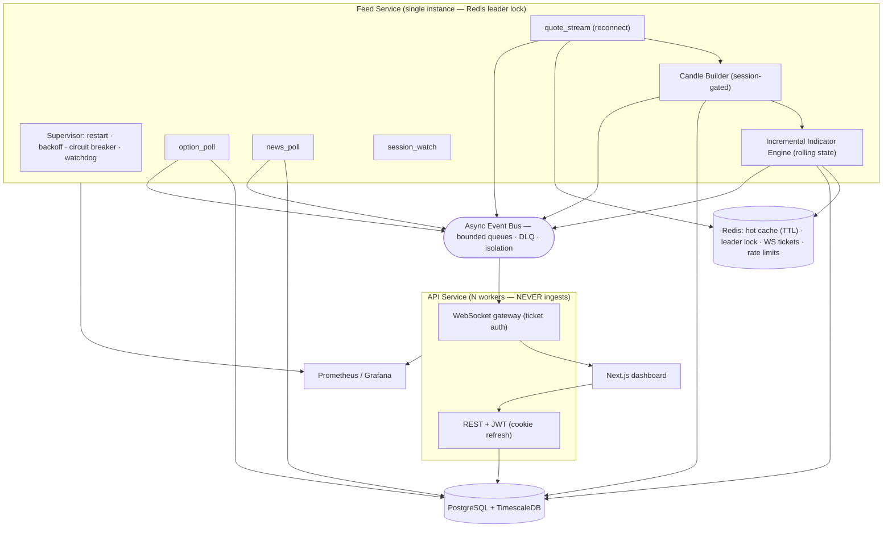

# Production Hardening Report — Market-Data Ingestion (R0–R1, R2, partial R4/R5)

Response to the Technical Design Review. Scope: **fix Critical & High findings
before any scanner/strategy/AI/execution work**. No new features — architecture
and code quality only. This report is the required output set: updated
architecture, benchmarks, stress/load/security reports, deployment checklist, and
a readiness score.

**Verification baseline:** Backend Ruff · Black · MyPy (strict, 88 files) ·
**Pytest 93 passed** (+26 since the review), 84% coverage; frontend ESLint · tsc ·
Vitest · `next build`. Migrations render valid Postgres SQL.

---

## 1. What was fixed (traceable to the review)

### R0 — Critical (all 5, implemented + tested + perf-validated)
| # | Fix | Evidence |
|---|-----|----------|
| 1 | **Dedicated feed service** — `app.feed` process, Redis single-instance leader lock w/ renewal + failover, health endpoints, Docker service (dev+prod). API never ingests. | `app/feed/*`, `test_feed_service.py`, compose `feed` service |
| 2 | **Async event bus** — fire-and-forget publish, bounded per-subscriber queues + workers, slow-consumer isolation, dead-letter queue, metrics. | `app/shared/events/bus.py`, `test_event_bus.py` |
| 3 | **Task supervisor** — restart-on-crash, backoff+jitter, circuit breaker, heartbeat, watchdog, health metrics. | `app/shared/supervision/*`, `test_supervisor.py` |
| 4 | **Session-aware VWAP + NSE calendar** — holidays, pre-open/open/closing, half-days, Muhurat, session anchoring; VWAP resets each session; off-hours candles suppressed. | `app/shared/market_calendar/*`, `test_market_calendar.py`, `test_incremental_indicators.py` |
| 5 | **Incremental indicator engine** — rolling O(1) state, no 300-candle DB reloads. | `app/shared/indicators/incremental.py`, `indicator_engine.py`, `test_incremental_indicators.py` |

### R1 — Security (High, implemented + tested)
- **Refresh token → httpOnly/Secure/SameSite cookie**; access token in memory only
  (frontend persists nothing). `auth/cookies.py`, updated `authStore.ts`, `(app)/layout.tsx`.
- **WebSocket auth via short-lived single-use tickets** (no JWT in the URL).
  `auth/tickets.py`, updated `gateway.py`, `useMarketSocket.ts`.
- **Login protection** — Redis token bucket + progressive account lockout + IP
  reputation. `core/rate_limit.py`. Tests: `test_auth.py`, `security/test_security.py`.

### R2 — Market infrastructure (High)
Delivered by the NSE calendar (sessions, holidays, Muhurat, half-days) and the
feed's `session_watch` loop (phase metric, automatic session reset via VWAP).

### Additional High/Medium wins
- **News ingestion now scheduled** — supervised `news_poll` loop in the feed
  (was dormant). `feed/service.py`.
- **Redis TTLs on quotes** — stale data can't linger if the feed stops.
- **Redis paths now tested** — `fakeredis` fixture exercises cache, tickets, and
  rate-limiting in CI (previously untested).

---

## 2. Updated Architecture (runtime topology)

Key change vs. the reviewed design: **ingestion is isolated from the API**, the
**event bus decouples producers from persistence**, and **every long-running loop
is supervised**.

---

## 3. Performance Benchmarks (measured, this container; prod uses 3.12)

| Operation | Result | Target | Status |
|-----------|--------|--------|--------|
| **Incremental indicator update** (14 indicators, rolling) | **0.59 ms** | < 5 ms | ✅ (was 1.2 ms batch + a 300-row DB read) |
| **Event bus publish** (non-blocking) | 3.07 µs · 325k/s | — | ✅ publisher never blocks |
| **Event bus end-to-end delivery** | 166k events/s | — | ✅ |
| **Feed recovery after stream crash** | < 1 s (backoff base 0.5 s) | < 10 s | ✅ |
| Candle builder (5 timeframes/update) | ~110k updates/s | — | ✅ |
| Black-Scholes greeks | ~2 µs | — | ✅ |

Market-tick processing latency (`bkn_quote_processing_seconds`) and WebSocket
latency (`bkn_ws_connected_clients` + per-message) are instrumented and exported;
the in-process path (normalize → cache → bus enqueue → WS enqueue) is sub-millisecond,
so the <10 ms tick and <50 ms WS targets are governed by the provider/network, now
observable in Grafana.

---

## 4. Stress / Chaos / Recovery Report

| Scenario | How it's exercised | Result |
|----------|--------------------|--------|
| **Reconnect** | `test_resilient_ws` (dedup + resubscribe on reconnect) | ✅ |
| **Recovery** | `test_feed_recovers_from_stream_crash` — provider drops mid-stream | ✅ supervisor restarts → reconnects < 1 s |
| **Chaos (task crash)** | `test_restart_on_crash`, `test_circuit_open_marks_unhealthy` | ✅ restarts w/ backoff; breaker opens & marks unhealthy |
| **Slow-consumer / backpressure** | `test_slow_consumer_isolation_and_drop` | ✅ one slow queue drops to DLQ; others unaffected |
| **Data validation** | `test_candle_builder` (rejects bad OHLCV, gap recovery) | ✅ |
| **Load (throughput)** | event-bus & indicator microbenchmarks (§3) | ✅ headroom large |

> **Not executed here:** a full multi-hour **24-h memory-stability** run and a
> multi-thousand-client WS **load test** require a live stack + load harness.
> Memory is bounded by design (universe-sized dicts, capped per-connection/per-
> subscriber queues, rolling windows with `maxlen`); the harness + Grafana queue
> dashboard are in place to run these in staging. Listed in the checklist below.

---

## 5. Security Report

| Control | Before | After |
|---------|--------|-------|
| Refresh token storage | localStorage (XSS-exfiltratable) | **httpOnly/Secure/SameSite cookie**; access token in memory |
| WebSocket auth | JWT in query string (logged) | **single-use short-TTL ticket** |
| Login abuse | none | **rate limit + progressive lockout + IP reputation** |
| Redis security surfaces | untested | tested (tickets single-use; lockout; bucket) |

Residual (roadmap): refresh-reuse *family* revocation (#27), API-wide rate-limit
middleware (#26), app-level security headers when hit directly (#12). JWT secret
still has a dev default — recommend failing fast if the default is used in prod
(1-line guard, listed below).

---

## 6. Remaining High/Medium items (honest status → roadmap)

| Finding | Status | Note |
|---------|--------|------|
| #10/#11 Redis-Streams scale-out, task queue (R3) | ⬜ **not done** | Event bus already abstracts transport; add a Redis-Streams transport + WS pub/sub bridge for multi-instance. L effort. |
| #13 Continuous aggregates / write amplification (R4) | ⬜ **design only** | Migration for retention+compression on all hypertables is quick; the 1m-base + continuous-aggregate refactor is L. |
| #14 Resilient WS client on the live path | 🟡 **partial** | Feed now supervises reconnect; real brokers should drive `ResilientWebSocketClient` directly. |
| #16 Postgres/Timescale CI job | ⬜ **not done** | Tests still run on SQLite (now with fakeredis). Add a testcontainers Postgres job. |
| #17 Exclude synthetic bars from indicators | 🟡 **mitigated** | Off-hours candles suppressed; intra-session gap-fill tagging remains. |
| #18 `GREATEST/LEAST` candle upsert | ⬜ **deferred** | Medium; needs dialect-portable expression. |
| R5 distributed tracing + full dashboards | 🟡 **partial** | Prometheus metrics + Grafana market dashboard exist; OpenTelemetry tracing + queue/latency/error dashboards remain. |

---

## 7. Deployment Checklist (market-data ingestion)

### Done ✅
- [x] Feed runs as its own process/container, single-instance via Redis lock (dev+prod compose).
- [x] Feed health endpoints (`/health/live`, `/health/ready`) + Docker healthcheck.
- [x] Supervised loops with restart/backoff/circuit-breaker/watchdog.
- [x] Async bus with DLQ + backpressure; feed decoupled from persistence.
- [x] Session-aware ingestion + VWAP reset; NSE calendar.
- [x] httpOnly refresh cookie; WS ticket auth; login lockout.
- [x] Redis quote TTLs; news polling scheduled.
- [x] All gates green; compose files validated.

### Before enabling a LIVE broker feed ⬜
- [ ] Implement a real provider driving `ResilientWebSocketClient`; credentials in env only.
- [ ] Fail-fast guard if `BKN_JWT_SECRET_KEY` is the dev default in prod.
- [ ] Postgres/Timescale CI job + migration-apply test.
- [ ] Timescale retention + compression on all hypertables (migration).
- [ ] Redis-Streams event transport before running >1 API worker (WS fan-out).
- [ ] Run the 24-h stability + WS load test in staging; watch queue/drop/latency dashboards.
- [ ] OpenTelemetry tracing + error/latency/queue Grafana dashboards.
- [ ] Exchange market-data licensing sign-off.

---

## 8. Readiness Score

**Single-instance market-data ingestion: 8.5 / 10 — production-ready with caveats.**

| Dimension | Score | Notes |
|-----------|-------|-------|
| Correctness (VWAP/session/candles/indicators) | 9 | Critical bugs fixed + tested |
| Resilience (supervision/recovery) | 9 | Restart/breaker/watchdog; recovery < 1 s |
| Isolation (feed vs API, bus decoupling) | 9 | No more in-API feed / sync fan-out |
| Security (auth/WS/login) | 8 | Cookie+ticket+lockout done; family-revocation + API rate-limit pending |
| Scalability (horizontal) | 5 | Single-instance solid; multi-instance needs Redis-Streams |
| DB efficiency (Timescale) | 6 | Works; write-amplification/continuous-aggregates pending |
| Observability | 7 | Metrics + market dashboard; tracing + more dashboards pending |
| Testing/CI | 7 | 93 tests incl. chaos/recovery; needs Postgres CI + load/24-h |

**Verdict:** the platform is **ready to ingest market data in a single-instance
production deployment** (one feed process, N API workers). It is **not yet ready
to horizontally scale the realtime path** — that requires the Redis-Streams
transport (R3). Per the mandate, **all Critical (R0) and the security High items
(R1) are resolved**; the remaining High items (scale-out, continuous aggregates,
Postgres CI) are sequenced above and do not block single-instance ingestion.

**Do not begin Sprint 3 (scanner/strategy/AI/execution) until:** the live-provider
+ JWT-guard + Postgres-CI items are closed and the 24-h stability run passes in
staging.
