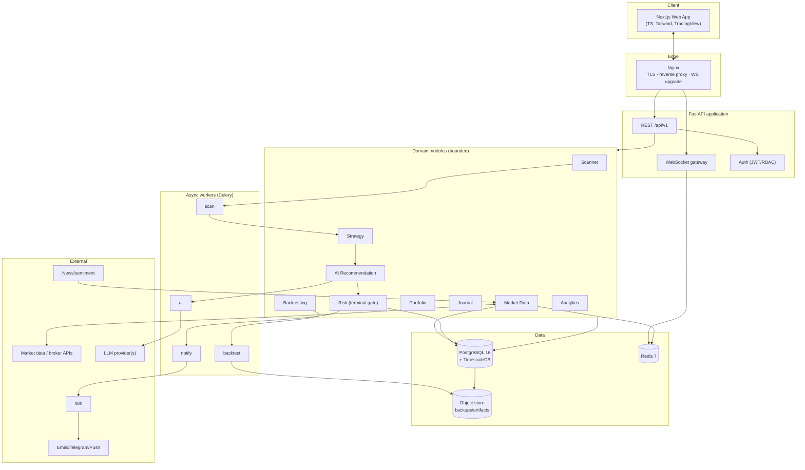
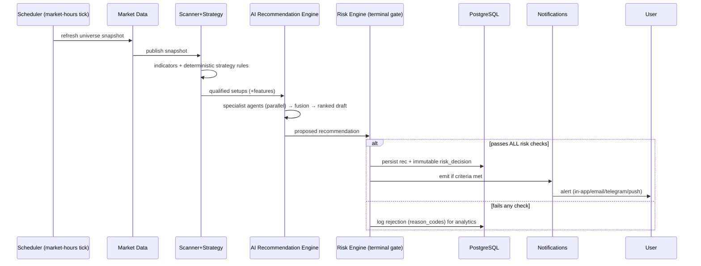
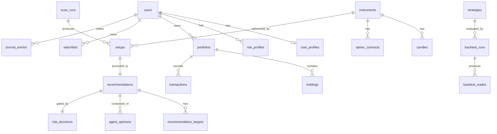
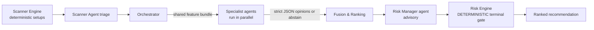
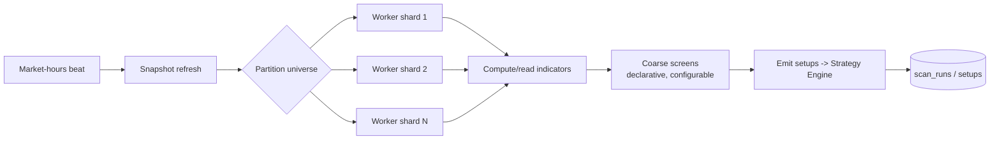
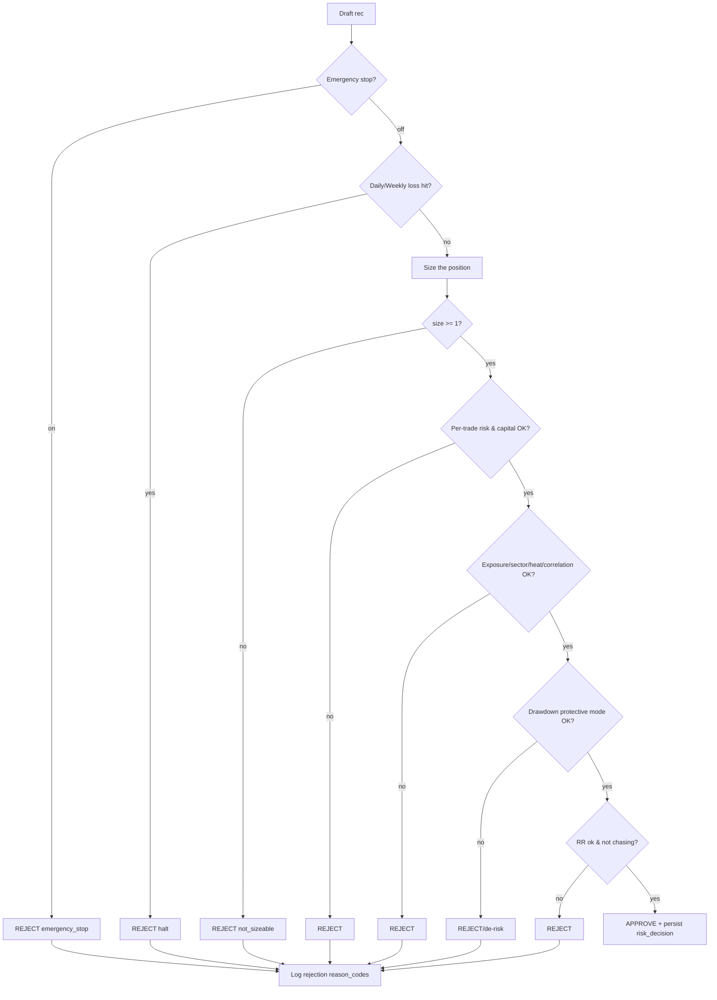
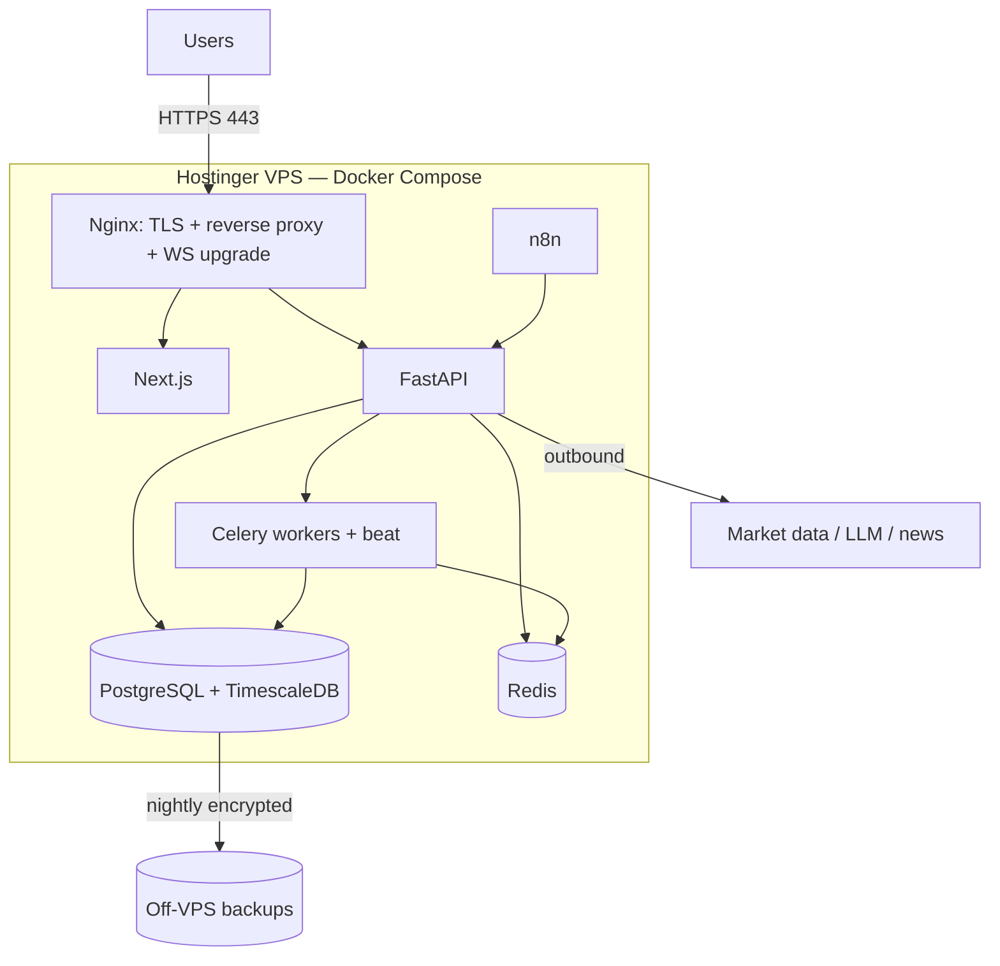

# BKN AI Capital — Software Design Document (SDD)

**Status:** For architecture review & approval · **Version:** 1.0 · **Phase:** Architecture (no application code)

> This is the consolidated, handoff-ready design document for BKN AI Capital — an
> institutional-grade, AI-assisted trading platform for the Indian market. It is
> self-contained; each section links to a deeper companion doc where one exists.
> **Nothing here executes trades. V1 is advisory only.** Implementation begins
> only after this document is approved.

### How to read this
Sections map 1:1 to the review objectives. Deep-dive companions:
[Architecture](01-architecture.md) · [Folders](02-folder-structure.md) ·
[DB](03-database-schema.md) · [API](04-api-design.md) ·
[Services](05-service-architecture.md) · [AI](06-ai-agents.md) ·
[Scanner](07-scanner-engine.md) · [Risk](08-risk-management.md) ·
[UI](09-frontend-ui.md) · [Deploy](10-deployment.md) ·
[Roadmap](11-roadmap.md) · [Security](12-security-compliance.md).

---

## 1. Overall System Architecture

### 1.1 Style
A **modular monolith at the code level, service-oriented at runtime**: one
FastAPI backend with strictly bounded modules (Clean Architecture), plus
independently-scaling **workers** for the bursty, heavy work (scanning, LLM
agents, backtests). Boundaries are drawn so the hot components can later be
extracted into standalone services without rewrites. Rationale: a small team
ships far faster on one deployable than on a dozen microservices, while the clean
seams preserve the option to split. See [01](01-architecture.md).

### 1.2 High-level architecture diagram



### 1.3 Service interactions
Modules never touch each other's tables — they collaborate through **published
application interfaces** (synchronous, in-process) and **domain events on Redis
pub/sub + Celery** (asynchronous, for the pipeline). This is what keeps each
module independently maintainable and extractable. See
[05](05-service-architecture.md) §3–4.

| Event | Emitted by | Consumed by |
|-------|-----------|-------------|
| `MarketSnapshotUpdated` | Market Data | Scanner |
| `SetupDetected` | Strategy | AI Recommendation |
| `RecommendationDrafted` | AI Recommendation | Risk |
| `RecommendationApproved` | Risk | Notifications, Portfolio, Analytics |
| `RecommendationRejected` | Risk | Analytics (learning loop) |
| `TradeJournaled` | Journal | Analytics |

### 1.4 Request flow (synchronous read)
`Browser → Nginx → FastAPI (JWT auth) → module application service → repository
(Postgres) / Redis snapshot → typed response`. p95 read target < 200 ms; live
quotes served from the Redis hot snapshot, not Postgres.

### 1.5 Real-time data flow
Market Data keeps a hot snapshot in Redis (updated each provider tick) and
publishes to Redis pub/sub. The WebSocket gateway authorizes each subscription
and fans out to browsers (`quotes:{symbol}`, `indices`, `recommendations`,
`alerts`, `portfolio`). Target: provider→browser < 500 ms. See [04](04-api-design.md) §12.

### 1.6 AI workflow (the recommendation pipeline)



**Invariant:** the AI ranks and explains; the **Risk Engine is the terminal
gate**. No AI path or client can bypass it. Deterministic strategy candidates
come *first*, so every agent is grounded in precomputed facts and LLM cost is
bounded.

### 1.7 Deployment architecture (summary)
Single **Hostinger VPS** running the full stack via Docker Compose behind
**Nginx + Let's Encrypt TLS**; Postgres/Redis bound to the private Docker
network. Identical topology to local dev. Full detail in §11 and [10](10-deployment.md).

---

## 2. Folder Structure

Monorepo; frontend, backend, AI, shared libs, config, and infra versioned
together. Backend follows Clean Architecture (dependencies point inward). Full
tree in [02](02-folder-structure.md).

```
peace_maker/
├── frontend/          # Next.js + TS + Tailwind
│   └── src/{app,components,features,lib,hooks,stores,types}
├── backend/           # Python + FastAPI
│   └── app/
│       ├── core/                # config, security, db, redis, di, telemetry
│       ├── modules/             # bounded contexts (see below)
│       │   └── <module>/{domain,application,infrastructure,api,tests}
│       ├── ai_engine/           # AI MODULES: agents/, orchestration/, infra
│       ├── workers/             # Celery app + tasks + market-hours schedule
│       ├── websocket/           # WS gateway + channels
│       └── shared/              # SHARED LIBS: indicators/, market_calendar/, types/
│   └── migrations/              # Alembic
├── automation/n8n/    # exported workflows (alerts, EOD, news ingest)
├── infra/             # INFRASTRUCTURE
│   ├── docker/ (backend/frontend/nginx Dockerfiles + nginx conf)
│   ├── compose/ (dev|staging|prod compose files)
│   ├── env/     # CONFIG: .env.*.example (documented, no secrets)
│   └── observability/ (prometheus, grafana, loki)
├── scripts/           # seed, migrate, lint helpers
├── .github/workflows/ # CI/CD
├── docs/              # this design set
└── docker-compose.yml, Makefile, .env.example
```

- **Frontend** `features/` mirror backend `modules/`; API types are **generated
  from the backend OpenAPI** so contracts never drift.
- **AI modules** live under `backend/app/ai_engine` — agents are pluggable and
  individually testable; prompts are versioned assets.
- **Shared libraries** (`shared/indicators`, `shared/market_calendar`) are pure,
  deterministic, and provider-agnostic with golden-value tests.
- **Config** is 12-factor: typed Pydantic settings from env; `.env.*.example`
  documents every key.

---

## 3. Database Design

**PostgreSQL 16 + TimescaleDB** (time-series in the same DB as relational —
avoids a second datastore). Money is `NUMERIC(18,4)`, never float; timestamps are
`TIMESTAMPTZ` (UTC stored, IST rendered). Migrations via Alembic. Full DDL in
[03](03-database-schema.md).

### 3.1 ER diagram (overview)



### 3.2 Tables (by domain)
| Domain | Tables |
|--------|--------|
| identity | `users`, `user_profiles`, `refresh_tokens`, `risk_profiles` |
| market | `instruments`, `candles`*, `option_contracts`, `option_chain_snapshots`*, `market_indicators`* |
| signals | `scan_runs`, `setups`, `recommendations`, `recommendation_targets`, `agent_opinions` |
| risk | `risk_decisions` |
| portfolio | `portfolios`, `holdings`, `transactions`, `watchlists`, `watchlist_items` |
| journal | `journal_entries` |
| backtest | `strategies`, `backtest_runs`, `backtest_trades` |
| ops | `notifications`, `audit_log`, `feature_flags` |

`*` = TimescaleDB hypertable.

### 3.3 Relationships & integrity
- One bar → at most one setup per strategy: `setups (instrument_id,
  strategy_name, bar_ts)` **unique** (idempotency).
- Every recommendation has exactly one `risk_decision` (the gate result) and its
  contributing `agent_opinions` (explainability).
- `risk_decisions` and `audit_log` are **append-only/immutable** (UPDATE/DELETE
  revoked in prod).
- Recommendations denormalize entry/stop/targets so historical records stay
  meaningful if a strategy later changes.

### 3.4 Indexes
| Concern | Index |
|---------|-------|
| Active recs feed | partial `(status, created_at DESC) WHERE status='active'` |
| Unread notifications | partial `(user_id) WHERE read_at IS NULL` |
| Time-series reads | hypertable primary keys `(instrument_id, timeframe, ts)` + chunk pruning |
| F&O universe scans | partial `(in_fno) WHERE in_fno` |
| Audit lookups | `(entity_type, entity_id)` |

### 3.5 Data retention strategy
| Data | Retention |
|------|-----------|
| Ticks / 1m candles | 6–12 months, then downsampled |
| Higher-TF candles | continuous aggregates from 1m base |
| Daily candles | indefinite |
| Option-chain snapshots | compressed after 7 days (TimescaleDB), pruned per policy |
| Recommendations / risk_decisions / audit | retained long-term (compliance) |
| Backtest artifacts | object store, lifecycle-expired |

---

## 4. API Design

Base path `/api/v1` (URL-versioned). JSON, `snake_case`. OpenAPI 3.1 auto-generated;
TS client generated from it. Full contract in [04](04-api-design.md).

### 4.1 Representative REST endpoints
| Area | Endpoints (selected) |
|------|----------------------|
| Auth | `POST /auth/{register,login,refresh,logout}`, `POST /auth/mfa/{setup,verify}`, `POST /auth/ws-ticket` |
| Me/Profile | `GET /me`, `PATCH /me/profile`, `GET|PUT /me/risk-profile`, `GET|PUT /me/notification-prefs` |
| Market | `GET /market/{instruments,quote/{id},candles/{id},indicators/{id},option-chain/{u},indices,breadth}` |
| Scanner | `GET /scanner/{runs,setups}`, `POST /scanner/run`, `GET|PUT /scanner/config` |
| Recommendations | `GET /recommendations`, `GET /recommendations/{id}`, `GET /recommendations/{id}/explanation`, `POST /recommendations/{id}/{act,dismiss}`, `GET /recommendations/history` |
| Risk | `POST /risk/position-size`, `GET /risk/exposure`, `GET /risk/decisions` |
| Portfolio/Watchlist/Journal | `GET /portfolio`, `GET|POST /portfolio/transactions`, `POST /portfolio/import`, `…/watchlists…`, `GET|POST|PATCH /journal…` |
| Backtest/Analytics | `POST|GET /backtests`, `GET /analytics/{performance,attribution,behavior}` |
| Notifications/Admin | `GET /notifications`, `POST /notifications/{id}/read`, `…/admin/{users,feature-flags,agents}` |

### 4.2 WebSocket events
Single authenticated multiplexed socket at `/api/v1/ws` (short-lived ticket).
Client subscribes to channels; server pushes events:

| Channel | Event payloads |
|---------|----------------|
| `quotes:{symbol}` | live LTP, change, volume |
| `indices` | Nifty/BankNifty/Sensex/VIX ticks |
| `recommendations` | `new`, `invalidated`, `expired` |
| `alerts` | criteria-met notifications |
| `portfolio` | live P&L updates |

### 4.3 Authentication
JWT: short-lived **access** (~15 min) + rotating **refresh** (httpOnly cookie;
server stores only a hash). RBAC (`user`/`admin`), server-enforced on every
endpoint. Passwords Argon2id. MFA (TOTP) ready, enforced for admins. WS via
short-lived ticket. See [12](12-security-compliance.md) §2.

### 4.4 Error handling
Consistent envelope with a machine code, human message, structured details, and a
correlation ID:
```json
{ "error": { "code": "risk_limit_exceeded", "message": "…",
  "details": { "limit_pct": 1.0, "attempted_pct": 1.8 },
  "correlation_id": "b1f2…" } }
```
Typed domain errors map to stable codes; validation errors (Pydantic) return
field-level detail; the correlation ID threads logs/traces.

### 4.5 Rate limiting
Redis token-bucket per user and per endpoint (default 60 req/min/user, tighter on
heavy endpoints), plus separate budgets on outbound provider/LLM calls. `429`
with `Retry-After`. Deprecations announced via `Sunset`/`Deprecation` headers
(≥90-day window).

---

## 5. AI Architecture (independent agents)

The AI is a **panel of specialist agents**, each with a narrow mandate producing a
**structured, scored, explainable** opinion; an orchestrator **fuses** them into
one ranked recommendation. Agents *interpret and explain* — they never invent
prices or compute size, and never override the Risk Engine. Full design in
[06](06-ai-agents.md).

### 5.1 The agents
| Agent | Mandate |
|-------|---------|
| **Market Intelligence Agent** | Regime, index trend, breadth, macro backdrop |
| **Scanner Agent** | Triage scanner candidates → shortlist worth full analysis |
| **Technical Analysis Agent** | Price structure, indicators, patterns |
| **Options Analysis Agent** | Option chain, OI, IV, greeks, structure selection |
| **Swing Trading Agent** | Multi-day validity, sector context, holding horizon |
| **Intraday Agent** | Session structure, VWAP, momentum, liquidity, timing |
| **News Agent** | Catalysts, event risk, sentiment, blackout windows, news-impact note |
| **Risk Manager** (agent) | *Advisory* risk read before the deterministic gate |
| **Portfolio Manager** (agent) | Correlation/concentration vs the existing book |
| **Journal Coach** | Behavioral guardrails, tilt/discipline, learning from journal |

### 5.2 How they communicate

- The **Orchestrator** dispatches a compact, precomputed **feature bundle** (real
  numbers already calculated by the quant core) to relevant agents in parallel.
- Each agent returns a **Pydantic-validated JSON contract** (`stance`, `score`,
  `key_points`, `risks`, self-uncertainty). Malformed output ⇒ that agent
  abstains; it never corrupts fusion.
- Communication is via the in-process orchestrator + the `ai` Celery queue; agent
  outputs persist to `agent_opinions` for audit.

### 5.3 How they produce ONE final recommendation (fusion)
1. **Relevance gating** — only agents relevant to the `trade_type` contribute
   (e.g. Options Analysis ≈ 0 weight for a pure equity swing).
2. **Weighted confidence** — `Σ(weightᵢ·scoreᵢ)/Σ(weightᵢ)`; weights are
   runtime-configurable in Admin.
3. **Veto** — a veto (Risk Manager, or News blackout) can only *lower/zero*
   confidence, never raise it.
4. **Disagreement penalty** — high variance across agents lowers confidence and is
   surfaced ("analysts disagree on…"); honesty about uncertainty is required.
5. **Calibration** — raw scores pass a calibration map fit on historical outcomes
   (Journal/Backtest loop) so a "78" is honest.
6. **Ranking** — approved drafts ranked by `confidence × expected RR`, deduped per
   instrument. Numeric trade parameters come from deterministic code; the Risk
   Engine has final veto.

**Explainability:** each agent's opinion, the applied weights, and the synthesized
narrative are persisted and exposed via `/recommendations/{id}/explanation`.
**Degradation:** if LLMs fail, the system falls back to deterministic
Strategy+Risk output, clearly labeled "reduced-AI" — it never drops risk gating.

---

## 6. Scanner Architecture

The scanner is the always-on "eyes": breadth and speed across large universes,
emitting candidate setups downstream. Full detail in [07](07-scanner-engine.md).

### 6.1 What it monitors
**Universes:** Nifty 500, F&O stocks, Nifty, BankNifty, Sensex, India VIX, index
option chains, futures.
**Signals per instrument/timeframe:** Volume & relative volume, Open Interest (+
change), VWAP, EMA (9/21/50/200), RSI(14), MACD, ATR(14), Supertrend, plus
market-level **breadth** (advances/declines) and **sector rotation**. All
indicator math is in the pure, golden-tested `shared/indicators`.

### 6.2 Pipeline


### 6.3 Update frequency (market-hours aware)
| Universe / purpose | Cadence |
|--------------------|---------|
| Indices, VIX, index option chains | ~every 1 min (or faster on ticks) |
| Intraday F&O hot list | 1m / 5m |
| Broad Nifty 500 / swing screens | 15m and EOD |
| Instrument master & memberships | daily pre-open |
The `shared/market_calendar` gates all scheduling to NSE session windows; an EOD
job prepares swing setups and rollups. Screens are **coarse/permissive** (favor
recall) — precision belongs to the Strategy Engine and the Risk gate.

### 6.4 Scalability
- Universe is **sharded across `scan` workers**; add workers or shard finer to
  scale. Target: full F&O scan tick < 10 s.
- Latest snapshot served from **Redis**, not Postgres (hot path).
- **Incremental compute** — only the latest bar recomputed; history cached.
- **Backpressure:** if a tick overruns, skip-and-log (freshness > completeness).
- Idempotent emission via `(instrument, strategy, bar_ts)`.
- Extraction path: Scanner can become its own service behind its event interface
  when load demands ([05](05-service-architecture.md) §10).

---

## 7. Dashboard Architecture

Professional, **institutional, dark-first** terminal UI; **mobile-responsive**
(desktop-primary, mobile for monitoring/alerts); real-time via WebSocket. Design
system on Tailwind; TradingView for charts; TanStack Query (server state) +
Zustand (client/WS state); types generated from OpenAPI. Full wireframes in
[09](09-frontend-ui.md).

Persistent **top bar** (live indices ticker, ⌘K command palette, alerts bell,
profile) + left **sidebar** nav. Color is never the only signal (accessibility,
WCAG AA).

| Page | Purpose / key content |
|------|-----------------------|
| **Dashboard** | Cockpit: market regime, top ranked recommendations, portfolio snapshot with **risk budget & heat used vs limits**, live alerts, sector-rotation heatmap |
| **Scanner** | Live-updating setups table; universe/type/timeframe/confidence filters; saved screens; row → detail drawer |
| **Charts** | Full TradingView advanced charts with platform indicators overlaid; option-chain panel for indices; multi-timeframe |
| **Recommendations** | Ranked list + **Recommendation Detail** — the trust surface rendering *every* required field and the agent-by-agent panel (who agreed/dissented) |
| **Portfolio** | Holdings, live P&L, exposure & **portfolio-heat gauges**, sector allocation, correlation heatmap, transaction ledger, statement import |
| **Journal** | Trade log (auto-draft from acted recs), outcome, R-multiple, emotional state, "followed plan?" — feeds behavioral analytics |
| **Analytics** | Equity curve, win rate, expectancy, profit factor, max drawdown; attribution by strategy/segment/sector; behavioral insights |
| **Settings** | Profile & capital, **risk-profile editor** (limits with live "what this means" preview), notification channels, theme, data sources |
| **Admin** | User management, feature flags, **agent config** (enable/weight/model), scanner-screen tuning, system health, emergency-stop toggle |

**Real-time UX:** in-place price/P&L updates (flash, no reflow), optimistic edits,
auto-reconnect with a stale badge, toasts + persistent bell for new
high-confidence recs. **Designed empty/error states:** "market quiet — no
high-quality setups", daily/weekly-loss-halt banners, reduced-AI badge,
emergency-stop banner.

---

## 8. Trading Recommendation Engine

The engine assembles deterministic trade parameters, attaches AI reasoning, and
passes the Risk gate before anything reaches the user. **Every recommendation
contains all of the following** — the API rejects any that is missing a field
(defense in depth beyond the gate):

| Field | Source |
|-------|--------|
| **Ticker / instrument** | Market Data |
| **Trade Type** (intraday/swing/options) | Strategy |
| **Entry** | Deterministic (strategy trigger) |
| **Stop Loss** | Deterministic (structure/ATR) |
| **Target 1 / Target 2 / Target 3** | Deterministic (R-multiples/levels) |
| **Risk Reward** (per target + blended) | Deterministic |
| **Position Size** (qty/lots) | Risk Engine |
| **Confidence Score** (0–100, calibrated) | AI fusion |
| **Reasoning** (synthesis) | AI orchestrator |
| **Technical Analysis** | Technical Analysis Agent |
| **News Impact** | News Agent |
| **Market Context** | Market Intelligence Agent |
| **Risk Factors** | Risk Manager + agents |
| **Invalidation Conditions** (machine-checkable) | Strategy + Risk |
| **Expected Holding Time** | Swing/Intraday Agent (`expected_hold` + bars) |
| **Expected Volatility** | Derived (ATR% regime) + Market Intelligence |
| Max Capital Allocation · Expected Risk (₹ & %) | Risk Engine |

Example payload and the contract guarantee are in [04](04-api-design.md) §7;
persistence in [03](03-database-schema.md) §3.3. A background **invalidation
monitor** transitions active recs to `invalidated`/`expired` on live data and
pushes a WS update so stale ideas never linger.

---

## 9. Risk Engine

The **terminal gate** of the pipeline and the platform's most important promise:
a recommendation reaches the user *only* if it passes **every** hard check. All
limits are **server-enforced** and per-user (`risk_profiles`); every decision
(pass or reject) writes an immutable `risk_decisions` audit row. Full logic and
must-pass test suite in [08](08-risk-management.md).

### 9.1 Rules
| Rule | Design |
|------|--------|
| **Position sizing** | Fixed-fractional: `size = floor(capital×risk% / |entry−stop|)`, rounded to lot; if size = 0 ⇒ **reject** (never show an un-sizeable idea) |
| **Daily risk** | Once `today_realized_loss ≥ max_daily_loss_pct` ⇒ halt new recs for the day |
| **Weekly risk** | Once `week_realized_loss ≥ max_weekly_loss_pct` ⇒ halt for the ISO week |
| **Maximum exposure** | `deployed + new ≤ capital × max_total_exposure_pct` |
| **Sector exposure** | `sector_exposure + new ≤ capital × max_sector_exposure_pct` |
| **Correlation** | Reject if highly correlated with an existing open position (concentration) |
| **Position sizing caps** | Also capped by `max_capital_per_trade_pct` and `max_open_positions` |
| **Portfolio heat** | Aggregate open risk: `Σ(sizeᵢ·|entryᵢ−stopᵢ|)/capital`; new rec rejected if heat > `max_portfolio_heat_pct` (default 6%) |
| **Maximum drawdown** | At `max_drawdown_pct` (peak-to-trough equity) ⇒ protective mode: cut risk-per-trade and/or halt until acknowledged |
| **Emergency stop** | Global kill-switch (manual or auto-triggered by data-integrity failure, VIX/gap shock, drawdown, anomaly) forces `reject=emergency_stop` platform-wide until an audited resume |

Plus **anti-martingale** (risk only ratchets down after losses, never up),
**anti-chase** (reject entries that have run beyond a configurable band from the
trigger), and minimum-RR enforcement. These are **release-gating tests** — the
platform does not ship if the gate leaks.

### 9.2 Decision flow


---

## 10. Backtesting Engine (architecture only)

Validates strategies and the fusion/calibration on history before anything ships
— "validate each stage." Runs as batch **`backtest` workers**; results feed the
AI calibration/learning loop and act as **CI regression gates**. Schema in
[03](03-database-schema.md) §3.7.

### 10.1 How strategies are tested
- Strategies are declarative/versioned (`strategies` table: name, version,
  params). A run is defined by `(strategy, universe, period, params)`.
- The engine **replays historical candles bar-by-bar through the same
  deterministic Strategy Engine and Risk Engine** used in production — so a
  backtest exercises the *real* sizing and gating, not a parallel reimplementation
  (single source of truth, no live/backtest drift).
- Event-driven simulation with explicit **fills, slippage, fees, and lot sizes**;
  point-in-time correctness (no lookahead) enforced by feeding only data ≤ bar.

### 10.2 Historical data
- OHLCV from TimescaleDB (`candles`), option/OI history from
  `option_chain_snapshots`, indicators recomputed by `shared/indicators` (same
  code as live). Corporate-action/adjustment handling on the instrument master.
- Long-horizon daily data retained indefinitely; intraday depth per retention
  policy (§3.5).

### 10.3 Performance metrics
Per run (`backtest_runs.metrics` JSON) + per-trade log (`backtest_trades`):
CAGR/total return, **win rate, expectancy, profit factor, average R, Sharpe/Sortino,
max drawdown, exposure, trade count, avg holding time**, and an **equity curve**
artifact (object store). Golden metrics lock into a regression suite so strategy
or fusion changes must clear prior results before release.

---

## 11. Deployment

**Docker** everywhere; identical topology local → prod. V1 hosts on a **Hostinger
VPS** via Docker Compose behind **Nginx**. Full detail in [10](10-deployment.md).



| Component | Design |
|-----------|--------|
| **Docker** | Multi-stage images: `bkn-backend`, `bkn-worker` (same code, diff entrypoint), `bkn-frontend`, `postgres` (timescale), `redis`, `n8n`, `nginx` |
| **Hostinger** | KVM VPS; only 22/80/443 exposed; DB/Redis on private Docker net (never published); `ufw`+`fail2ban`, key-only SSH, unattended security updates |
| **Nginx** | Public entry; TLS termination, HTTP→HTTPS, `/`→Next.js, `/api`→FastAPI, `/api/v1/ws` WebSocket upgrade, security headers, gzip/brotli |
| **SSL** | Let's Encrypt (Certbot) with auto-renew; TLS 1.2+ modern ciphers |
| **PostgreSQL** | Postgres 16 + TimescaleDB; Alembic migrations as pre-deploy job; nightly encrypted backups off-VPS; WAL archiving (RPO ≤ 5 min) |
| **Redis** | Cache + pub/sub + Celery broker; bound to private net |
| **FastAPI** | Uvicorn/Gunicorn ASGI; stateless; horizontally replicable |
| **Next.js** | Standalone build; SSR/ISR; static assets cached at Nginx |
| **Environment variables** | Root `.env` on VPS (chmod 600, uncommitted); `infra/env/.env.prod.example` documents every key; rotatable; never in images/logs |
| **CI/CD** | GitHub Actions: lint→type→unit→integration(testcontainers)→contract→**risk-gate & backtest regression (hard gate)**→security scans→build/push→SSH deploy (`compose pull`→migrate→`up -d`→health-check→auto-rollback) |
| **Logging** | Structured JSON + correlation IDs (request & per-recommendation) → Loki |
| **Monitoring** | Prometheus + Grafana (API latency, pipeline duration, queue depth, scan efficacy, LLM error rate); OpenTelemetry traces; Sentry errors; trading-hours SLO alerts + kill-switch runbook |

CI/CD flow and alert catalog in [10](10-deployment.md) §4/§6.

---

## 12. Sprint Plan

**18 sprints, each an independently-deployable increment** — every sprint ends
with something that builds, passes the gates, and ships to staging (prod after
M0). Incomplete work sits behind feature flags; migrations are additive; no
sprint depends on the *next* one to be releasable. Full detail, milestones, and
DoD in [11](11-roadmap.md).

| # | Sprint | Ships | Milestone |
|---|--------|-------|-----------|
| S1 | Skeleton & CI | Monorepo scaffold, Docker Compose stack, Postgres+Timescale+Redis, base CI | |
| S2 | Auth & profiles | JWT auth, RBAC, user/profile + risk-profile CRUD, staging pipeline | **M0** |
| S3 | Nginx + SSL + prod | Nginx, Let's Encrypt TLS, Hostinger bring-up, prod deploy path | |
| S4 | Instrument master & ingest | Instruments + seed, market-data adapter, candle/quote persistence, calendar | |
| S5 | Indicators & snapshot cache | Golden-tested indicators lib, Redis hot snapshot | |
| S6 | Realtime + Live Market | WebSocket gateway, indices ticker, Charts/Live Market (TradingView), Dashboard v1 | **M1** |
| S7 | Scanner Engine | Universe sharding, screening, `scan_runs`/`setups`, market-hours beat | |
| S8 | Strategy Engine | 2–3 deterministic strategies → qualified setups + features | |
| S9 | Scanner page | Live setups table, filters, saved screens, scanner metrics | **M2** |
| S10 | Risk Engine core | Sizing + all hard limits (daily/weekly/heat/drawdown/exposure/correlation), audit, must-pass suite, emergency stop | |
| S11 | Recommendation assembly | Deterministic rec with all fields (incl. hold/volatility), API + WS channel | |
| S12 | Recommendation UI + monitors | Recommendation Detail, invalidation monitor, anti-chase/circuit breakers | **M3** |
| S13 | AI foundation + first agents | AI scaffolding, LLM adapter, Scanner + Market Intelligence + Technical agents (flagged) | |
| S14 | Specialist agents | Options, Intraday, Swing, News agents; grounding; abstain handling | |
| S15 | Fusion + explainability | Orchestrator/fusion, Journal Coach + Risk + Portfolio (advisory), Analyst Panel UI, reduced-AI degradation, agent admin | **M4** |
| S16 | Portfolio & Journal | Holdings, P&L, exposure/heat gauges, journal (auto-draft), import | |
| S17 | Analytics & Notifications | Analytics suite, n8n alerts + EOD report, news ingest | **M5** |
| S18 | Backtesting + Hardening + Beta | Backtesting engine + regression harness, perf/security review, runbooks, beta onboarding | **M6/M7** |

**Keystone:** S12 / **M3** delivers a fully risk-gated, explainable recommendation
*before* any LLM complexity — proving the core promise early. Post-V1 (futures,
advanced options, learning-loop maturation, opt-in gated broker-connect) is
decomposed at kickoff.

---

## Approval

This document is ready for architecture review. Please annotate any section you
want revised. **Per the process, no application code is written until this is
approved.** On approval, implementation begins with Sprint S1.
