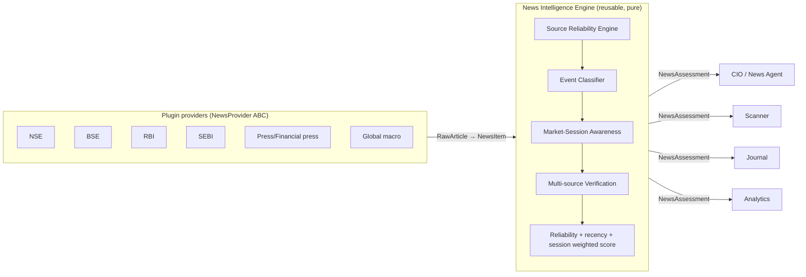

# Sprint 11 — Institutional News Intelligence Agent

> **Advisory-only.** News Intelligence produces *explainable research*, never
> orders. It influences the committee's confidence; it cannot place a trade.

## Objective

A permanent, institutional-grade News Intelligence capability that **collects,
classifies, verifies, scores, and explains** news reaching the CIO — behaving
like a professional equity-research analyst, not a headline reader.

Delivered as a **single reusable service** (`app.modules.news_intelligence`) that
the CIO, Scanner, Journal, Analytics, and every future agent consume through one
standardized contract — no duplicated news logic anywhere.

## Architecture

The engine is **pure and deterministic** (inject a clock), so the same code runs
in CIO deliberation, Scanner enrichment, Journal snapshots, and Analytics
back-fills. Everything downstream reads the standardized `NewsAssessment`; nobody
re-processes raw articles.

## The standardized contract — `NewsAssessment`

`engine.assess(symbol, items) -> NewsAssessment` is the one entry point.

| Field | Meaning |
|---|---|
| `news_score` | signed −100..+100 |
| `sentiment` | strong_positive … strong_negative |
| `confidence` | 0..1 (blends reliability + verification + corroboration + magnitude) |
| `source_reliability` | 0..100 aggregate |
| `verification_status` | verified / corroborated / single_source / pending / rejected |
| `impact_horizon` | intraday / swing / medium_term / long_term (the *thesis* duration) |
| `impact_timing` | immediate / next_session / multi_day / long_term (*when* it reacts) |
| `dominant_session` | pre_market / during_market / after_market / weekend / holiday |
| `primary_reasons` | explainable analyst prose |
| `risk_factors` | explicit caveats (pending verification, conflicting headlines, out-of-hours) |
| `events` | every classified `EventAssessment` (type, severity, source, reliability, session, timing) |

`.as_dict()` is JSON-serializable for the API / UI / Journal / Analytics.

## Source Reliability Engine (`reliability.py`)

Every source scores 0-100 and buckets into a tier; **unknown sources are rejected**
(never trusted by default), and social feeds score 0 (insufficient on their own).
Ambiguous matches resolve to the **most trusted** source. Extending trust is
data-only — add a row to `_REGISTRY`.

| Example | Tier | Reliability |
|---|---|---|
| NSE / BSE / SEBI / RBI | 1 | 100 |
| Company filing / results | 1 | 98 |
| Investor presentation | 1 | 95 |
| Economic Times / Business Standard / Reuters | 2 | 88-90 |
| Global macro wire | 3 | 75 |
| Financial blog | untrusted | 60 (never sufficient alone) |
| Social media / unknown | rejected | 0 / — |

## Event Taxonomy (`taxonomy.py`)

26 event types (earnings beat/miss, guidance up/down, dividend, buyback, bonus,
split, rights, acquisition, merger, regulatory action, SEBI order, RBI, CEO/CFO
change, rating up/down, bulk/block deal, promoter buy/sell, govt tender, order
win, litigation, sector, general). Each carries an **explainable prior**
(polarity, severity, holding horizon, whether it is *critical* — needs
verification). The classifier refines polarity from the headline text.

## Market-Session Awareness (`sessions.py`)

Reuses the shared NSE calendar. Each event is tagged with its **publication
session** and an estimated **impact timing** — the same earnings print reacts
`immediate` at 10:30 IST but `next_session` at 18:30. Out-of-hours news is
discounted (`session_weight`) because it is diluted by the time the market reopens.

## Multi-source Verification (`verification.py`)

Critical events (SEBI order, M&A, ratings, earnings) require **≥2 independent
sources** for `VERIFIED`; a lone critical source is marked **`PENDING`** — the
platform never front-runs an unverified rumour. Verification scales the score
(`confidence_multiplier`).

## CIO Integration

The CIO computes `contribution = stance × confidence × role_weight`, with
`NEWS = 0.7` vs `TECHNICAL = 1.4`. Because `NewsAssessment.confidence` already
encodes reliability + verification + session, **trustworthy news carries more
weight automatically — with no CIO change** — while news remains subordinate to
the technical read. This satisfies "influence confidence, don't override."

The News agent (`committee/agents/news.py`) votes on the assessment when present
(rich, cited findings) and falls back to the legacy aggregate score otherwise.

## Plugin-Based Architecture

Providers already implement the `NewsProvider` ABC (`fetch() -> [RawArticle]`).
Adding NSE/BSE/RBI/SEBI/premium sources is a new adapter only — the engine and all
consumers are untouched. Future agents (Fundamental, Macro, Institutional Flow,
Economic Calendar, …) plug into the CIO through the same `Agent` interface and can
consume the same `NewsAssessment`.

## What ships in Phase 1 (this PR)

✅ Reusable engine: taxonomy, reliability engine, classifier, session awareness,
verification, standardized `NewsAssessment`, reliability/recency/session-weighted
scoring, explainable reasons + risk factors · ✅ CIO/committee integration
(confidence-weighted, non-overriding) · ✅ Prometheus metrics · ✅ 35 unit tests ·
✅ this doc + architecture diagram.

## Phase 2 — Live sources, history & the reusable service (shipped)

- **Tier-1 plugin adapters** (`news/providers/official.py`): `nse`, `bse`, `rbi`,
  `sebi` over the `NewsProvider` interface, each tagging a canonical `source` the
  reliability engine scores at 100. HTTP transport is injectable (default httpx),
  so parsing is unit-tested against fixtures with no network; registered in the
  provider factory. Adding a source = one subclass (endpoint + field map).
- **Historical assessment store** (`news_assessments`, migration `0009`): an
  append-only per-symbol history — score, sentiment, confidence, reliability,
  verification, horizon, timing, session, plus the full JSON payload (events,
  reasons, risks, headlines) — the training substrate for calibration.
- **`NewsIntelligenceService`** — the reusable API: `assess(symbol)` loads stored
  news → runs the engine → persists a snapshot → returns the standardized
  `NewsAssessment`; `latest`/`latest_or_assess`/`history` serve the read model.
  Every consumer goes through this.
- **REST**: `GET /news-intelligence/{symbol}`, `POST /{symbol}/assess`,
  `GET /{symbol}/history` for the Scanner/Journal/Analytics UI.

> Live endpoint URLs/headers for the Tier-1 sources need verification against the
> real services (network-gated, like the Zerodha indicator-parity gate); the
> adapters and their parsing are complete and unit-tested against fixtures.

## Phase 3 — Learning loop & live wiring (shipped)

- **Committee wiring** (`committee/service.py`): every deliberation now computes
  the symbol's `NewsAssessment` via `NewsIntelligenceService` and attaches it to
  the `CommitteeBrief`, so the News agent votes on real, verified, session-aware
  news in live recommendations (side-effect-free; `persist=False`).
- **Continuous self-calibration** (`calibration.py`): `NewsCalibrationService`
  matches every closed `JournalEntry` to the news assessment that preceded entry
  and scores whether the sentiment predicted the realized price move — producing
  accuracy, avg return after positive vs negative news, and per-sentiment
  win-rate/return. Read-only; it never changes any strategy. Served at
  `GET /analytics/news-performance`.

## Deferred (final piece — frontend)

- **UI:** Scanner column (score, headlines, horizon, explanation, reliability),
  Journal (news-at-entry/exit, supported/contradicted), and the Analytics
  news-performance panel. The backend APIs above are the data source; this is a
  presentation-layer follow-up.

No placeholder implementations were shipped; deferred items are genuinely
out-of-scope, not mocked.
