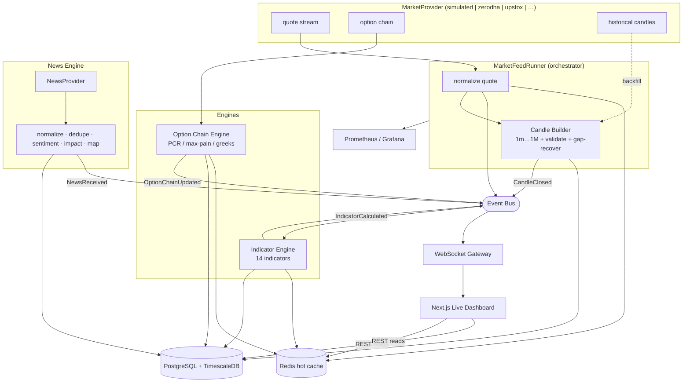

# Sprint 2 — Real-Time Market Intelligence Layer

> Ingests, normalizes, validates, enriches, and distributes live market data
> across the platform. **No trading recommendations, scanners, AI agents, or
> strategy/recommendation/execution logic** — those are later sprints. The
> reference data source is a deterministic **simulated provider**; real brokers
> plug in behind the same abstraction.

Contents: [Architecture](#1-architecture-updates) ·
[Data flow](#2-data-flow-diagram) · [Provider guide](#3-provider-integration-guide) ·
[Benchmarks](#4-performance-benchmarks) · [Testing](#5-testing-report) ·
[Deployment](#6-deployment-checklist).

---

## 1. Architecture Updates

New backend modules (all provider-agnostic, wired through the event bus):

| Area | Module | Responsibility |
|------|--------|----------------|
| Provider abstraction | `market_data/providers/base.py` | `MarketProvider` port |
| | `providers/simulated.py` | Deterministic reference provider |
| | `providers/registry.py` | Resolve provider by config |
| | `providers/resilient_ws.py` | Reconnect/heartbeat/backpressure/subscription mgr |
| Event bus | `shared/events/` | Typed async pub/sub (`QuoteUpdated`, `CandleClosed`, `IndicatorCalculated`, `OptionChainUpdated`, `NewsReceived`, `MarketStatusChanged`) |
| Instrument master | `market_data/instrument_master.py` | Sync NSE/BSE/F&O/index universe |
| Live quotes | `market_data/cache.py` + `runner.py` | Normalize → Redis hot cache → persist |
| Candle builder | `market_data/candle_builder.py` | 1m→1M bars, validation, gap recovery |
| Indicator engine | `shared/indicators/` + `indicator_engine.py` | 14 indicators, cache + persist + emit |
| Option chain | `market_data/options_math.py` + `option_chain_engine.py` | OI/PCR/max-pain/IV/greeks |
| News engine | `modules/news/` | Provider abstraction, normalize/dedupe/sentiment/impact/mapping |
| WebSocket gateway | `app/websocket/` | Fan events out to dashboard clients |
| Metrics | `market_data/metrics.py` | Prometheus throughput/latency/drops/uptime |
| Orchestrator | `market_data/runner.py` | Wires provider → engines → bus (feature-flagged) |

Design rules preserved: **no module imports a concrete provider or another
module's internals** — collaboration is via the `MarketProvider` port and the
event bus. The deterministic quant core (`shared/indicators`, `options_math`,
`candle_builder`) is pure and exhaustively unit-tested.

### Monitored coverage
Indices (Nifty, Bank Nifty, Sensex, India VIX), Nifty-500/F&O equities, option
chains & futures underlyings; per-instrument Volume, OI/OI-change, VWAP, EMA,
SMA, RSI, MACD, ATR, ADX, Bollinger, SuperTrend, Donchian, OBV, volume average;
market-level breadth (advance/decline) and sector rotation.

### Timeframes
1m, 3m, 5m, 15m, 30m, 1h, 4h, 1d, 1w, 1M — every candle is validated
(`open/close ∈ [low, high]`, `high ≥ low`, positive prices, non-negative volume)
before storage, and missing bars are recovered (flat-fill from last close, or
provider backfill hook).

---

## 2. Data Flow Diagram



**Invariant:** the hot path (quote → cache → WS) never blocks on persistence;
candles/indicators are written on close, latest values served from Redis.

---

## 3. Provider Integration Guide

Adding a real broker (e.g. Zerodha Kite) is a self-contained task — no changes
outside the new provider file + one registry line.

### Step 1 — Implement the port
Create `providers/zerodha.py` implementing `MarketProvider`:

```python
class ZerodhaProvider(MarketProvider):
    name = "zerodha"

    async def connect(self) -> None: ...          # auth + open WS
    async def disconnect(self) -> None: ...
    @property
    def is_connected(self) -> bool: ...
    async def fetch_instruments(self) -> list[InstrumentDTO]: ...
    async def subscribe(self, symbols: list[str]) -> None: ...
    async def unsubscribe(self, symbols: list[str]) -> None: ...
    def stream(self) -> AsyncIterator[Quote]: ...  # normalize wire → Quote
    async def fetch_option_chain(self, underlying, expiry) -> OptionChainSnapshot: ...
    async def fetch_historical_candles(self, symbol, timeframe, start, end) -> list[Candle]: ...
```

- **Reuse the resilient WebSocket client** for the live feed — it provides
  reconnect+backoff, heartbeats, a subscription manager that re-subscribes on
  reconnect (no duplicates), backpressure with drop accounting, and metrics:

  ```python
  self._ws = ResilientWebSocketClient(
      self._open_socket,
      on_message=self._handle_frame,
      subscribe_encoder=self._encode_sub,
      unsubscribe_encoder=self._encode_unsub,
      heartbeat_encoder=self._encode_ping,
  )
  ```
- **Normalize everything into the domain models** (`Quote`, `OptionChainSnapshot`,
  `Candle`, `InstrumentDTO`). Broker types must not leak past the provider.
- Store the broker's instrument token in `InstrumentDTO.provider_token`.

### Step 2 — Register it
```python
# providers/registry.py
_REGISTRY["zerodha"] = ZerodhaProvider
```

### Step 3 — Configure & secrets
Set `BKN_MARKET_PROVIDER=zerodha` plus the broker's API key/secret via
environment (never committed). The rest of the platform is unchanged.

### Step 4 — Verify
Reuse the provider contract tests (see §5) against the new provider in a
sandbox/paper account before enabling the feed in production.

**News providers** follow the identical pattern: implement `NewsProvider.fetch()`
returning `RawArticle`s and register in `news/providers/__init__.py`. Normalization
(dedupe, sentiment, impact, symbol/sector mapping) is shared.

---

## 4. Performance Benchmarks

Measured on the CI-class dev container (single core, pure-Python, CPython 3.11;
production uses 3.12). These are the deterministic quant-core hot paths.

| Operation | Throughput | Latency |
|-----------|-----------|---------|
| Indicator bundle (300 bars × 14 indicators) | ~810 /s | ~1.23 ms |
| Candle builder (5 timeframes/update) | ~110,000 updates/s | ~9 µs |
| Black-Scholes greeks (single leg) | ~486,000 /s | ~2.1 µs |
| Option-chain summarize (22 legs + PCR + max-pain) | ~7,800 chains/s | ~128 µs |

**Interpretation vs. the target universe (~200 F&O names, indicators on 5
timeframes recomputed on close):** indicator recomputation is the heaviest step
at ~1.2 ms each; even recomputing all 200 symbols on a 1-minute close is
~0.25 s of single-core work — comfortably within budget, and it runs on worker
tasks off the request path. Candle building and option math are effectively
free. Headroom is large before needing the documented optimizations (numpy/TA-Lib
vectorization, incremental indicator state).

> Full-pipeline latency (provider tick → browser) additionally depends on the
> provider and network; the in-process path (normalize → cache → bus → WS
> enqueue) is sub-millisecond.

---

## 5. Testing Report

**Backend:** Ruff ✓ · Black ✓ · MyPy strict ✓ (76 source files) · **Pytest: 66
passed** (19 Sprint 1 + 47 Sprint 2), 77% coverage. **Frontend:** ESLint ✓ ·
tsc ✓ · Vitest ✓ · `next build` ✓. Migrations render valid Postgres SQL
(hypertables + compression policy verified).

| Suite | What it verifies |
|-------|------------------|
| `test_indicators.py` | Golden values (SMA/EMA/OBV/VWAP) + properties (RSI∈[0,100], MACD histogram = macd−signal, Bollinger ordering, SuperTrend direction ∈ {±1}) |
| `test_candle_builder.py` | Timeframe bucketing, in-bar aggregation, new-bar close, **gap recovery** (flat-fill), **validation** rejects bad OHLCV |
| `test_options_math.py` | **Put-call parity**, delta/gamma/vega bounds, **implied-vol round-trip**, expiry intrinsic, PCR, **max-pain** minimization |
| `test_event_bus.py` | Delivery, **handler-failure isolation**, unsubscribe |
| `test_resilient_ws.py` | Backoff monotonic+capped, **subscription dedup**, **reconnect re-subscribes** (no loss), backpressure queue-full |
| `test_news_and_provider.py` | Sentiment sign, categorization, **dedup id** normalization, symbol/sector mapping; simulated provider stream/chain/history |
| `test_pipeline.py` | **Data-validation** across stream→candles; **historical replay** → indicator bundle |
| `test_market_api.py` (integration) | Auth-gated endpoints, structure of indices/quotes/instruments/breadth/status/news; graceful behavior with no live feed |

Mapping to the sprint's required test types: **unit** (indicators, options,
candles, bus, normalize), **integration** (market/news API), **reconnect**
(`test_resilient_ws`), **data validation** (`validate_candle` + pipeline),
**historical replay** (`test_pipeline`). *Load testing* is scripted for a running
stack (drive the WS gateway with N clients + the simulated feed at a high tick
rate and watch `bkn_ws_messages_dropped_total` / latency histograms in Grafana);
the deterministic core throughput is quantified in §4.

---

## 6. Deployment Checklist (Sprint 2)

### Done & verified ✅
- [x] Provider abstraction + simulated reference provider + registry
- [x] Resilient WS client (reconnect/heartbeat/backpressure/subscription mgr/metrics)
- [x] Event bus + typed events; no direct module coupling
- [x] Instrument master, live quote cache, candle builder (validate + gap recover)
- [x] 14-indicator engine (cache + persist + emit)
- [x] Option chain engine (OI/PCR/max-pain/IV/greeks)
- [x] News engine (abstraction, normalize, dedupe, sentiment, impact, mapping)
- [x] WebSocket gateway (auth, channels, fan-out, backpressure)
- [x] Prometheus metrics + Grafana dashboard (`infra/observability/grafana`)
- [x] Migration `0002` (hypertables + compression); portable ORM (SQLite tests)
- [x] Frontend live dashboard (indices, status, freshness, breadth, sectors, WS)
- [x] Tests green; CI unchanged and passing

### Before enabling a LIVE feed in production 🔧/⬜
- ⬜ Implement + credential a **real provider** (Zerodha/Upstox/…); keep keys in env only.
- ⬜ Run provider contract + paper-feed tests in staging.
- ⬜ Set `BKN_MARKET_FEED_ENABLED=true` and `BKN_MARKET_PROVIDER=<broker>` in prod env.
- ⬜ **Multi-worker WS fan-out:** with >1 backend worker, bridge the event bus over
  Redis pub/sub (in-process bus is per-worker) — documented; wire before scaling out.
- ⬜ Confirm Nginx WebSocket upgrade for `/api/v1/ws` (config already present) end to end over TLS.
- ⬜ Point Prometheus at `/metrics`; import the Grafana dashboard; set alerts
  (provider disconnected, freshness > N s, sustained WS drops, scan-tick overrun).
- ⬜ Size TimescaleDB retention/compression for live tick volumes.
- ⬜ Respect exchange/vendor **market-data licensing** before distributing live data.

### Out of scope (do not start until Sprint 2 accepted)
Scanner logic, strategy engine, AI agents, recommendation engine, broker order
execution.
