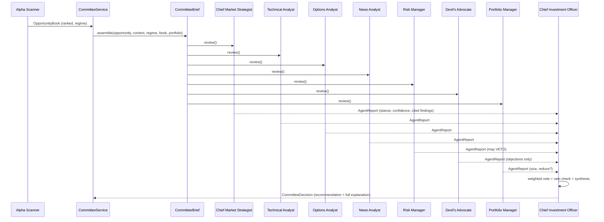

# Sprint 4 — AI Investment Committee

> A trade recommendation is **never** issued by a single analyzer. Seven
> independent agents review each opportunity from different perspectives, then
> the Chief Investment Officer synthesizes one fully-explainable decision.
> Advisory only (V1) — nothing here places orders.

## 1. No black box — a deliberate design choice

The mandate is explicit: *"Every recommendation must be fully explainable. The AI
must cite exactly which rules, indicators and conditions caused the
recommendation."* That is fundamentally incompatible with an opaque LLM call, and
no LLM is wired into this platform.

So every agent is a **deterministic rule engine** that emits `Finding` objects,
each carrying a `citation` — the exact rule, indicator, or condition behind the
judgement (e.g. `RSI(14)=72`, `drawdown=15.0% ≥ max 12.0%`, `PCR=1.5`). The whole
recommendation therefore traces, line by line, back to observable inputs. The
`Agent` interface is intentionally narrow (`review(brief) -> AgentReport`) so any
single agent can later be swapped for an LLM-backed analyst **without changing**
the CIO, the orchestrator, or the API — the explainability contract stays.

## 2. Communication flow

Agents are independent and pure — they never see each other's reports; only the
CIO integrates them. That independence is what makes the committee a genuine
check rather than an echo chamber.

## 3. The seven agents

| Agent | Perspective | Example citations |
|---|---|---|
| **Chief Market Strategist** | Market regime, macro/event overlays, index trend, sector rotation | `index_trend=long, regime=trending_bull`, `relative_strength=+6.0% vs index` |
| **Technical Analyst** | Price action, multi-timeframe, indicators, chart structure | `risk_reward=2.5`, `ADX(14)=30`, `EMA21>EMA50`, `RSI(14)=62` |
| **Options Analyst** | Open Interest, PCR, IV, greeks, futures positioning | `PCR=1.5`, `max_pain=140 (…% below entry)`, `IV %ile=82` |
| **News Analyst** | Earnings, corporate actions, sentiment, economic calendar | `news_score=+0.40`, `calendar=RBI policy decision` |
| **Risk Manager** | Position sizing, correlation, portfolio heat, drawdown | `drawdown=15.0% ≥ max 12.0%`, `stop_distance=4.2%`, `sector_exposure(IT)=2` |
| **Devil's Advocate** | Actively find reasons **not** to trade; invalidate the bull thesis | `index_trend=short vs long`, `RSI(14)=74`, `liquidity_score=38` |
| **Portfolio Manager** | Allocate capital? how much? reduce another position? | `size=120@3050 (~1.00% risk)`, `reduce=INFY` |

**Two structural safeguards:**

- The **Risk Manager holds a hard veto.** If a portfolio circuit breaker trips —
  max drawdown, daily-loss limit, or no heat budget — it returns `veto=True` and
  the CIO **must** REJECT. No single setup overrides portfolio survival.
- The **Devil's Advocate is asymmetric by construction:** it only ever emits bear
  findings or neutral notes, and the strongest stance it can take is NEUTRAL
  (when it genuinely cannot find a hole). It is a deliberate bias check.

Each agent returns an `AgentReport`: a `Stance`
(strong_support → support → neutral → concern → oppose), a self-`confidence`
(0–1), a `headline`, the cited `findings`, an optional `veto`, and structured
numeric `metrics` (e.g. the Risk Manager's `recommended_risk_pct`, the Portfolio
Manager's `recommended_qty`).

## 4. CIO synthesis

The CIO computes a **role-weighted signed vote** — each agent's
`stance.score × confidence × role_weight` — into a `consensus` in [-1, 1] (Risk
Manager and Technical Analyst carry the most weight; News and Options the least).
Then:

1. **Any veto → REJECT** (unconditional).
2. Otherwise the recommendation ladder: `consensus ≥ 0.60` → STRONG_BUY/SELL;
   `≥ 0.35` → BUY/SELL; `≤ -0.35` → REJECT; else HOLD (stand aside).

The `CommitteeDecision` carries the full mandated deliverable:

- **Recommendation** and direction
- **Confidence breakdown** — every agent's signed contribution
- **Bull case** / **Bear case** — the strongest cited findings of each polarity
- **Invalidation** — the exact stop and its distance
- **Risk** — entry, stop, R:R, stop distance %, first target
- **Position size** — quantity, risk %, notional (PM's ask, capped by Risk Manager)
- **Expected holding time**
- **Alternatives** — the other ranked candidates and *why each was rejected*
- **Rationale** — a plain-language summary citing the consensus and regime

## 5. Observability

Prometheus metrics on the existing `/metrics` endpoint:

| Metric | Type | Labels |
|---|---|---|
| `bkn_committee_agent_seconds` | Histogram | `role` |
| `bkn_committee_deliberation_seconds` | Histogram | — |
| `bkn_committee_agent_stance_total` | Counter | `role`, `stance` |
| `bkn_committee_vetoes_total` | Counter | `role` |
| `bkn_committee_decisions_total` | Counter | `recommendation` |

Plus a structured `committee_decision` log line per deliberation (symbol,
recommendation, consensus, vetoed, elapsed_ms). A misbehaving agent is isolated —
its failure becomes a NEUTRAL abstention, logged as `agent_error`, never a crash.

## 6. Performance

Deliberation is microsecond-scale — 7 pure agents + CIO synthesis run in
**≈1 ms** on a warm path. The benchmark test asserts a best-of-N deliberation
under a **25 ms** budget (generous headroom for CI runners); locally it lands
near 1 ms. Because everything is deterministic and side-effect-free, the same
committee can be replayed over historical opportunities in a backtest unchanged.

## 7. Testing

`tests/unit/committee/` + `tests/integration/committee/` (17 tests):

- **Roster** is exactly the seven roles.
- **No black box:** every finding from every agent carries a non-empty citation.
- **Per agent:** strategist supports aligned trend / opposes hostile regime; Risk
  Manager vetoes on drawdown, daily-loss, and heat breaches; Devil's Advocate
  never supports; Options abstains without data and reads PCR.
- **CIO:** full deliverable populated; a veto forces REJECT with zero size;
  unanimous support yields STRONG_BUY; alternatives shape holds.
- **Orchestrator:** seven reports; a broken agent is isolated; deliberation
  latency under budget.
- **API:** endpoints require auth; roster lists seven; `/review` returns a full,
  cited decision (or a reasoned no-trade).

## 8. REST API (read-only, advisory)

| Endpoint | Description |
|---|---|
| `GET /api/v1/committee/agents` | The committee roster |
| `GET /api/v1/committee/review?symbol=&fno=` | Convene on the top (or a named) opportunity → full decision, all seven reports, and timing |

## 9. Module map

| File | Responsibility |
|---|---|
| `committee/base.py` | Contracts: `Agent`, `AgentReport`, `Finding`, `Stance`, `CommitteeBrief`, `PortfolioState`, `Position` |
| `committee/agents/*.py` | The seven deterministic agents |
| `committee/cio.py` | `ChiefInvestmentOfficer`, `CommitteeDecision`, `Recommendation` |
| `committee/committee.py` | `InvestmentCommittee` orchestrator + `Deliberation` record |
| `committee/metrics.py` | Prometheus observability |
| `committee/service.py` + `api.py` | Scan→brief→deliberate facade + REST |

## 10. Out of scope for this sprint

Order execution and live LLM-backed agents (the interface seam exists). The
`PortfolioState` is an advisory input in V1; wiring it to a live positions store
is a later step. No recommendation is ever produced without full, cited
reasoning, and the Risk Manager's veto is absolute.
