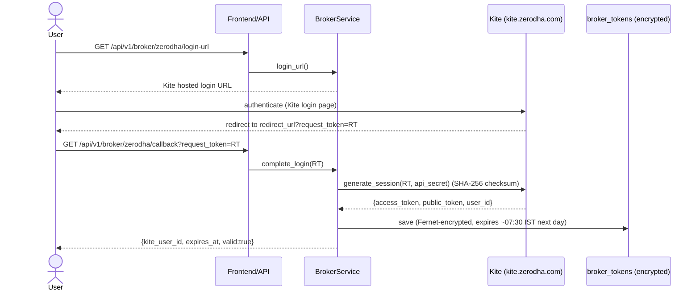

# Sprint 6 — Zerodha Kite Connect Integration

> Live market data + OAuth authentication + historical ingestion for the Indian
> market via **Zerodha Kite Connect**, behind the existing broker abstraction.
> **No live order placement** — this sprint implements authentication, live data,
> historical ingestion, and paper-trading compatibility only. There is no order
> method anywhere in the broker module.

## 1. Design principles

- **Two seams, zero leakage.** The platform already had `MarketProvider` (the
  data-source port). Sprint 6 adds a second, lower seam — SDK-agnostic
  `KiteHttpPort` / `KiteTickerPort` Protocols — so the `kiteconnect` SDK is never
  imported by anything except thin adapters, and never at module load. No Kite dict
  crosses the provider boundary; everything is normalized to domain models.
- **Optional dependency.** `kiteconnect` is an optional extra
  (`pip install '.[zerodha]'`), lazily imported with a clear `ProviderError` if
  missing. The entire broker module is **fully tested with fakes** — no SDK, no
  network — so it installs and passes CI without touching Zerodha.
- **No execution path.** The `MarketProvider` interface has no order method; the
  Kite adapters wrap only market-data/auth calls. Live order placement is out of
  scope by design.
- **Paper ⇄ live is a config switch.** `BKN_MARKET_PROVIDER=paper|simulated`
  (built-in paper broker) or `zerodha` (live Kite data).

## 2. Module map

| File | Responsibility |
|---|---|
| `broker/ports.py` | `KiteHttpPort` / `KiteTickerPort` Protocols (no order methods) |
| `broker/kite/adapters.py` | Thin SDK wrappers (`build_kite_http`, `build_ticker`) — lazy import |
| `broker/mappers.py` | Kite tick / instrument / candle → domain models |
| `broker/provider.py` | `ZerodhaProvider(MarketProvider)` — stream, subscribe, historical, health |
| `broker/reconnect.py` | `BackoffPolicy` (bounded exp. backoff + jitter) + `ReconnectState` |
| `broker/auth.py` | `ZerodhaAuth` — login URL, session exchange |
| `broker/token_store.py` | Fernet `Cipher`, `DbTokenStore` / `MemoryTokenStore`, expiry math |
| `broker/orm.py` | `broker_tokens` table (encrypted at rest) |
| `broker/historical.py` | `HistoricalDataService` — chunked backfill → TimescaleDB |
| `broker/metrics.py` | Prometheus: connected, token-valid, reconnects, ticks, subs |
| `broker/factory.py` | Registers `zerodha` + `paper` in the provider registry |
| `broker/service.py` + `api.py` | Orchestration + `/broker` REST |

## 3. OAuth login flow

Kite Connect uses a redirect login. There is **no refresh token** — the access
token is valid for the trading day and re-minted by repeating this flow (typically
each morning).



The plaintext access token never touches the database or the logs — it is
**Fernet-encrypted** (AES-128-CBC + HMAC) with `BKN_BROKER_ENC_KEY`.

## 4. Live market-data flow

```mermaid
sequenceDiagram
    participant F as Feed process
    participant ZP as ZerodhaProvider
    participant KT as KiteTicker (SDK thread)
    participant Q as asyncio.Queue
    participant EB as Event bus / Redis Stream

    F->>ZP: _attach_broker_token() → set_access_token(AT)
    F->>ZP: connect()
    ZP->>KT: build ticker(api_key, AT); connect(threaded)
    ZP->>ZP: fetch_instruments() → token↔symbol maps
    F->>ZP: subscribe([Nifty500 + watchlist (+ F&O)])
    ZP->>KT: subscribe(tokens); set_mode("full", tokens)
    loop live ticks
        KT-->>ZP: on_ticks([...])  (SDK thread)
        ZP->>ZP: tick_to_quote(...)  (normalize)
        ZP->>Q: call_soon_threadsafe(put)  (thread-safe handoff)
    end
    F->>ZP: async for quote in stream()
    F->>EB: publish QuoteUpdated → candle builder → indicators → WS
```

Market data flows through the **existing** event bus, candle builder, indicator
engine, and Redis-Streams fan-out — the Kite provider is a drop-in source; nothing
downstream changes.

## 5. Reconnect with exponential backoff

The Kite ticker's own reconnect is **disabled** (`reconnect=False`); the platform
drives reconnect with its own bounded exponential-backoff-with-jitter policy so
broker reconnect behaves like every other resilient connection and is
independently testable.

```mermaid
sequenceDiagram
    participant KT as KiteTicker
    participant ZP as ZerodhaProvider
    KT-->>ZP: on_close (drop)
    ZP->>ZP: state.on_disconnect(); delay = backoff.delay_for(attempts)
    ZP->>ZP: sleep(delay) then rebuild + connect ticker
    KT-->>ZP: on_connect → state.on_connect(); resubscribe(full)
```

`delay_for(attempt)` = `min(base·factorⁿ, max_delay)` ± jitter — monotonic, capped
at 60 s, jitter-bounded (unit-tested).

## 6. Historical data ingestion

`HistoricalDataService.backfill(symbol, timeframe, start, end)`:
- resolves the instrument in the local master,
- chunks the range to respect Kite's per-request day limits
  (1m≤55d, 5m≤95d, 15m≤190d, 1h≤390d, 1d≤1900d),
- downloads via `provider.fetch_historical_candles`,
- **upserts into the same `candles` hypertable** the live pipeline writes to (so
  backfilled and live candles are indistinguishable downstream).

## 7. Subscriptions

The feed subscribes the instrument universe returned by the Kite instrument master,
flagged during sync: **Nifty 500** (`in_nifty500`), the **configurable watchlist**
(`BKN_BROKER_WATCHLIST`), and **F&O** instruments when `BKN_BROKER_SUBSCRIBE_FNO=true`
(FUT/CE/PE segments). Index instruments (Nifty 50, Bank Nifty) are always included.

## 8. Health monitoring

`ZerodhaProvider.health_check()` returns true only if the ticker is connected **and**
a Kite `profile()` call succeeds (token still valid). `/api/v1/broker/status`
surfaces token presence/validity and expiry. Metrics: `bkn_broker_connected`,
`bkn_broker_token_valid`, `bkn_broker_reconnects_total`, `bkn_broker_ticks_total`,
`bkn_broker_subscriptions`.

## 9. Configuration

| Setting | Meaning |
|---|---|
| `BKN_MARKET_PROVIDER` | `simulated` / `paper` (paper broker) or `zerodha` (live data) |
| `BKN_ZERODHA_API_KEY` | Kite Connect app API key |
| `BKN_ZERODHA_API_SECRET` | Kite Connect app API secret |
| `BKN_ZERODHA_REDIRECT_URL` | OAuth redirect (must match the Kite app config) |
| `BKN_BROKER_ENC_KEY` | Fernet key for token encryption at rest (**required in prod**) |
| `BKN_BROKER_SUBSCRIBE_FNO` | Subscribe to F&O instruments (default false) |
| `BKN_BROKER_WATCHLIST` | Extra symbols beyond Nifty 500 (CSV) |

## 10. REST API (auth + data only — no orders)

| Endpoint | Description |
|---|---|
| `GET /api/v1/broker/providers` | List available providers (simulated/paper/zerodha) |
| `GET /api/v1/broker/zerodha/login-url` | Kite hosted login URL |
| `GET /api/v1/broker/zerodha/callback?request_token=` | Exchange request_token → encrypted access token |
| `GET /api/v1/broker/status` | Broker/token status |
| `POST /api/v1/broker/logout` | Clear the stored token |
| `POST /api/v1/broker/historical/backfill?symbol=&timeframe=&start=&end=` | Download & store candles |

## 11. Setup guide

1. **Create a Kite Connect app** at <https://developers.kite.trade/>. Note the
   **API key** and **API secret**. Set the app's **Redirect URL** to
   `https://<your-host>/api/v1/broker/zerodha/callback`.
2. **Install the SDK** on the deployment:
   ```bash
   pip install '.[zerodha]'   # adds kiteconnect
   ```
3. **Generate an encryption key** and configure the environment:
   ```bash
   python -c "from cryptography.fernet import Fernet; print(Fernet.generate_key().decode())"
   ```
   ```
   BKN_MARKET_PROVIDER=zerodha
   BKN_ZERODHA_API_KEY=xxxx
   BKN_ZERODHA_API_SECRET=xxxx
   BKN_ZERODHA_REDIRECT_URL=https://<host>/api/v1/broker/zerodha/callback
   BKN_BROKER_ENC_KEY=<fernet-key>          # persist this — losing it invalidates stored tokens
   BKN_BROKER_SUBSCRIBE_FNO=false
   BKN_BROKER_WATCHLIST=RELIANCE,HDFCBANK
   ```
4. **Apply migrations** (`alembic upgrade head` creates `broker_tokens`).
5. **Log in each trading morning:** open `GET /api/v1/broker/zerodha/login-url`,
   complete the Kite login; Kite redirects to the callback, which stores the
   encrypted daily token. Confirm with `GET /api/v1/broker/status`.
6. **Start the feed** (`python -m app.feed`). It loads the encrypted token, attaches
   it, connects the ticker, and streams live data through the normal pipeline. If no
   valid token is present, the feed logs a clear instruction to complete the login.
7. **(Optional) backfill history:**
   `POST /api/v1/broker/historical/backfill?symbol=TCS&timeframe=1d&start=...&end=...`.

## 12. Testing

`tests/unit/broker/` + `tests/integration/broker/` (19 tests), all via **fake ports**
(no SDK, no network):
- **Mappers:** tick→Quote, instrument→DTO (F&O/Nifty-500 flags), candle→domain,
  interval mapping.
- **Reconnect:** backoff monotonic/capped/jitter-bounded; state transitions.
- **Token store:** Fernet roundtrip, wrong-key rejection, bad-key rejection, Kite
  07:30-IST expiry math.
- **Auth:** login URL, session exchange stores an **encrypted** session, validity,
  logout, missing-token rejection.
- **Provider:** connect requires a token; `stream()` yields normalized quotes;
  subscribe maps symbols→tokens; historical; health; reconnect-on-drop via backoff.
- **API (integration):** endpoints require auth; providers list zerodha/paper;
  **full OAuth flow** (login-url → callback → status); historical backfill persists
  candles to TimescaleDB.

## 13. Out of scope (by explicit requirement)

Live order placement — there is no order endpoint or method anywhere in this
module. Option-chain assembly from Kite (no single endpoint) is deferred; the
provider raises a clear `ProviderError` for it in this sprint.
