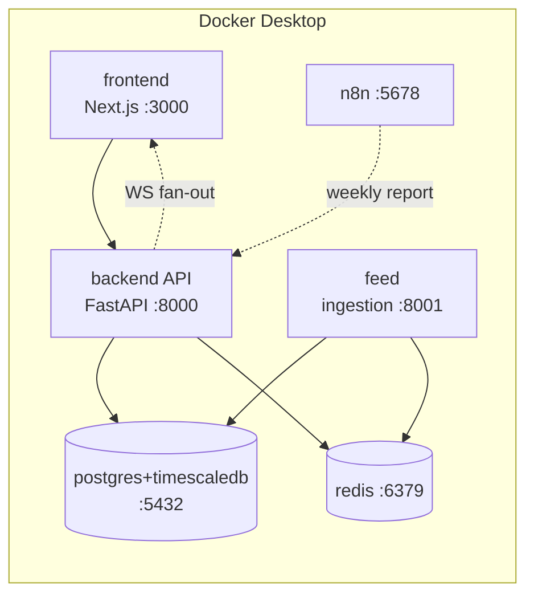
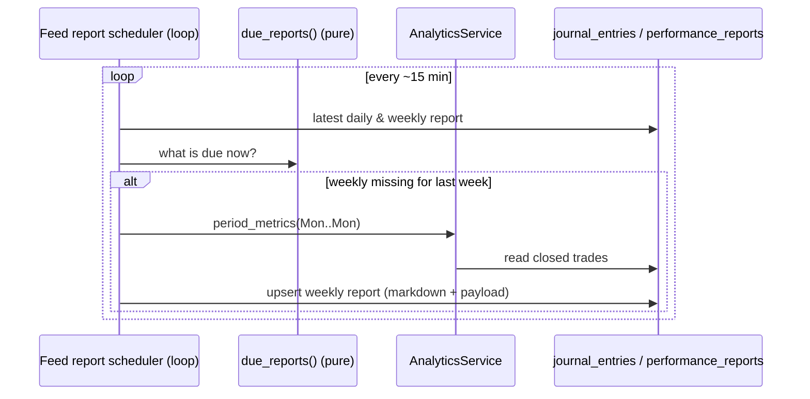

# Sprint 7 — Local Deployment & Validation

> Run the entire BKN AI Capital platform on a local machine (macOS via Docker
> Desktop), stream live market data **read-only**, execute and record **paper
> trades**, and have **daily/weekly performance reports generate automatically**.
> **No live broker orders are ever placed** — the platform is advisory-only and
> there is no order-placement path anywhere in the codebase.

---

## 1. What Sprint 7 delivers

| Requirement | How it's delivered |
|---|---|
| Docker Desktop setup for macOS | `docker-compose.yml` + §2 guide (Apple Silicon & Intel) |
| One-command startup | `make up` → `./scripts/dev-up.sh` (builds, starts, waits for health) |
| One-command shutdown | `make down` / `make purge` → `./scripts/dev-down.sh` |
| Health checks for all services | Compose `healthcheck` on postgres, redis, backend, feed, frontend |
| Automatic database migrations | Backend container runs `alembic upgrade head` on startup |
| Environment variable templates | `.env.example`, `infra/env/.env.dev.example` |
| Sample development configuration | `infra/env/.env.dev.example` (safe placeholder values) |
| End-to-end validation script | `./scripts/validate.sh` (`scripts/validate.py`, stdlib only) |
| Live market data (read-only) | `simulated` feed by default, or `zerodha` (Sprint 6) — no orders |
| Paper trading engine | `app/modules/paper_trading` (simulated fills at live prices) |
| Trade journal | `app/modules/journal` (book of record for closed trades) |
| Performance analytics dashboard | `app/modules/analytics` (`/api/v1/analytics/*`) |
| Daily & weekly performance reports | `app/workers/reports` + feed scheduler + n8n workflow |

**Success criteria (all met):** the platform runs locally on macOS; live data
flows through the system; paper trades are executed and recorded; the weekly
analytics report is generated automatically; no live broker orders are placed.

---

## 2. macOS Docker Desktop setup

1. **Install Docker Desktop** for Mac from <https://www.docker.com/products/docker-desktop/>.
   Choose the **Apple Silicon** build on M-series Macs, **Intel** otherwise.
2. **Start Docker Desktop** and wait for the whale icon to go steady.
   Recommended resources (Settings → Resources): **≥ 4 CPUs, ≥ 8 GB RAM, ≥ 20 GB disk**
   (Postgres + Redis + backend + feed + frontend + n8n).
3. **Verify** in a terminal:
   ```bash
   docker --version && docker compose version && docker info | grep -i 'server version'
   ```
4. **Clone the repo** and enter it:
   ```bash
   git clone <repo-url> && cd peace_maker
   ```

> The images are multi-arch (TimescaleDB, Redis, Node, Python), so the same
> compose file runs natively on Apple Silicon and Intel.

---

## 3. One-command startup & shutdown

```bash
make up          # build, start everything, run migrations, wait until healthy
```

`make up` (→ `scripts/dev-up.sh`) will:
1. verify Docker is running,
2. create `.env` from `infra/env/.env.dev.example` if missing,
3. `docker compose up --build --wait` — blocking until every service reports
   **healthy**,
4. print the URL map.

When it returns you'll have:

| Service | URL |
|---|---|
| Frontend | http://localhost:3000 |
| API (Swagger) | http://localhost:8000/docs |
| API readiness | http://localhost:8000/api/v1/health/ready |
| Feed liveness | http://localhost:8001/health/live |
| n8n | http://localhost:5678 |

Stop it:
```bash
make down        # stop containers, keep data (Postgres/Redis/n8n volumes)
make purge       # stop AND delete all volumes (fresh slate)
```

---

## 4. Service topology & health



Every service has a Docker `healthcheck`:

- **postgres** — `pg_isready`
- **redis** — `redis-cli ping`
- **backend** — `GET /api/v1/health/live`
- **feed** — `GET :8001/health/live`
- **frontend** — `wget --spider http://localhost:3000`

`make up` uses `docker compose up --wait`, so it only returns once all of them
are healthy (or fails fast and prints logs).

**Automatic migrations:** the backend container's command is
`alembic upgrade head && uvicorn …`, so the schema (through migration
`0005_paper`) is applied on every startup before the API serves traffic.

---

## 5. Paper trading (advisory only — no live orders)

The paper-trading engine simulates order execution against the **live quote
cache** and records every round-trip. It is DB-authoritative: opening a position
reserves cash (notional + fee); closing releases it plus realized P&L.

```mermaid
sequenceDiagram
    actor U as User / Frontend
    participant API as API (/paper)
    participant SVC as PaperTradingService
    participant CACHE as Live quote cache (Redis)
    participant DB as paper_* tables
    participant JN as Trade journal
    participant FEED as Feed (tick loop)

    U->>API: POST /paper/orders {symbol, side, qty, stop, target}
    API->>CACHE: live price for symbol
    API->>SVC: submit_order(request, ref_price)
    SVC->>SVC: engine.decide_order (validate + price fill)
    SVC->>DB: record order (filled) + open position; reserve cash
    API-->>U: {status: filled, fill_price, position}

    loop live ticks
        FEED->>CACHE: QuoteUpdated(symbol, ltp)
        FEED->>SVC: apply_price(symbol, ltp)  (paper runner)
        SVC->>SVC: engine.exit_signal (stop/target?)
        alt stop or target hit
            SVC->>DB: close position; realize P&L; release cash
            SVC->>JN: record closed trade (book of record)
        end
    end
```

The **engine** (`paper_trading/engine.py`) is pure and deterministic — fills,
exits, and P&L are identical live or in tests. The **runner**
(`paper_trading/runner.py`) runs inside the feed process, marking open positions
against every live tick and closing them on stop/target.

REST (all under `/api/v1/paper`, auth required):

| Endpoint | Purpose |
|---|---|
| `POST /paper/orders` | Submit a paper order (fills at the live price) |
| `GET /paper/positions` | Open positions with live marks |
| `GET /paper/orders` | Order history (fills + rejections) |
| `GET /paper/account` | Cash, equity, realized/unrealized P&L |
| `POST /paper/positions/{id}/close` | Close a position at the live price |

> There is **no** order endpoint that reaches a broker. The Zerodha adapter
> (Sprint 6) wraps market-data and auth calls only.

---

## 6. Trade journal

Every closed paper position writes one immutable `journal_entries` row with the
performance figures denormalized (gross/net P&L, R-multiple, holding time,
outcome) plus free-text notes and tags.

| Endpoint | Purpose |
|---|---|
| `GET /journal/entries` | Closed-trade log (filter by strategy/symbol) |
| `GET /journal/entries/{id}` | One entry |
| `PATCH /journal/entries/{id}` | Add notes / tags |

The journal is the **book of record** the analytics engine reads.

---

## 7. Performance analytics & automatic reports

`AnalyticsService` reads the journal and computes the standard figures via the
pure `analytics/metrics.py` core: win rate, profit factor, expectancy (₹ and R),
payoff ratio, max drawdown (₹ and %), a daily-return Sharpe, best/worst, average
holding, equity curve, and a per-strategy breakdown.

| Endpoint | Purpose |
|---|---|
| `GET /analytics/summary` | Overall performance metrics |
| `GET /analytics/equity-curve` | Equity-curve points |
| `GET /analytics/by-strategy` | Per-strategy breakdown |
| `GET /analytics/daily` | Daily P&L series |
| `GET /analytics/reports` | List stored reports |
| `GET /analytics/reports/latest?kind=weekly` | Latest weekly report (markdown) |
| `POST /analytics/reports/generate?kind=weekly` | Generate on demand |

**Automatic generation.** The feed process runs a **report scheduler** loop
(`app/workers/reports.py::ReportScheduler`). On each tick it asks the pure
`due_reports()` helper whether a **daily** report for yesterday or a **weekly**
report for last week is missing, and generates the ones that are. Reports are
stored in `performance_reports` (one row per period) and rendered as markdown.

Three ways to generate:
1. **Automatic** — the feed scheduler (satisfies "generated automatically").
2. **CLI** — `make report` or `docker compose exec feed python -m app.workers.reports --kind weekly`.
3. **n8n** — `automation/n8n/workflows/weekly_performance_report.json` (schedule
   → HTTP request; configure a service-token credential, don't embed secrets).



---

## 8. Live market data (read-only)

- **Default (`simulated`)** — the feed generates realistic ticks; nothing external
  is needed. Ideal for local validation.
- **Live (`zerodha`)** — set `BKN_MARKET_PROVIDER=zerodha` and complete the Kite
  login (see `docs/SPRINT6_ZERODHA.md`). Market data streams in read-only; **no
  orders** are placed.

Data flows through the existing event bus → candle builder → indicators → WS
fan-out, and now also into the paper-trading runner.

---

## 9. End-to-end validation

With the stack up:

```bash
make validate          # or ./scripts/validate.sh
```

`scripts/validate.py` (standard-library only, runs on stock macOS Python 3)
drives and asserts the full loop:

1. the API becomes **ready** (DB + Redis healthy),
2. a user can register/authenticate,
3. **live market data is flowing** (`/market/quotes` returns priced symbols),
4. a **paper trade executes and is recorded** (order → position → close → journal),
5. **analytics update** and a **weekly report generates**,
6. **no live order-placement endpoints exist** (introspects `/openapi.json`).

It prints a per-step ✓/✗ and exits non-zero on any failure — suitable for CI or a
smoke test after `make up`.

---

## 10. Configuration reference (Sprint 7 additions)

| Setting | Default | Meaning |
|---|---|---|
| `BKN_PAPER_TRADING_ENABLED` | `true` | Run the tick-driven paper position manager in the feed |
| `BKN_PAPER_STARTING_CASH` | `1000000` | Paper account starting capital (₹) |
| `BKN_PAPER_FEE_BPS` | `3.0` | Blended per-side cost (bps) on paper fills |
| `BKN_PAPER_SLIPPAGE_BPS` | `1.0` | Market-order slippage (bps) on paper fills |
| `BKN_REPORT_SCHEDULER_ENABLED` | `true` | Generate daily/weekly reports automatically |
| `BKN_REPORT_SCHEDULER_INTERVAL_SECONDS` | `900` | How often the scheduler checks for due reports |

See `infra/env/.env.dev.example` for the full development configuration and the
Sprint 6 broker variables.

---

## 11. Testing

- **Unit** (`tests/unit/paper_trading`, `tests/unit/analytics`) — the pure engine
  (fills, stop/target exits, direction-aware P&L, fee model) and the metrics core
  (win rate, profit factor, expectancy, drawdown, Sharpe, per-strategy),
  scheduling (`due_reports`) and report rendering — all hand-worked cases.
- **Integration** (`tests/integration/paper_trading`) — order → position → exit →
  journal → analytics → weekly report, against the real database; plus the
  `/paper`, `/journal`, `/analytics` REST endpoints (auth, live-price gating,
  full flow).

Run: `make be-test` (or `cd backend && pytest`).

---

## 12. Out of scope (by design)

Live order placement. The paper engine simulates fills against live read-only
prices and there is no code path — no endpoint, no method — that submits an order
to Zerodha or any broker. This is enforced by the validation script, which fails
if any order-placement endpoint appears in the OpenAPI schema.
